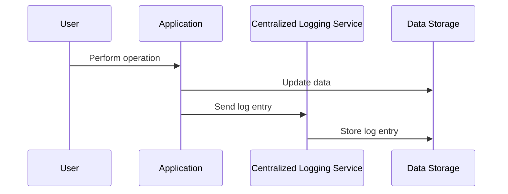

## Audit Trails

### Overview

Audit trails are comprehensive logs that chronologically record the sequence of operations affecting systems, applications, and data. They play a pivotal role in ensuring the integrity, security, and compliance of IT systems by capturing details of user interactions, system changes, and data access patterns. By maintaining these detailed histories, organizations can facilitate forensic analyses, meet regulatory requirements, and support troubleshooting and system optimization efforts.

### Core Concepts

- **Chronological Recording**: Captures the sequence in which events occur.
- **Immutable Records**: Entries in the audit trail should be tamper-proof to ensure integrity.
- **Granular Detail**: Records should include context such as the user, timestamp, affected resources, and the nature of the operation.

### Architectural Approaches

#### Centralized Logging

A common pattern is to route all audit events to a centralized logging service. This approach often utilizes a log aggregation platform like Elasticsearch, Logstash, and Kibana (ELK Stack) or various cloud-native solutions such as AWS CloudTrail, Azure Monitor, or Google Cloud Logging.

##### Sequence Diagram: Centralized Logging



#### Event-Driven Logging

In an event-driven architecture, logging can be implemented using pub/sub messaging systems (like Apache Kafka). Each component publishes audit logs as events, which are then processed and stored by a centralized logging component.

### Best Practices

1. **Data Integrity**: Utilize cryptographic methods to ensure that audit logs are tamper-proof.
2. **Granular Permissions**: Limit access to audit trail data to authorized personnel only.
3. **Retention Policies**: Define and enforce retention policies balancing compliance requirements and storage costs.
4. **Performance Considerations**: Optimize logging to minimize the impact on system performance, such as asynchronous logging mechanisms.

### Example Code

Below is an example in Java demonstrating how to implement an audit trail entry using a simple log model.

```java
public class AuditLogEntry {
    private String userId;
    private LocalDateTime timestamp;
    private String action;
    private String resource;
    private String details;

    // Getters and setters

    public AuditLogEntry(String userId, LocalDateTime timestamp, String action, String resource, String details) {
        this.userId = userId;
        this.timestamp = timestamp;
        this.action = action;
        this.resource = resource;
        this.details = details;
    }

    @Override
    public String toString() {
        return String.format("User: %s, Action: %s, Resource: %s, Timestamp: %s, Details: %s",
                userId, action, resource, timestamp.format(DateTimeFormatter.ISO_LOCAL_DATE_TIME), details);
    }
}
```

### Related Patterns

- **Event Sourcing**: Events are the primary source of truth, capturing all changes as a sequence of events.
- **Command Query Responsibility Segregation (CQRS)**: Segregates the read and update operations for data storage.
- **Secure Data Storage**: Patterns ensuring data stored remains secure and confidential.

### Additional Resources

- [NIST Special Publication 800-92: Guide to Computer Security Log Management](https://nvlpubs.nist.gov/nistpubs/Legacy/SP/nistspecialpublication800-92.pdf)
- [AWS Security Logging Strategies](https://aws.amazon.com/blogs/security/tag/aws-cloudtrail/)
- [Azure Monitoring and Logging Best Practices](https://docs.microsoft.com/en-us/azure/cloud-adoption-framework/govern/best-practices/logging-and-monitoring)

### Summary

Audit trails are essential components of any system where user actions and data integrity are critical. They provide a detailed, unalterable history of all operations, supporting security, compliance, and diagnostic capabilities. By leveraging centralized and event-driven logging architectures, organizations can efficiently manage and utilize audit data to uphold system integrity and compliance standards.
