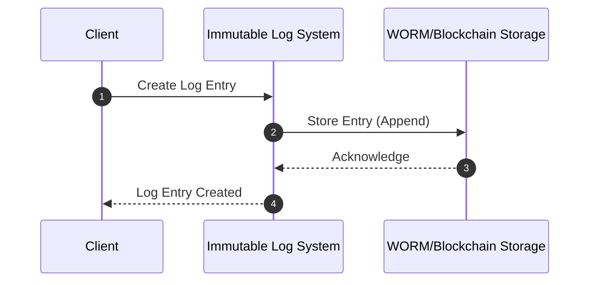

### Overview

The Immutable Audit Logs design pattern is essential in scenarios where security and data integrity are paramount. By making logs immutable, you protect against tampering and unauthorized deletions, thereby ensuring that the audit logs remain a reliable source of truth.

### Detailed Explanation

Immutable Audit Logs are crucial for maintaining compliance, detecting unauthorized access, and tracking operational activities. This pattern is often implemented using write-once-read-many (WORM) storage solutions, cryptographic techniques, or blockchain technologies to enforce the immutability of records.

#### Key Components

1. **Write-Once-Read-Many (WORM) Storage:**
   - WORM storage allows data to be written and retained but prevents modification or deletion after the data is committed. This type of storage is suitable for regulatory compliance.

2. **Blockchain:**
   - Utilize the decentralized and append-only nature of blockchain to maintain immutable audit records. Each entry becomes a part of the blockchain, benefiting from the security and traceability inherent in the technology.

3. **Cryptographic Hashing:**
   - Use cryptographic hashing to ensure data integrity. Each log entry is hashed, and the hash can be used to verify the log's authenticity.

4. **Versioning:**
   - Implement versioning of logs, where each change creates a new version without altering the original entry, ensuring that the original data remains intact.

### Best Practices

- **Data Security**: Ensure that your logging system is secure against unauthorized access. Use secure access controls and encryption for sensitive information.
- **Redundancy**: Keep redundant copies of your audit logs across different geographic locations to prevent data loss.
- **Efficiency**: Optimize storage and retrieval processes to handle large volumes of data efficiently.
- **Compliance**: Stay updated with regulatory standards (like GDPR, HIPAA) by having immutable audit logs that comply with legal and organizational requirements.

### Example Code

```java
import java.time.LocalDateTime;
import java.util.UUID;
import java.security.MessageDigest;

public class ImmutableLogEntry {
    private final String id;
    private final String message;
    private final LocalDateTime timestamp;
    private final byte[] hash;

    public ImmutableLogEntry(String message) throws Exception {
        this.id = UUID.randomUUID().toString();
        this.message = message;
        this.timestamp = LocalDateTime.now();
        this.hash = computeHash();
    }

    private byte[] computeHash() throws Exception {
        MessageDigest digest = MessageDigest.getInstance("SHA-256");
        return digest.digest((id + message + timestamp.toString()).getBytes("UTF-8"));
    }

    // Getters
    public String getId() {
        return id;
    }

    public String getMessage() {
        return message;
    }

    public LocalDateTime getTimestamp() {
        return timestamp;
    }

    public byte[] getHash() {
        return hash;
    }
}
```

### Diagram



### Related Patterns

- **Event Sourcing**: This pattern records state changes as a sequence of events to ensure that all changes are immutable and traceable.
- **Command Query Responsibility Segregation (CQRS)**: Although primarily for handling reads and writes differently, it can assist in maintaining the separation and integrity of logs.

### Additional Resources

- [NIST Guidelines on Logging](https://nvlpubs.nist.gov)
- [Blockchain as a Service (BaaS) on Azure](https://azure.microsoft.com/en-us/solutions/blockchain/)
- [AWS WORM Storage](https://aws.amazon.com/blogs/security/what-are-worm-protected-data-objects-in-amazon-s3/)

### Summary

Implementing Immutable Audit Logs is crucial for organizations that prioritize security, compliance, and data integrity. By ensuring that logs are tamper-proof and deletions are impossible, businesses can maintain a secure and trustworthy logging infrastructure. Whether through WORM storage solutions or advanced blockchain technology, the integrity and authenticity of audit logs can be effectively preserved.
