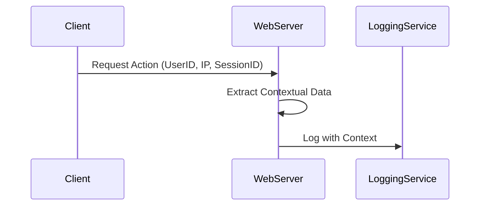

## Logging Contextual Information

### Introduction

In modern distributed systems, having comprehensive audit logs is crucial for maintaining security and ensuring compliance. Logging contextual information builds upon traditional logging by incorporating additional data such as user IDs, IP addresses, session IDs, and other environmental information into logs. This pattern is vital in tracing activities, analyzing incidents, and forensic analysis.

### Architectural Approach

When designing a system to log contextual information, the architecture must capture essential metadata along with standard application logs. Here is how it can be structured:

1. **Log Context**: Include all pertinent data right from the source of the interaction. For instance, web applications can extract user data from sessions or request headers.

2. **Aggregated Logging**: Upon capturing, these logs can be sent to centralized logging systems like ELK Stack (Elasticsearch, Logstash, Kibana) or managed services like AWS CloudWatch or Google Cloud Logging for aggregation and processing.

3. **Structure and Consistency**: Ensure logs are structured in JSON or similar formats to allow easier indexing and searching.

4. **Privacy Considerations**: Sensitive information (like user credentials) must be handled with care and perhaps anonymized to comply with regulations like GDPR.

### Example Implementation

Here's an example in Java making use of the SLF4J library for logging contextual information:

```java
import org.slf4j.Logger;
import org.slf4j.LoggerFactory;
import org.slf4j.MDC; // Mapped Diagnostic Context 

public class AuditLogger {

    private static final Logger logger = LoggerFactory.getLogger(AuditLogger.class);

    public static void logUserAction(String userId, String ipAddress, String sessionId, String action) {
        try {
            // Set contextual information
            MDC.put("userId", userId);
            MDC.put("ipAddress", ipAddress);
            MDC.put("sessionId", sessionId);

            // Log the action
            logger.info("Action performed: {}", action);
        } finally {
            // Clear the context
            MDC.clear();
        }
    }
}
```

### Diagram



### Related Patterns

- **Correlation ID**: Allows tracking related logs across components and services using a unique identifier.
- **Distributed Tracing**: Provides a comprehensive trace of user requests throughout various interacting microservices.

### Additional Resources

- [SLF4J Logger Documentation](http://www.slf4j.org/manual.html)
- [Elastic Stack for Logging and Monitoring](https://www.elastic.co/elastic-stack/)
- [AWS CloudWatch Logging](https://aws.amazon.com/cloudwatch/)

### Summary

Logging contextual information enhances the transparency and traceability of logs, providing richer insights for diagnosing issues and auditing activities. By integrating this pattern into system architectures, organizations can significantly improve their logging and monitoring capabilities, ensuring compliant and secure operations. Handling this data carefully considering privacy requirements cannot be overemphasized, as it protects both user interests and adheres to legal mandates.

This design pattern is crucial in an era where analyzing user interactions and system behavior has become as important as the applications themselves, augmenting both operational excellence and security compliance.
