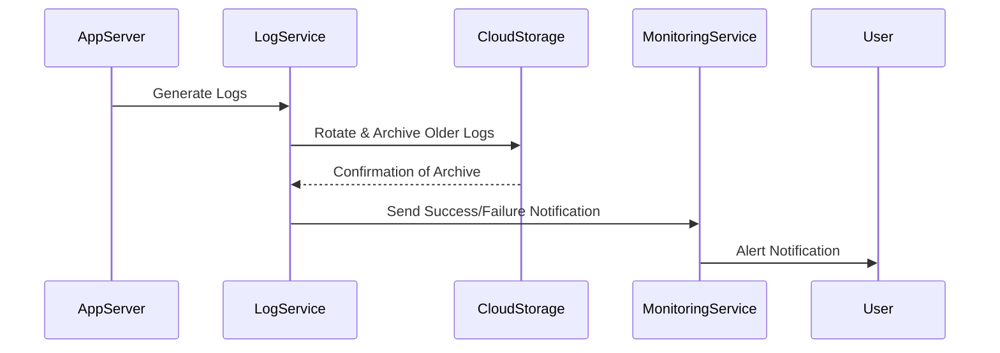

## Introduction

Log archiving is a critical design pattern in cloud computing environments where managing log data efficiently is essential to maintaining system performance and compliance with data retention policies. Logs can quickly accumulate, potentially degrading system performance and increasing storage costs. Regularly archiving older logs to cost-effective and scalable cloud storage solutions helps mitigate these issues.

## Architectural Approach

Log archiving can be structured around several key steps:

1. **Rotation & Segregation**: Continuously rotate logs and separate older logs from recent ones. This can be automated using log rotation tools or built-in log management support available in cloud services.

2. **Archival**: Move log files typically older than a predefined threshold (e.g., one year) to long-term storage solutions. Cloud providers like AWS S3, Azure Blob Storage, or Google Cloud Storage offer low-cost storage options designed for infrequent access.

3. **Indexing & Retrieval**: Implement indexing mechanisms to ensure archived logs can be easily retrieved when needed without browsing through massive dumps manually.

4. **Monitoring & Alerts**: Set up monitoring to ensure that log archiving processes succeed as scheduled. Alert systems should be in place to notify engineers about failures in the archiving process.

## Example Code

For illustration, here's a Python script using Boto3 (AWS SDK for Python) to archive logs from S3 to Glacier:

```python
import boto3
from datetime import datetime, timedelta

s3 = boto3.client('s3')

def archive_old_logs(bucket_name, archive_bucket_name, threshold_days=365):
    one_year_ago = datetime.now() - timedelta(days=threshold_days)
    
    def move_object(key):
        # Copy the object to Glacier storage
        copy_source = {'Bucket': bucket_name, 'Key': key}
        s3.copy_object(CopySource=copy_source, Bucket=archive_bucket_name, Key=key, StorageClass='GLACIER')
        # Delete original object
        s3.delete_object(Bucket=bucket_name, Key=key)
    
    for obj in s3.list_objects_v2(Bucket=bucket_name)['Contents']:
        if 'LastModified' in obj and obj['LastModified'] < one_year_ago:
            move_object(obj['Key'])

archive_old_logs('current-logs-bucket', 'archived-logs-bucket')
```

## Best Practices

- **Data Compliance**: Ensure compliance with data governance and compliance standards, such as GDPR or HIPAA, which may dictate how long logs should be retained or archived.
  
- **Cost Management**: Leverage tiered storage options available from cloud providers to balance the cost and access speed of log data.

- **Security**: Use encryption for logs at rest to ensure that sensitive information is safeguarded even in long-term storage.

- **Regular Review**: Regularly review and update log policies and archival thresholds to align with changing business needs and technology landscapes.

## Diagrams

### Sequence Diagram of a Log Archiving Process



## Related Patterns

- **Log Rotation**: Focuses on segmentation and naming conventions for logs to optimize performance before archiving.

- **Data Lifecycle Management**: Encompasses policies and practices for managing data from creation through archival and eventual deletion.

## Additional Resources

- [AWS S3 to Glacier Archiving](https://docs.aws.amazon.com/AmazonS3/latest/dev/lifecycle-transition-general-considerations.html)
- [Azure Blob Storage Lifecycle Management](https://learn.microsoft.com/en-us/azure/storage/blobs/storage-lifecycle-management-concepts?WT.mc_id=AI-MVP-5003398)
- [Google Cloud Storage Lifecycle Management](https://cloud.google.com/storage/docs/lifecycle)

## Summary

Log archiving is an essential pattern in cloud environments, helping organizations manage storage costs and system performance effectively. By offloading older logs to cold storage solutions provided by cloud vendors, and maintaining robust retrieval and monitoring mechanisms, enterprises can ensure scalable, compliant, and efficient data management strategies.
