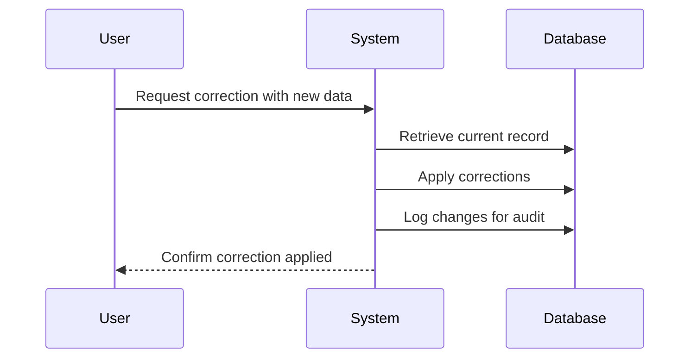

In the realm of data management, the Back-Dating Corrections pattern addresses the need to correct data that impacts the historical validity of datasets. This is an essential mechanism for systems where historical accuracy and time-dependent data integrity are critical. This pattern enables the updating of past records without compromising the data's original and planned timeline integrity.

## Use Cases

- **HR Systems**: Correcting an employee's hire date upon discovering it was incorrectly recorded.
- **Financial Systems**: Adjusting a transaction date for an accounting error discovered after closing books.
- **Supply Chain**: Adjusting warehouse stock levels post-hoc based on new information that was unavailable earlier.

## Design Pattern Explanation

The Back-Dating Corrections pattern is implemented through mechanisms that allow layered data corrections with minimal disruption. The common methods to achieve this include:

1. **Versioned Data Stores**: Implementing a storage strategy whereby each change to the data results in a new version of the data item, preserving prior states for accuracy and traceability.

2. **Temporal Databases**: Utilizing databases designed to handle temporal logic and validity intervals, capturing both transaction and valid time.

3. **Event Sourcing**: Logging the sequence of data event changes. Corrections can be applied by appending "correction events" to the log without altering existing entries.

4. **Audit Logging**: Creating detailed logs of changes with reasoning, timestamp, and initiator records, ensuring visibility of data evolution.

## Architectural Considerations

- **Data Integrity**: Care must be taken to maintain data integrity by ensuring all dependencies and associations are updated to reflect the corrections.
  
- **System Performance**: Consider the additional load on storage and processing power due to versioned or temporal data retention.

- **User Interaction**: Provide interfaces for authorized users to review and approve corrections to maintain governance.

## Example Code Snippet

Here's an illustrative example in Java using a temporal database approach.

```java
import java.time.LocalDate;

public class Employee {
    private String id;
    private String name;
    private LocalDate hireDate;
    
    // Constructor, getters, and setters omitted for brevity

    public void correctHireDate(LocalDate newHireDate) {
        // Log the change for audit
        System.out.println("Updating hire date from " + this.hireDate + " to " + newHireDate + " for employee ID: " + this.id);

        // Update hire date
        this.hireDate = newHireDate;
    }
}
```

## Diagram

Here's a Mermaid UML Sequence Diagram depicting the Back-Dating Correction process:



## Related Patterns

- **Event Sourcing**: Utilization of event logs to recreate past states and allow backward-looking adjustments.
- **Audit Trail**: Ensuring traceable and verifiable changes to records, especially in systems requiring compliance.
- **Command Query Responsibility Segregation (CQRS)**: Separating the reading of data from the modification, which can help manage changes and corrections more smoothly.
  
## Additional Resources

1. Martin Fowler's article on Temporal Models.
2. Pat Helland's work on "Building on Quicksand" illustrating patterns in systems requiring data correction.
3. "Event Sourcing" by Greg Young, providing deep insights into event-based persistence models.

## Summary

The Back-Dating Corrections pattern empowers systems to retroactively amend past data inaccuracies without compromising on integrity or auditability. This pattern is vital for any context where data history must be accurate and traceable, interacting seamlessly with supporting design practices like event sourcing and audit trails. For best practices, careful consideration of data structures, performance, and user interfaces is paramount.
