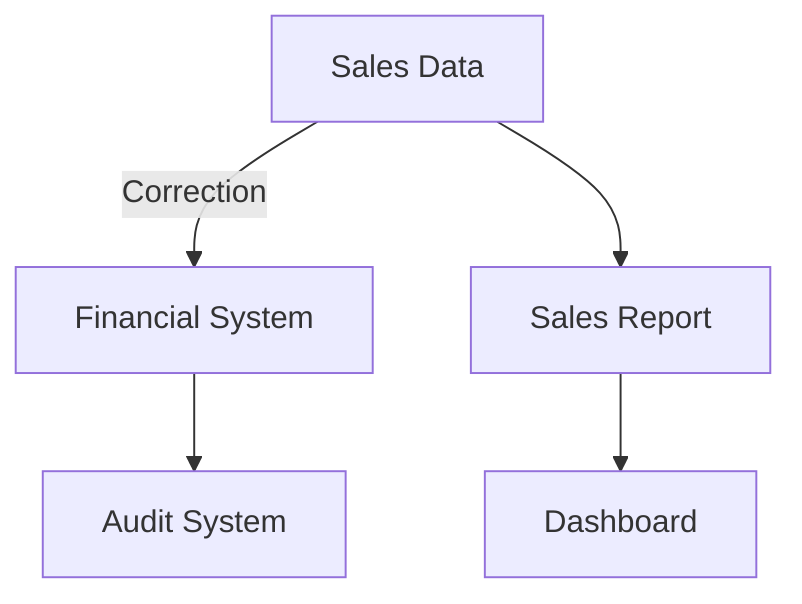

---

linkTitle: "Impact Analysis"
title: "Impact Analysis"
category: "Correction and Reconciliation Patterns"
series: "Data Modeling Design Patterns"
description: "Assessing the effects of data corrections on dependent systems or reports, ensuring integrity and accuracy across interconnected systems."
categories:
- data-modeling
- systems-integration
- data-quality
tags:
- impact-analysis
- data-correction
- data-integrity
- reconciliation
- dependency-management
date: 2024-07-07
type: docs

canonical: "https://softwarepatternslexicon.com/103/7/10"
license: "© 2024 Tokenizer Inc. CC BY-NC-SA 4.0"
---

## Overview

### Introduction

Impact Analysis is a fundamental design pattern in data modeling, particularly in Correction and Reconciliation Patterns, which focuses on evaluating the influence of data corrections and adjustments on various dependent systems and reports. This analysis ensures that any modifications made to data do not adversely affect the accuracy or functionality of interconnected systems.

### Importance

The need for Impact Analysis arises due to the intricate dependencies that exist within enterprise systems. When a data correction occurs, it can have a cascading effect, potentially altering calculations, reports, and business decisions. Impact Analysis helps identify the systems and reports that might be affected by these changes, enabling proactive measures to maintain data integrity.

## Architectural Approaches

### Dependency Mapping

1. **Identification**: Establish all data dependencies across systems.
2. **Analysis**: Develop a comprehensive map that outlines how data flows through the system.
3. **Visualization**: Use tools or diagrams to visualize these dependencies, aiding in understanding potential impacts.

### Automated Monitoring and Alerting

1. **Monitoring**: Implement systems that continuously monitor data flows and alert relevant stakeholders to changes.
2. **Scenario Analysis**: Conduct what-if scenarios to predict potential impacts of data corrections.

## Best Practices

- **Comprehensive Documentation**: Maintain detailed documentation of data flows and system dependencies to aid in impact analysis.
- **Stakeholder Involvement**: Engage relevant stakeholders early in the data correction process to gain insights into potential impacts.
- **Regular Updates**: Update dependency maps regularly to reflect changes in systems and data flows for accurate analysis.
  
## Example Code

Below is a simple pseudocode implementation for identifying potential impacts of a data correction using a dependency mapping approach:

```pseudo
function analyzeImpact(dataCorrection, dependencyMap):
    impactedSystems = []
    for dependency in dependencyMap:
        if dependency.source == dataCorrection.entity:
            impactedSystems.append(dependency.target)

    return impactedSystems
```

This code assumes `dataCorrection` consists of the entity being corrected, and `dependencyMap` is a structure containing data dependencies.

## Diagrams

### Dependency Flow Diagram



This diagram illustrates how a correction in sales data might impact the financial system, sales report, audit systems, and dashboards.

## Related Patterns

- **Data Versioning**: Keeping track of data changes through versions to analyze impacts.
- **Change Data Capture (CDC)**: Continuously capturing changes in data, which forms the basis for analyzing impacts.
- **Backward Compatibility**: Designing systems to handle both old and new data, reducing negative effects of data changes.

## Additional Resources

- [Data-Driven Design by Zhamak Dehghani](https://martinfowler.com/articles/data-driven-design.html)
- [Dependency Injection in Various Languages](https://martinfowler.com/articles/injection.html)
- [Enterprise Integration Patterns](https://www.enterpriseintegrationpatterns.com)

## Summary

Impact Analysis plays a crucial role in maintaining the reliability and accuracy of interconnected enterprise systems. By mapping data dependencies and continuously monitoring changes, organizations can proactively manage data corrections without disrupting business operations. This design pattern ensures systems remain fault-tolerant and business decisions trustworthy, even in the face of necessary data corrections.
