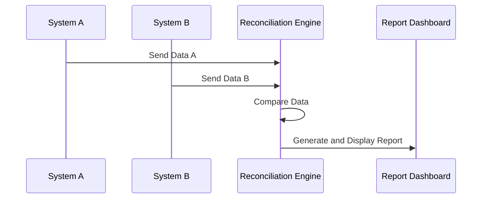

## Reconciliation Reports

### Description

Reconciliation Reports are a critical design pattern used to ensure data consistency across distributed systems. When multiple systems are maintained independently - such as separate inventory, billing, and supply chain systems - over time, discrepancies in the data they hold can occur. Reconciliation Reports help identify and highlight these mismatches so that they can be addressed promptly, ensuring data integrity and operational efficiency.

### Architectural Approaches

The approach to implementing Reconciliation Reports typically involves several steps:

1. **Data Collection**: Collecting data from various sources. This might involve connecting to different databases, APIs, or even flat file sources to pull relevant data into a central system for analysis.

2. **Data Comparison**: Once data from different sources is collected, it must be compared to identify discrepancies. This is often done using database join operations or in-memory data processing.

3. **Discrepancy Highlighting**: After comparison, the differences between datasets are identified. These mismatches are highlighted in the report to enable quick identification and rectification.

4. **Correction Facilitation**: The report should not only highlight discrepancies but also suggest or automate ways to resolve them. This might involve integrating with workflow management tools to track and assign correction tasks.

### Paradigms and Best Practices

- **Automate Data Collection**: Use scheduled tasks, event-driven architectures, or streaming data pipelines to automate data collection. Technologies like Apache Kafka can be leveraged to ensure real-time data flow between systems.

- **Leverage ETL Processes**: Use Extract, Transform, Load (ETL) processes to standardize data before comparison, ensuring data consistency and reliability.

- **Use Dashboard for Reporting**: Implement an intuitive dashboard that provides real-time insights and visualizations of reconciliation status.

- **Apply Machine Learning**: Use machine learning models to predict potential discrepancies and spot anomalies that might not be evident with rule-based reconciliation.

- **Feedback Loop for Continuous Improvement**: Implement a feedback loop wherein insights drawn from reconciliation reports improve data collection, processing, and correction mechanisms continually.

### Example Code

Below is a basic Python example using Pandas to highlight discrepancies between two sample datasets representing two separate inventory systems:

```python
import pandas as pd

system_a = pd.DataFrame({
    'item_id': [101, 102, 103],
    'quantity': [15, 30, 45]
})

system_b = pd.DataFrame({
    'item_id': [101, 102, 103],
    'quantity': [15, 25, 50]
})

discrepancy_report = pd.merge(system_a, system_b, on='item_id', suffixes=('_a', '_b'))
discrepancy_report['quantity_discrepancy'] = discrepancy_report['quantity_a'] - discrepancy_report['quantity_b']

print(discrepancy_report)
```

### Diagrams



### Related Patterns

- **Event Sourcing**: Maintain a history of changes to aid in tracking discrepancies over time.
- **Data Audit**: Implementing data audit logs helps understand when data was changed and by whom, providing insights for resolving discrepancies.

### Additional Resources

- [Effective Data Reconciliation Strategies](https://example.com/data-reconciliation-strategies)
- [Implementing ETL Processes](https://example.com/etl-implementation)
- [Machine Learning in Data Quality Management](https://example.com/ml-data-quality)

### Summary

Reconciliation Reports are a fundamental design pattern utilized across various industries to ensure data consistency and integrity. By automating data collection, leveraging ETL processes, and harnessing the power of dashboards and machine learning, organizations can significantly reduce discrepancies. Implementing these solutions not only ensures operational accuracy but also builds trust in the systems used and the data they maintain.
