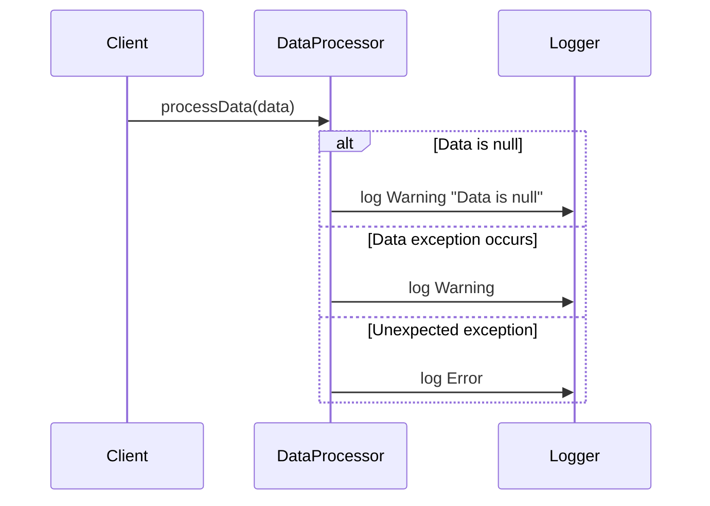

## Exception Handling Procedures

### Introduction

Exception handling procedures are crucial in data management, especially in scenarios where data quality and reliability are paramount. This design pattern specifies how to define, implement, and maintain effective methods for addressing exceptions in data processing systems. These procedures ensure data consistency and integrity, thus improving the overall reliability of the system.

### Architectural Overview

Exception Handling Procedures can be architected through the following steps:
- **Identification**: Recognizing the types of exceptions your system may encounter.
- **Categorization**: Grouping exceptions based on characteristics such as frequency, impact, or root cause.
- **Documentation**: Creating detailed descriptions and handling steps for each exception type.
- **Automation**: Implementing automated detection and handling mechanisms.
- **Review**: Setting up a feedback loop to continuously improve exception handling processes.

### Best Practices

1. **Centralized Handling**: Implement a centralized system for logging and managing exceptions across different system components.
2. **Granular Categorization**: Use detailed categories for exceptions to facilitate precise handling and resolution.
3. **Alerting and Monitoring**: Automate alerts for critical exceptions and implement comprehensive monitoring to identify patterns.
4. **Version Control**: Manage changes to exception handling procedures using version control to track and apply updates systematically.
5. **Continuous Updates**: Regularly update handling procedures based on new learnings and changing system requirements.

### Example Code

Below is an example of a simple error handling procedure implemented in Java:

```java
import java.util.logging.Level;
import java.util.logging.Logger;

public class DataProcessor {

    private static final Logger logger = Logger.getLogger(DataProcessor.class.getName());

    public void processData(String data) {
        try {
            // Parsing and processing data
            if (data == null) {
                throw new DataException("Data is null");
            }
            // Further processing...
        } catch (DataException e) {
            handleDataException(e);
        } catch (Exception e) {
            handleGeneralException(e);
        }
    }

    private void handleDataException(DataException e) {
        logger.log(Level.WARNING, "Data exception occurred: {0}", e.getMessage());
        // Specific recovery procedures
    }

    private void handleGeneralException(Exception e) {
        logger.log(Level.SEVERE, "Unexpected exception: {0}", e.getMessage());
        // General recovery procedures
    }
}
```

### Diagrams

#### Mermaid UML Sequence Diagram



### Related Patterns

- **Retry Pattern**: Implement retries for transient faults that can potentially resolve on subsequent attempts.
- **Circuit Breaker Pattern**: Prevent ongoing faults through immediate fallback mechanisms when failure rates exceed thresholds.
- **Compensation Transaction**: Use in scenarios needing transactions to be reverted consistently in distributed system environments.

### Additional Resources

- **Books**:
  - "Clean Code: A Handbook of Agile Software Craftsmanship" by Robert C. Martin
  - "Release It!: Design and Deploy Production-Ready Software" by Michael T. Nygard

- **Online**:
  - [Exception Handling Best Practices in Java](https://www.baeldung.com/exception-handling-java-best-practices)
  - [Effective Practices for Exception Handling](https://developers.google.com/tech-writing/exception-handling)

### Summary

Appropriate exception handling procedures are integral to developing robust, high-quality data systems. By clearly identifying, categorizing, and systematically handling exceptions, organizations can significantly enhance system reliability and data quality. Leveraging both manual strategies and automated tools, exception handling processes are continually refined to accommodate evolving system landscapes and growing data complexity.
