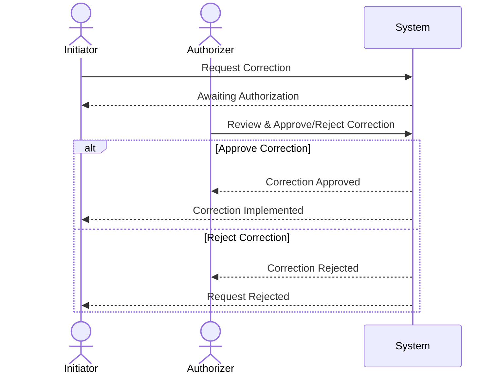

## Introduction

The Dual Control Mechanism is an essential design pattern for ensuring that critical data changes are both validated and authorized by multiple parties. This process reduces the risk of errors, fraud, and unintended modifications within systems that handle sensitive or high-value data.

## Detailed Explanation

The Dual Control Mechanism operates on the principle that no single individual should have the autonomy to make critical changes without oversight. This pattern is particularly valuable in scenarios involving financial transactions, sensitive personal data, and high-stakes business operations.

### Key Components
- **Initiator**: The individual or entity responsible for proposing or initiating a data correction. Their role involves documenting the reason behind the change, ensuring clarity and communication.
  
- **Authorizer**: A separate individual or entity responsible for reviewing the proposed change. Their task is to verify the validity of the proposed correction, checking for any potential errors or fraudulent activity.

- **Audit Trail**: A comprehensive log that records all changes, including both the initial proposal and the authorization, which can be used for future audits, compliance, or investigations.

## Architectural Approach

The Dual Control Mechanism can be implemented using various architectural approaches adapted to the nature and scale of the system. Below is a simplified UML sequence diagram illustrating a typical implementation of the pattern.



## Best Practices

1. **Segregation of Duties**: Ensure clear roles and responsibilities are defined to prevent any overlap that could compromise the integrity of the dual control process.
  
2. **Comprehensive Training**: Both initiators and authorizers should be adequately trained to understand the importance and correct use of this pattern.
  
3. **Automated Alert Systems**: Implement alerts and notifications to reduce delays in obtaining authorization and to keep stakeholders informed about pending actions.

4. **Robust Audit Logging**: Keep an immutable log of all corrections and their approval status to assure compliance with regulatory standards and to provide clarity during audits.

5. **Scalable Authorization Workflows**: Develop authorization workflows that can accommodate varying levels of data criticality and urgency, enabling flexible yet secure operations.

## Example Code

Here's a basic example of how a dual control process can be represented using Java.

```java
public class DualControlProcess {
    
    private CorrectionRequest request;
    private boolean isAuthorized;

    public DuelControlProcess(CorrectionRequest request) {
        this.request = request;
        this.isAuthorized = false;
    }

    public void initiateCorrection(Initiator initiator) {
        // Logic to submit the change request
        System.out.println("Correction requested by: " + initiator.getName());
    }

    public void authorizeCorrection(Authorizer authorizer, boolean approval) {
        if (approval) {
            this.isAuthorized = true;
            applyCorrection();
            System.out.println("Correction approved by: " + authorizer.getName());
        } else {
            System.out.println("Correction rejected by: " + authorizer.getName());
        }
    }

    private void applyCorrection() {
        if (isAuthorized) {
            // Apply the correction to the system
            System.out.println("Correction Applied: " + request.getDetails());
        }
    }
}
```

## Related Patterns

- **Four Eyes Principle**: Requires that two independent parties evaluate and approve actions before they are executed.
- **Audit Trail**: Maintaining a chronological record of all activities to ensure traceability and accountability.

## Additional Resources

- [NIST Guidelines on Computer Security](https://www.nist.gov/publications)
- [ISO/IEC 27001 - Information Security Management](https://www.iso.org/isoiec-27001-information-security.html)

## Summary

The Dual Control Mechanism is a vital pattern for safeguarding sensitive operations. By necessitating joint authorization, this pattern ensures robust data integrity and security. Its application is particularly critical in sectors where data accuracy and protection are paramount, providing a strong defense against operational and security breaches.
