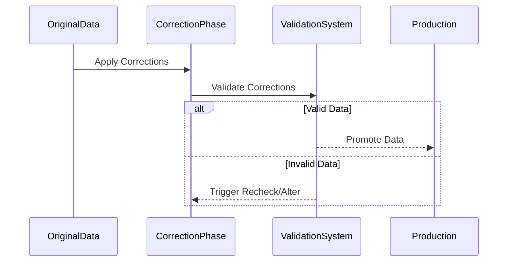

---

linkTitle: "Validation Checks Post-Correction"
title: "Validation Checks Post-Correction"
category: "Correction and Reconciliation Patterns"
series: "Data Modeling Design Patterns"
description: "Verifying data integrity after corrections are made to ensure the data is consistent and free of new errors."
categories:
- data-quality
- data-integrity
- data-modeling
tags:
- validation
- reconciliation
- data-quality
- error-handling
- patterns
date: 2024-07-07
type: docs

canonical: "https://softwarepatternslexicon.com/103/7/15"
license: "© 2024 Tokenizer Inc. CC BY-NC-SA 4.0"
---

## Introduction

The **Validation Checks Post-Correction** pattern focuses on verifying the integrity and quality of data after it has undergone transformations or corrections. These checks are crucial to ensure that new errors haven't been introduced during the correction process, maintaining consistent and reliable data across systems.

## Detailed Explanation

When processing large datasets, especially in environments where data is frequently updated or corrected, ensuring the integrity of the data post-correction is imperative. This design pattern helps to validate that the intended corrections were applied accurately, without introducing new data integrity issues. Key components of this pattern include:

1. **Verification Phase**: After corrections are applied, a series of validation checks are executed to verify that data meets the predefined quality standards.
2. **Automated Testing**: Automated scripts frequently run to check for data anomalies, duplications, or violations of business rules.
3. **Business Rules Validation**: These are checks reflecting the domain logic ensuring that data satisfies the necessary conditions post-correction.
4. **Logging and Alerting**: Logging any discrepancies identified and notifying responsible stakeholders for further investigation.

## Architectural Approaches

- **Data Gatekeeping**: Post-correction data is temporarily held at a "gate" where it is validated before entering the production environment.
- **Staging Environment**: Use of a staging area where data is corrected and validated before being pushed to live systems.
- **Automated Rollback**: In case of validation failure, corrections can be automatically rolled back to preserve data integrity.

## Best Practices

- **Comprehensive Test Coverage**: Develop exhaustive test cases to capture as many edge cases as possible.
- **Incremental Disclosure**: Review corrections incrementally and subject them to validation to catch errors early in the process.
- **Use Proven Libraries**: Utilize well-established validation libraries that facilitate efficient and thorough data checks.

## Example Code

Here is a Java example using the Apache Commons Validator:

```java
import org.apache.commons.validator.routines.IntegerValidator;

public class DataValidationPostCorrection {
    public static void main(String[] args) {
        IntegerValidator validator = IntegerValidator.getInstance();
        int correctedData = 100; // Example corrected data

        if (validator.isInRange(correctedData, 1, 1000)) {
            System.out.println("Data validated successfully.");
        } else {
            System.out.println("Data validation failed.");
            // Trigger a rollback or alert here
        }
    }
}
```

## Diagrams

To represent the process flow, a UML Sequence Diagram could be utilized:



## Related Patterns

- **Error Detection and Correction**: Techniques for detecting errors and correcting them at the point of entry.
- **Data Audit Trail**: Keeping a record of data changes for ensuring traceability.

## Additional Resources

- [Apache Commons Validator](https://commons.apache.org/proper/commons-validator/)
- [OWASP Data Validation](https://owasp.org/www-community/data_validation)
- [Data Quality Assessment](https://www.dataversity.net/data-quality-assessment)

## Summary

The **Validation Checks Post-Correction** pattern ensures the integrity of corrected data, preventing the introduction of new errors. It is a fundamental aspect in environments where data quality is paramount and reinforces a robust data governance strategy.

---
