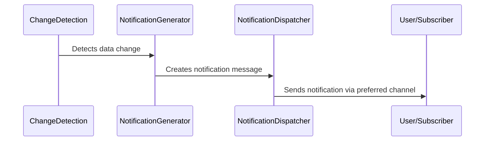

## Overview

The User Notification of Changes design pattern ensures that users and systems reliant on specific data are promptly informed about any alterations or corrections made to that data. This pattern promotes transparency and builds trust by keeping stakeholders updated on critical changes, thereby enhancing data integrity across your cloud-native applications.

## Architectural Approach

The implementation of this design pattern leverages an event-driven architecture, integrating messaging systems like **Apache Kafka** or **AWS SNS/SQS** to disseminate change notifications. The pattern can be represented by the following components and processes:

1. **Change Detection**: A system component monitors changes to the data. This could be an audit log in a database, a dedicated change capture mechanism, or a data reconciliation tool.

2. **Notification Generator**: Once a change is detected, this component creates an appropriate notification or message that contains details about the change.

3. **Notification Dispatcher**: This component sends the generated notifications to interested parties via chosen communication channels, such as email, SMS, or push notifications.

4. **Subscriber Management**: Manages user subscriptions/preferences, ensuring notifications are only sent to those who have opted for them.

## Diagram



## Best Practices

- **Granular Notification Levels**: Allow users to specify different levels of notifications to avoid overwhelming them with information.
  
- **Security and Privacy**: Ensure messages do not contain sensitive information if they traverse unsecured channels.

- **Resilience and Fault-tolerance**: Implement retry mechanisms for message delivery and handle failed notifications gracefully.

- **Intuitive Opt-in Process**: Users should have a clear and easy process to subscribe to or unsubscribe from notifications.

## Example Code

Below is a simplified example of a microservice in Scala using **Kafka** to notify users of data changes:

```scala
import org.apache.kafka.clients.producer.{KafkaProducer, ProducerRecord}
import java.util.Properties

object UserNotificationService {

  val kafkaProps: Properties = {
    val props = new Properties()
    props.put("bootstrap.servers", "localhost:9092")
    props.put("key.serializer", "org.apache.kafka.common.serialization.StringSerializer")
    props.put("value.serializer", "org.apache.kafka.common.serialization.StringSerializer")
    props
  }

  val producer = new KafkaProducer[String, String](kafkaProps)

  def sendNotification(userId: String, changeDetails: String): Unit = {
    val record = new ProducerRecord[String, String]("user-notifications", userId, changeDetails)
    producer.send(record)
  }

  def notifyChanges(userId: String, changes: List[String]): Unit = {
    changes.foreach { change =>
      sendNotification(userId, s"Change detected: $change")
    }
  }
}
```

## Related Patterns

- **Event Sourcing**: Captures every state change as an event, providing a historical audit trail.
- **Change Data Capture (CDC)**: A design pattern for monitoring and capturing changes in data stores.
- **Consumer-Driven Contracts**: Ensures that notifications being sent match the structure and expectations of the consumer.

## Additional Resources

1. [Apache Kafka Documentation](https://kafka.apache.org/documentation/)
2. [AWS SNS/SQS Documentation](https://aws.amazon.com/sns/)
3. [Pattern: Event-Driven Architecture](https://martinfowler.com/articles/201701-event-driven.html)

## Summary

The User Notification of Changes design pattern is crucial in modern data architectures, particularly within cloud-native environments where data accuracy and timeliness are vital. By informing users of relevant data changes, you increase transparency, trust, and confidence in your system's data integrity. Implementing this pattern effectively requires careful consideration of architecture, security, and user experience for optimal results.
