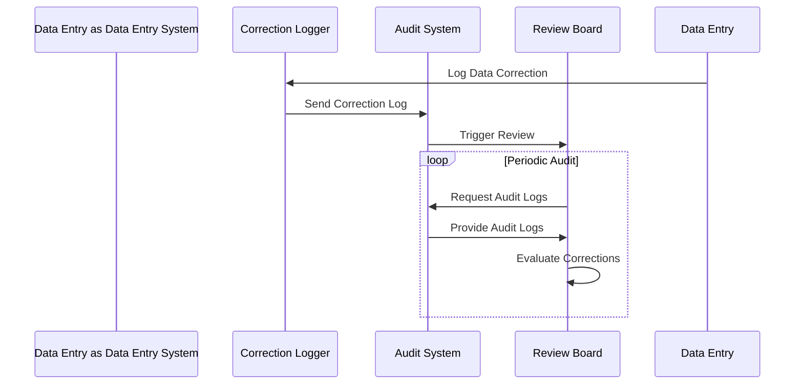

## Introduction
The Data Correction Audit Review pattern involves a systematic approach to reviewing data corrections within software systems. This process helps ensure that any modifications made to data are compliant with organizational standards and regulations, thereby improving data integrity and authenticity. It is crucial for maintaining accountability and transparency in data management practices.

## Motivation
Organizations frequently make corrections to data for reasons such as rectifying errors, adjusting for new business conditions, and meeting regulatory requirements. However, without a proper audit mechanism, these corrections can lead to data inconsistencies and become a source of vulnerabilities, eventually compromising the system's reliability. The Data Correction Audit Review pattern addresses these issues by providing a formalized structure for oversight.

## Applicability
This pattern is suited for environments where:
- Data accuracy is critical for business operations.
- Regulations require accountability and compliance in data processing and storage.
- Periodic audits are mandated to maintain certification or accreditation.

## Structure
The pattern comprises the following components:
- **Correction Logs**: Centralized records of all data corrections made.
- **Audit Trail**: A detailed log that captures what changes were made, by whom, and when.
- **Review Board**: A team responsible for periodically reviewing audit trails and logs.
- **Compliance Rules**: A set of predefined rules and policies against which corrections are evaluated.

## Best Practices
- Maintain a comprehensive logging mechanism to track all data corrections.
- Ensure logs are immutable and secure to prevent tampering.
- Employ automated tools to assist in identifying anomalies or repeated correction patterns.
- Establish a regular schedule for the review process to ensure timely scrutiny.
- Involve stakeholders from different departments to provide diverse perspectives during reviews.

## Example Code
Here's an example of a simple implementation to log and review data corrections using a hypothetical Java application:

```java
public class DataCorrection {
    
    private UUID correctionId;
    private String correctedBy;
    private Date correctionDate;
    private String previousValue;
    private String newValue;

    public DataCorrection(UUID correctionId, String correctedBy, Date correctionDate, String previousValue, String newValue) {
        this.correctionId = correctionId;
        this.correctedBy = correctedBy;
        this.correctionDate = correctionDate;
        this.previousValue = previousValue;
        this.newValue = newValue;
    }

    public void logCorrection() {
        // Logic to log the correction into a persistence layer
        System.out.println("Logging data correction: " + this);
    }

    @Override
    public String toString() {
        return "DataCorrection{" +
                "correctionId=" + correctionId +
                ", correctedBy='" + correctedBy + '\'' +
                ", correctionDate=" + correctionDate +
                ", previousValue='" + previousValue + '\'' +
                ", newValue='" + newValue + '\'' +
                '}';
    }
}
```

## Diagram
Here is a UML sequence diagram illustrating a typical data correction audit review process:



## Related Patterns
- **Event Sourcing**: Captures all changes as a sequence of events, allowing complete history review, often used in conjunction with the Data Correction Audit Review for immutable logging.
- **Snapshot Pattern**: Periodically saves the state of the system to create a baseline against which corrections can be compared.

## Additional Resources
- [Data Governance Frameworks](https://example.com/data-governance): An overview of data governance and compliance.
- [Regulatory Compliance in IT](https://example.com/regulatory-compliance): Understanding regulations that affect data correction practices.

## Summary
The Data Correction Audit Review pattern is an essential practice for safeguarding the integrity and authenticity of data within software systems. By implementing a structured review process, organizations can ensure compliance, enhance accountability, and foster trust in their data management processes.
