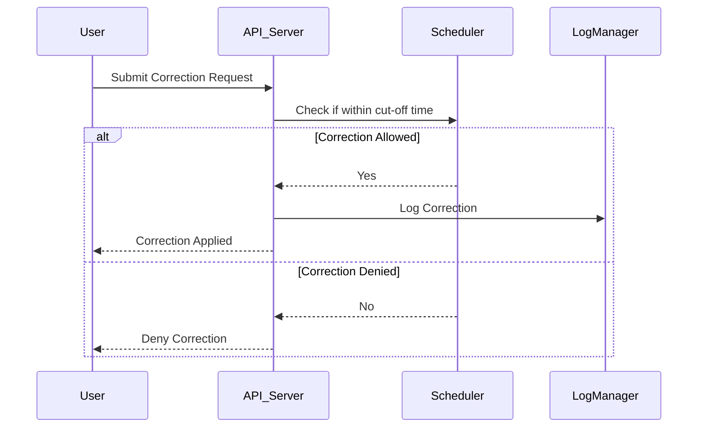

## Introduction

In data-driven systems, especially those dealing with financial or sensitive data, implementing **Correction Cut-Off Times** is essential for maintaining data integrity, improving performance, and ensuring compliance with legal and business requirements. This pattern defines the temporal boundaries within which data corrections are allowed, ensuring that data states remain consistent post-cut-off.

## Intent

The primary goal of the Correction Cut-Off Times design pattern is to determine specific times at which data corrections are prohibited, effectively freezing the datasets for accurate reporting and analysis. This is particularly critical in systems where data consistency and accuracy are paramount, such as financial reporting, auditing, and regulatory compliance.

## Applicability

- **Financial Systems**: Where financial data needs to be fixed by the end of the fiscal month or quarter.
- **Inventory Management**: To lock data inputs before reconciliation processes and annual audits.
- **Compliance and Regulatory Reporting**: Ensuring data integrity to comply with industry regulations.
- **Batch Processing Systems**: Where SPOF can compromise a set of synchronized tasks.

## Architectural Structure

The architectural approach for implementing the Correction Cut-Off Times pattern involves various components:

1. **Correction Window**: A configurable time period after data entry is allowed for tweaks and rectifications.
2. **Cut-Off Scheduler**: A system component that automatically enforces the cut-off, rejecting or queuing requests for processing after the deadline.
3. **Audit Logging**: Keeps a record of changes for transparency and compliance.
4. **Exception Manager**: Allows for bypassing the cut-off in critical exceptional conditions under strict governance.

### Example Code

```kotlin
data class CorrectionRequest(val dataId: String, val corrections: Map<String, Any>, val timestamp: LocalDateTime)

fun isCorrectionAllowed(request: CorrectionRequest, cutOffTime: LocalDateTime): Boolean {
    return request.timestamp.isBefore(cutOffTime)
}

val cutOffTime = LocalDateTime.of(2024, 7, 31, 23, 59)
val correctionRequest = CorrectionRequest("123ABC", mapOf("amount" to 2000), LocalDateTime.now())

if (isCorrectionAllowed(correctionRequest, cutOffTime)) {
    println("Correction allowed.")
} else {
    println("Correction denied: cut-off time has passed.")
}
```

## Process Flow

Here's a Mermaid UML sequence diagram illustrating a typical process flow.



## Related Patterns

- **Data Audit Trails**: Complements cut-off times by ensuring data changes are tracked and can be reviewed.
- **Versioned Database Pattern**: Allows historical data snapshots to be maintained and compared.
- **Command Query Responsibility Segregation (CQRS)**: Differentiates between requests that modify data and those that don't, which can help in enforcing correction cut-off rules.

## Best Practices

- **Clear Communication**: Ensure all stakeholders are aware of the cut-off policies through documentation and alerts.
- **Automation**: Use automated schedulers to enforce the cut-off times to minimize human error.
- **Monitoring**: Continuously monitor compliance with cut-off policies using comprehensive logging and reporting tools.

## Additional Resources

- [Financial Data Compliance and Integrity Guide](https://example.com/financial-compliance)
- [Automated Scheduling in Distributed Systems](https://example.com/distributed-systems-scheduling)

## Summary

The Correction Cut-Off Times pattern is crucial for maintaining data integrity, especially in regulated environments like finance. By establishing temporal constraints for corrections, it ensures both consistency and reliability of data while simplifying compliance efforts. With proper implementation and adherence, it minimizes risks related to data handling and reporting.
