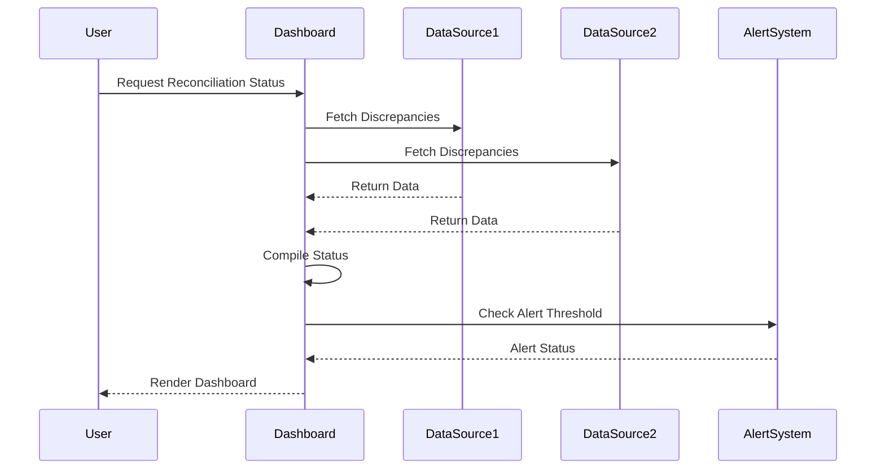

## Introduction
Reconciliation dashboards serve as visual tools that provide a comprehensive overview of data reconciliation processes across multiple systems. These dashboards are crucial for monitoring the status of reconciliation efforts and to promptly address any outstanding issues or discrepancies. Through real-time data visualization and analytic capabilities, reconciliation dashboards enable organizations to maintain high levels of data integrity.

## Design Pattern Overview

### Key Characteristics
- **Real-Time Monitoring**: Ensures that data discrepancies are tracked and addressed in a timely manner.
- **User-Friendly Interface**: Offers intuitive visualizations and interaction models to improve user experience.
- **Integrated Data Sources**: Combines data from various systems to provide a unified view of reconciliation metrics.
- **Alerting & Notifications**: Provides alert mechanisms for stakeholders when discrepancies exceed defined thresholds.

### Architectural Approaches
- **Microservices Architecture**: Utilizes microservices to handle data ingestion, processing, and visualization independently, improving the system's scalability and maintainability.
- **Event-Driven Approach**: Employs an event-sourcing model to capture and respond to changes in data state, allowing the dashboard to reflect real-time data integrity status.
- **Cloud-Native Design**: Leverages cloud platforms to handle the dynamic scaling demands and to facilitate deployment and maintenance.

### Paradigms and Best Practices
- **Data Privacy and Security**: Ensure compliance with data protection regulations through role-based access controls and secure data storage practices.
- **Data Quality Management**: Implement routine data quality checks within the processes feeding the dashboard.
- **Customization and Extensibility**: Allow users to customize their views to focus on specific areas of discrepancies or data integrity.

## Example Code
Below is a simple conceptual example using JavaScript with a data visualization library, such as D3.js, for rendering parts of a reconciliation dashboard:

```javascript
// Assuming we have a function `fetchReconciliationData` that gets data from an API

fetchReconciliationData()
    .then(data => {
        const svg = d3.select("svg");
        const g = svg.append("g");

        // Example: Visualize discrepancies as a bar chart
        g.selectAll("rect")
            .data(data.discrepancies)
            .enter().append("rect")
            .attr("x", (d, i) => i * 30)
            .attr("y", d => svg.height - d.value)
            .attr("width", 20)
            .attr("height", d => d.value)
            .attr("fill", "red");
        
        // Add notifications
        if (data.alertCount > 0) {
            alert(`There are ${data.alertCount} new reconciliation alerts.`);
        }
    })
    .catch(error => console.error("Error fetching reconciliation data:", error));
```

## Diagrams
### UML Sequence Diagram


### Related Patterns
- **Data Audit Trail**: Provides a historical record of data changes to assist in the reconciliation process.
- **Data Aggregator**: Consolidates data from various sources to prepare for reconciliation and visualization.
- **Real-Time Data Dashboard**: A broader application pattern for displaying various real-time analytics, not limited to reconciliation.

## Additional Resources
- [Data Reconciliation and Visualization](https://example.com/reconciliation-viz-guide)
- [Effective UX Design for Dashboards](https://example.com/ux-dashboard-tips)
- [Understanding Event-Driven Architectures](https://example.com/eda-primer)

## Summary
Reconciliation dashboards are essential tools for organizations to ensure data integrity across systems. By offering real-time insights and comprehensive visualizations, these dashboards allow for efficient monitoring and management of data discrepancies. Implementing a reconciliation dashboard involves addressing architectural, design, and security considerations while maintaining the flexibility to adapt to various data reconciliation scenarios.
