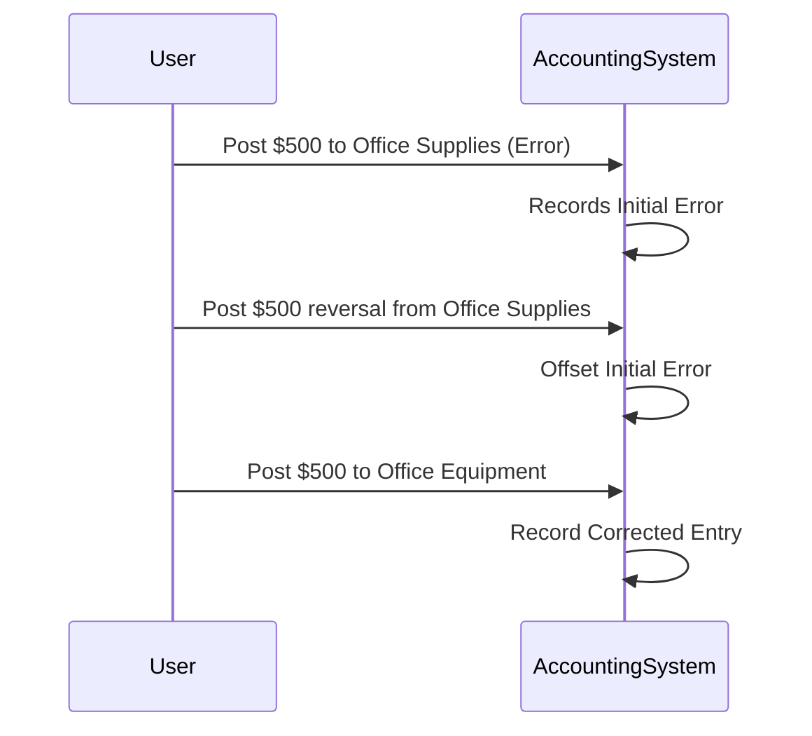

Reversing Entries is a design pattern commonly used in various data systems, particularly accounting and financial applications, to ensure data integrity through the correction of erroneous entries. This pattern emphasizes creating new entries that offset or reverse the effects of incorrect data entries.

## Description

In various data systems, errors in data entry or processing can lead to significant inaccuracies and issues in data integrity. The Reversing Entries pattern provides a systematic approach to correcting such errors by introducing offsetting entries that negate the effects of the incorrect data.

### Key Elements:

- **Offsetting Entries**: These specific entries are created to nullify the effect of the previous incorrect entries.
- **Negation**: The core philosophy of this pattern is to counterbalance or negate the incorrect data, restoring the system to its accurate state.
- **Systematic Correction**: Instead of manual interventions or data deletions, reversing entries ensure the correction is traceable and repeatable.

## Example Use Case

Consider an accounting system where an incorrect debit entry was mistakenly posted:

1. **Initial Error**: A $500 debit is mistakenly recorded under 'Office Supplies' instead of 'Office Equipment'.
2. **Reversal Entry**: To correct this, an additional $500 credit is posted under 'Office Supplies'.
3. **Corrective Entry**: A new $500 debit entry is correctly posted under 'Office Equipment'.

The introduction of these reversing entries ensures the trial balance remains correct and actions are well-documented.

## Best Practices

1. **Audit Trail**: Always maintain an audit trail of original transactions and their subsequent reversing entries for accountability.
2. **Consistency**: Apply reversing entries consistently across tasks to simplify training and ensure data integrity.
3. **Automated Validation**: Use automated systems where possible to detect incorrect entries promptly and generate reversing entries.

## Diagram

## Related Patterns

- **Compensating Transactions**: Used in cloud-native and microservices environments to achieve eventual consistency.
- **Event Sourcing**: A pattern where state changes are saved as a sequence of events rather than overwriting the state, allowing for reversible actions.

## Additional Resources

- *Event-Driven Microservices Architecture* by Kasun Indrasiri and Prabath Siriwardena - A guide to applying structured patterns like Event Sourcing and Compensating Transactions.
- *Accounting Principles* by Jerry J. Weygandt, Paul D. Kimmel, and Donald E. Kieso - A comprehensive resource on traditional principles that lend insights to IT patterns such as Reversing Entries.

## Summary

The Reversing Entries pattern is an essential tool in ensuring data integrity in systems where transactional correctness is crucial, such as financial and accounting software. By systematically applying reversing entries, organizations can manage and mitigate erroneous data entries, ensuring the correctness and consistency of the system's state while maintaining a comprehensive audit trail.
