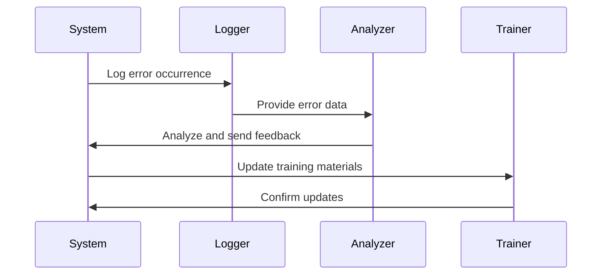

## Introduction

**Feedback Loops for Prevention** is a design pattern within the domain of correction and reconciliation patterns aimed at enhancing processes by leveraging feedback from correction data. This pattern involves identifying recurrent errors or inefficiencies in a system, collecting data related to these issues, and then using this data to make adjustments that prevent similar issues from occurring in the future.

## Detailed Explanation

### Design Pattern Overview

Feedback loops are integral to many systems to ensure continuous improvement and adaptation. In the context of data systems, these loops provide insights into common sources of error or inefficiencies that can be gradually eliminated or reduced. By systematically addressing these issues, organizations can significantly improve data quality and operational efficiency.

### Architectural Approaches

1. **Data Collection and Monitoring:**
   - Implement logging and monitoring tools to detect errors and anomalies in data processes.
   - Use analytic platforms to collect correction data systematically.

2. **Analysis and Identification:**
   - Analyze collected data to identify patterns and frequent error sources.
   - Employ machine learning techniques to uncover non-obvious error trends.

3. **Feedback Mechanism Implementation:**
   - Create channels to incorporate insights back into the system, such as updated protocols, enhanced training materials, or automated error detection scripts.

4. **Execution and Adjustment:**
   - Regularly adjust processes and systems based on feedback.
   - Implement periodic reviews to ensure changes are effective and further tweaks are made if necessary.

### Example Use Case

Consider a healthcare data entry system where operators frequently make errors due to complex forms. By collecting data on these common mistakes:
- **Step 1:** Monitor and log every data correction occurrence.
- **Step 2:** Analyze the errors to identify the most frequent error-prone fields.
- **Step 3:** Update the training materials to emphasize correct procedures for problematic fields.
- **Step 4:** Automate some of the data entry validation where feasible, using preset rules or machine learning models to predict and alert on potential errors.

### Example Code

Here is a pseudocode example that demonstrates a simple feedback loop in a data processing system:

```scala
class DataCorrectionSystem {

  private var errorLogs: ListBuffer[ErrorLog] = ListBuffer()

  def processData(data: Data): ProcessedData = {
    val processedData = process(data)
    val errors = validateData(processedData)
    if (errors.nonEmpty) {
      errorLogs.append(ErrorLog(data, errors))
      updateTrainingMaterials(errors)
      processedData.correct(errors)
    }
    processedData
  }

  private def updateTrainingMaterials(errors: List[String]): Unit = {
    // Update procedures based on error feedback
    // for example, append error details into a training manual
    
    errors.foreach(error => println(s"Updating material for error: $error"))
  }
  
  // Other helper functions for processing and validating data
}
```

## Diagrams

Below is a UML sequence diagram depicting the feedback loop process:



## Related Patterns

- **Retry Pattern**: Helps in executing operations that can fail intermittently.
- **Circuit Breaker Pattern**: Stops the flow of commands after continued failure to avoid system overload.
- **Graceful Degradation Pattern**: Maintains functionality when parts of a system fail.

## Additional Resources

- "Building Microservices" by Sam Newman
- Coursera Course: "Data-driven Decision Making"
- AWS Whitepapers on Best Practices for Error Handling

## Summary

Feedback Loops for Prevention pattern is a powerful concept in enhancing system resilience and data quality by learning from the potential missteps. By continuously refining processes with real-world data insights, organizations can not only correct errors more swiftly when they happen but also reduce future instances of those errors, leading to more efficient and reliable systems.
