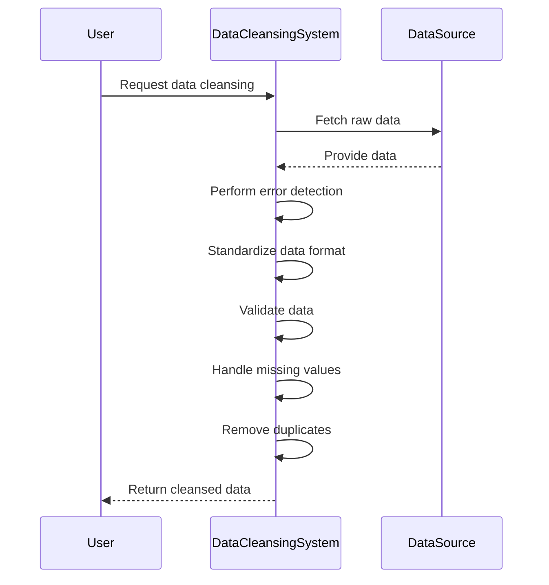

## Introduction

Data Cleansing is a design pattern focused on systematically improving data quality by correcting or removing corrupt, inaccurate, duplicate, or incomplete data records within a dataset. This pattern is essential in various areas such as data analytics, business intelligence, and machine learning, where the accuracy, consistency, and reliability of data are paramount.

## Detailed Explanation

Data Cleansing involves several steps aimed at enhancing the quality of data. The primary goals include:

1. **Detection and Removal of Errors**: Identify and rectify incorrect data entries, such as typos, misplaced entries, or wrongly formatted records.

2. **Standardization**: Ensure uniformity by converting various data representations into a common standard, such as consistent address formats.

3. **Data Validation**: Implement rules and constraints to ensure data accuracy, adhering to predefined formats and values.

4. **Handling Missing Values**: Use methods like imputation or deletion to address missing data entries.

5. **Duplication Removal**: Identify and merge or eliminate duplicate records that lead to skewed analysis.

## Example Code

Below is an example in Python using Pandas for basic data cleansing:

```python
import pandas as pd

data = {
    'Name': ['John Doe', 'Jane Doe', '', 'Jake Doe'],
    'Age': [28, 22, None, 34],
    'Address': ['123 Elm St', '456 Oak St', '123 Elm Street', '789 Pine St']
}

df = pd.DataFrame(data)

df['Address'] = df['Address'].apply(lambda x: x.replace('Street', 'St'))

df['Name'].replace('', 'Unknown', inplace=True)
df['Age'].fillna(df['Age'].mean(), inplace=True)

df.drop_duplicates(inplace=True)

print(df)
```

## Diagram

Here is a sequence diagram illustrating the data cleansing process:



## Related Patterns

- **Data Enrichment**: Adding additional relevant information to existing data to enhance its value.
- **Master Data Management**: Ensuring uniformity, accuracy, and accountability across business entities.

## Best Practices

- **Automate Processes**: Use automated tools and frameworks to perform repetitive cleansing tasks.
- **Continuous Monitoring**: Implement data quality dashboards to monitor and report data inconsistency and errors continuously.
- **Feedback Loops**: Establish mechanisms for users to report discrepancies, feeding into ongoing data improvement efforts.

## Additional Resources

- [Pandas Documentation](https://pandas.pydata.org/pandas-docs/stable/)
- [Data Cleaning Techniques and Processes](https://towardsdatascience.com/the-art-of-data-cleaning-3d26abae0f37)
- [OpenRefine](https://openrefine.org/)

## Conclusion

Data Cleansing is a critical process in ensuring that data meets the quality standards necessary for accurate decision-making and analysis. By establishing proper cleansing mechanisms and integrating them into your data processing workflow, organizations can significantly improve the reliability and usefulness of their datasets.
