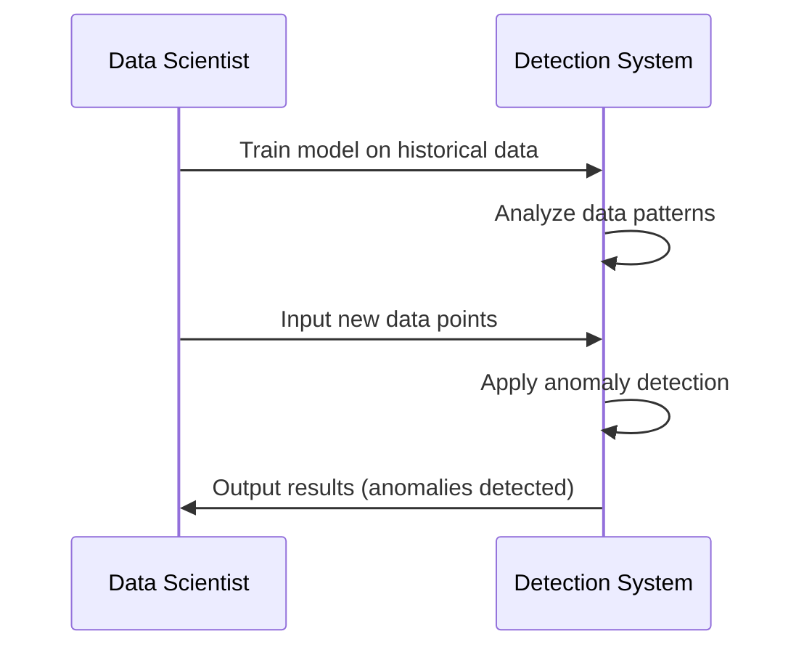

## Anomaly Detection Design Pattern

### Introduction

Anomaly Detection is a design pattern used in data modeling to identify data points, events, or observations that deviate significantly from the common pattern or behavior present in a dataset. These anomalies can indicate critical incidents such as fraud detection, network security threats, equipment failures, and data errors.

### Functional Explanation

Anomaly detection involves the use of statistical analysis, machine learning algorithms, and domain-specific business rules to identify irregular and suspicious data points from datasets. The process often requires training models on historical data to understand expected behaviors and patterns.

### Architectural Approaches

1. **Statistical-Based Methods**: Use statistical measures like Z-score, Tukey's method, or hypothesis testing to identify anomalies in smaller datasets.
2. **Machine Learning-Based Methods**: Supervised learning (e.g., regression, classification) or unsupervised learning (e.g., clustering, autoencoders) can be employed to detect anomalies.
3. **Time-Series Analysis**: Utilize techniques like ARIMA models or seasonal decomposition to detect anomalies in time-series data.
4. **Ensemble Techniques**: Combine multiple algorithms to improve anomaly detection accuracy.

### Example Code

The following example demonstrates using Python's Scikit-learn library to employ an Isolation Forest for anomaly detection:

```python
from sklearn.ensemble import IsolationForest
import numpy as np

X = np.array([[10, 2], [12, 3], [13, 2], [10, 3], [18, 15]])

model = IsolationForest(contamination=0.2)
model.fit(X)

predictions = model.predict(X)

print("Anomaly detection results:", predictions)
```

### Diagram



### Related Patterns

- **Dimensionality Reduction**: Simplify datasets for faster anomaly detection.
- **Pattern Recognition**: Identify common data patterns to help differentiate anomalies.
- **Data Cleaning**: Prioritize cleaning known anomalies and errors in datasets.

### Best Practices

- **Understanding Context**: Anomalies must be interpreted in the context of business logic to ensure relevant and actionable insights.
- **Continuous Monitoring**: Implement systems for real-time anomaly detection where applicable.
- **Adaptive Models**: Regularly update models to adapt to changing data and patterns.

### Additional Resources

- [Scikit-learn: Anomaly Detection](https://scikit-learn.org/stable/modules/outlier_detection.html)
- [Machine Learning Mastery – Anomaly Detection](https://machinelearningmastery.com/anomaly-detection-algorithms-with-python/)
- [Understanding Eigenvectors in Principal Component Analysis](https://blog.computational.com/understanding-eigenvectors)

### Summary

Anomaly Detection is a crucial pattern in maintaining data integrity and identifying potential issues in systems. By using a combination of statistical analysis and machine learning, organizations can proactively address data errors and unusual incidents, aiding in decision-making and enhancing operational efficiency. When properly implemented, anomaly detection solutions can give competitive advantages in industries such as finance, healthcare, and IT infrastructure.
