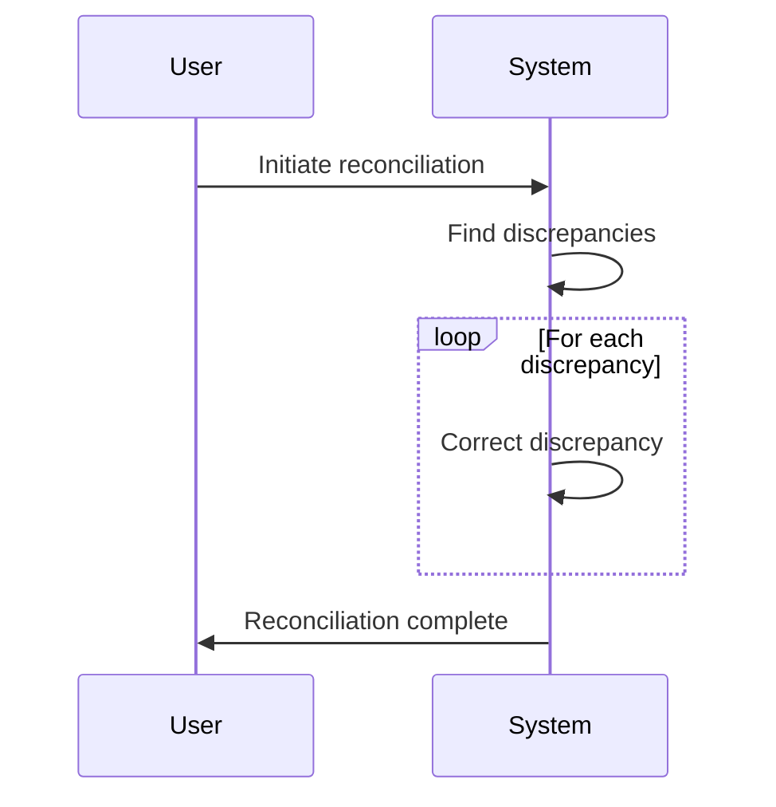

## Introduction

Reconciliation in data systems is a critical process that ensures data consistency and accuracy across systems and databases. The *Reconciliation Policies and Procedures* design pattern formalizes the approach to detect and correct data inconsistencies. This pattern is vital in scenarios involving financial transactions, intercompany interactions, and distributed systems. A robust reconciliation process prevents data errors from propagating, maintaining overall data integrity and trustworthiness.

## Architectural Approaches

### Core Components

1. **Validation Framework**: Structures data assessment checks to identify inconsistencies or mismatches before reconciliation begins.

2. **Correction Mechanism**: Implements strategies and automated tools for correcting data errors or inaccuracies discovered during reconciliation.

3. **Audit Trail System**: Records all reconciliation activities and adjustments for compliance and historical reference.

4. **Frequency and Schedule Management**: Establishing when reconciliations occur and how frequently they should be executed to capture discrepancies promptly.

### Best Practices

- **Consistent Error Handling**: Develop a standardized method for capturing and resolving data discrepancies.

- **Automated Checks**: Employ automation to compare source and target datasets, reducing manual workload and human error.

- **Clear Documentation**: Maintain comprehensive documentation of reconciliation processes and any decisions or changes enacted.

- **Regular Reviews**: Periodically evaluate reconciliation policies and procedures to adapt to new requirements or identified inefficiencies.

## Example Code

The following is a sample Java-based solution for reconciling data discrepancies:

```java
public class Reconciliation {

    public void reconcileData(List<DataRecord> records) {
        List<DataRecord> discrepancies = findDiscrepancies(records);

        for (DataRecord discrepancy : discrepancies) {
            correctDiscrepancy(discrepancy);
        }

        logReconciliation(discrepancies);
    }

    private List<DataRecord> findDiscrepancies(List<DataRecord> records) {
        // Implement logic to identify data mismatches 
        return records.stream()
                .filter(record -> !record.isConsistent())
                .collect(Collectors.toList());
    }

    private void correctDiscrepancy(DataRecord record) {
        // Implement correction logic
        record.correct();
    }

    private void logReconciliation(List<DataRecord> discrepancies) {
        // Log reconciliation process
        discrepancies.forEach(System.out::println);
    }
}
```

## Diagrams

### Reconciliation Sequence Diagram



## Related Patterns

- **Database Shadowing Pattern**: Provides redundancy and aids in detecting erroneous data entries.
  
- **Event Sourcing Pattern**: Assists in preserving the state history to reconstruct corrected versions of data.

## Additional Resources

- [Data Quality Management Guide](https://example.com)
- [Ensuring Data Integrity in Distributed Systems](https://example.com)

## Summary

The *Reconciliation Policies and Procedures* design pattern is fundamental for maintaining data quality and integrity across complex systems. By establishing clear guidelines, leveraging automation, and maintaining thorough documentation, organizations can ensure consistent and accurate data alignment. This pattern not only improves operational efficiency but also upholds compliance and regulatory standards.

The approach is universally applicable in environments where data consistency and integrity are non-negotiable aspects, thereby making it an essential component of comprehensive data governance.
