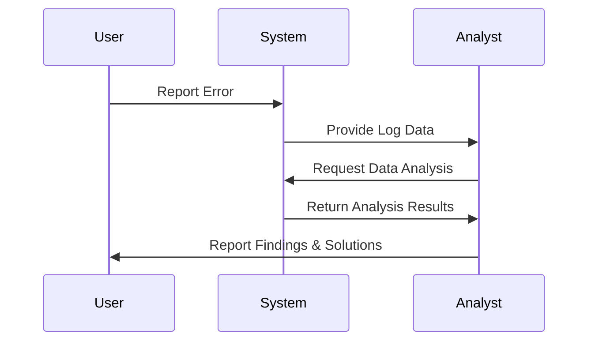

## Introduction

Root Cause Analysis (RCA) in data systems focuses on identifying the underlying causes of data errors in order to prevent their recurrence. This design pattern is critical in maintaining high data quality and operational efficiency within cloud-based data environments. The ultimate goal is to not just troubleshoot but to implement preventive measures that ensure data integrity over time.

## Detailed Explanations

### Key Concepts

- **Root Cause**: The fundamental reason for the occurrence of a problem. Identifying the root cause helps in addressing the core issue rather than just the symptoms.
- **Recurrence Prevention**: Implementing changes that prevent the same error from happening in the future.

### Steps in Root Cause Analysis

1. **Error Detection**: Use monitoring tools and alerts to promptly detect abnormalities or anomalies in data processes.
2. **Data Collection**: Gather comprehensive data logs, user reports, and system outputs to understand the scope and specifics of the issue.
3. **Hypothesis Formation**: Develop theories on what might have caused the error, often employing data patterns or historical precedents.
4. **Analysis**: Utilize analytical techniques or software to test hypotheses, such as Pareto Charts and Fault Tree Analysis.
5. **Solution Identification**: Develop actionable measures to correct the underlying problem.
6. **Implementation and Monitoring**: Apply the corrective actions and continuously monitor the processes to ensure the solution is effective.

## Cloud Architectures and Tools

Adopting Root Cause Analysis in cloud computing platforms like AWS, Azure, and GCP involves:

- **AWS CloudWatch**: For setting alarms and logging events to trace issues.
- **Azure Monitor**: Offers end-to-end monitoring and diagnostics.
- **Google Stackdriver**: Provides insights into application performance and operational volumes.
- **Open-source Tools**: Use ELK Stack (Elasticsearch, Logstash, Kibana) for centralized logging and analysis.

## Best Practices

- **Automation**: Implement automated tools for monitoring to quickly identify and flag data discrepancies.
- **Historical Analysis**: Keep historical data of similar issues to improve hypothesis accuracy and speed up the analysis.
- **Continuous Improvement**: Regularly refine data collection and analysis techniques to enhance RCA processes.
- **Documentation**: Maintain detailed documentation for RCA procedures and findings to benefit current and future analysis.

## Example Code

Here's a simple illustration of an RCA process using Python for log analysis:

```python
import datetime

def parse_log(log):
    # Mockup function to parse logs
    error_entries = []
    with open(log, 'r') as logfile:
        for line in logfile:
            if 'ERROR' in line:
                error_entries.append(line)
    return error_entries

def analyze_entries(entries):
    # Hypothetical analysis function
    error_summary = {}
    for entry in entries:
        timestamp, message = entry.split(' - ')
        date = datetime.datetime.strptime(timestamp, "%Y-%m-%d %H:%M:%S")
        error_type = message.split(':')[0]
        
        if error_type not in error_summary:
            error_summary[error_type] = []
        error_summary[error_type].append(date)
    return error_summary
```

## Diagrams

### Sequence Diagram of RCA Process



## Related Patterns

- **Event Sourcing**: Capturing all changes to an application state as a sequence of events can aid in root cause analysis by providing a full history for investigation.
- **Data Lineage**: Understanding where data originated and how it has been modified can assist in identifying causative factors in errors.
- **Health Endpoint Monitoring**: Regularly checking the status of components to identify issues before they affect users.

## Additional Resources

- [AWS CloudWatch Documentation](https://aws.amazon.com/cloudwatch/)
- [Azure Monitor Documentation](https://docs.microsoft.com/en-us/azure/azure-monitor/)
- [Google Stackdriver Documentation](https://cloud.google.com/monitoring)

## Summary

Root Cause Analysis is an invaluable design pattern for diagnosing and preventing data errors in cloud systems. By systematically addressing the fundamental issues rather than just the symptoms, organizations can achieve higher data integrity and efficiency. Through the integration of AI, automation, and robust monitoring tools, RCA becomes a proactive measure in the data management landscape.
