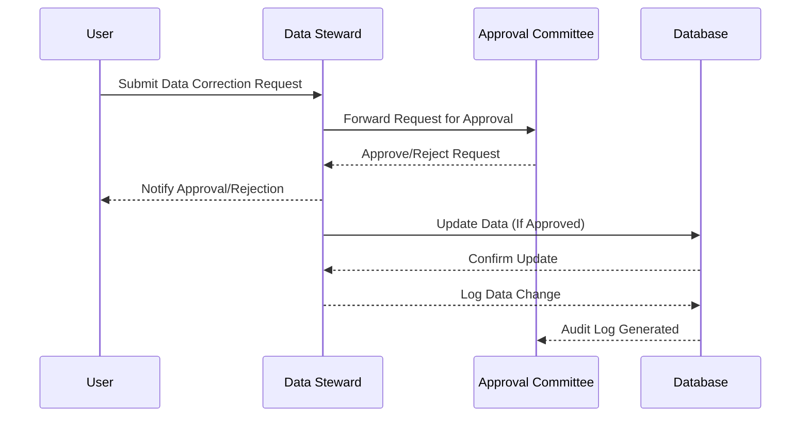

## Data Correction Roles and Responsibilities

The **Data Correction Roles and Responsibilities** design pattern focuses on establishing clearly defined roles and responsibilities for managing data corrections within an organization. This pattern is essential for maintaining data integrity and ensuring that only authorized personnel can make data changes. By creating a structured framework for data governance, organizations can improve data quality and accountability.

### Context

In modern organizations, data is a critical asset that drives decision-making and operational processes. However, data inconsistencies and errors can arise due to various factors such as data entry mistakes, integration issues, or system errors. Without a structured approach to correct these errors, data quality can deteriorate, leading to misinformed decisions and operational inefficiencies.

### Problem

How can an organization ensure that data corrections are made accurately and responsibly, without compromising data integrity or security?

### Solution

Implement the **Data Correction Roles and Responsibilities** design pattern, which involves:

- **Role Definition**: Establish specific roles for data correction, such as Data Stewards, Data Quality Analysts, and System Administrators.
- **Authorization Control**: Implement access controls to ensure that only authorized personnel can perform data corrections.
- **Governance Policies**: Develop governance policies outlining the standard procedures and approval workflows for data correction activities.
- **Audit Trails**: Maintain detailed logs of all data correction activities to enable traceability and accountability.

### Example

In a retail organization, customer data is a crucial asset that influences marketing strategies and customer relationship management. To ensure the integrity of customer data, the organization:

- Assigns **Data Stewards** the responsibility of managing master data alterations. These stewards are trained personnel with a deep understanding of data governance.
- Develops a formal process for requesting and approving data changes, involving multiple levels of review.
- Utilizes database management systems with robust role-based access control (RBAC) mechanisms to enforce authorization policies.
- Ensures the creation of audit logs for all data correction activities, which can be reviewed by compliance teams.

### Diagram

Here is a Mermaid UML Sequence Diagram that illustrates the data correction process:

### Related Patterns

- **Role-Based Access Control (RBAC)**: Ensures that users have appropriate access based on their roles.
- **Data Audit Log**: Maintains a record of changes made to the data for traceability.
- **Master Data Management (MDM)**: Centralizes and standardizes the handling of critical data elements.

### Best Practices

- Clearly define data correction roles and responsibilities in your organizational policies.
- Implement stringent access controls to prevent unauthorized data modifications.
- Regularly review and update your data governance policies to reflect changing regulations and industry best practices.
- Provide training to relevant staff on data management and correction procedures.

### Additional Resources

- Book: *Data Governance: How to Design, Deploy and Sustain an Effective Data Governance Program* by John Ladley
- Online Resource: [The Data Governance Institute](http://www.datagovernance.com/)
- Whitepaper: *Data Stewardship: A Best Practices Guide* (available from tech industry resources)

### Summary

The **Data Correction Roles and Responsibilities** design pattern is instrumental in enhancing data integrity and accountability within an organization. By clearly defining the roles and responsibilities for data correction, organizations can manage data quality more effectively, ensuring accurate data is available for decision-making. Implementing this pattern leads to improved trust in data, reduced risk of data breaches, and adherence to compliance standards.
