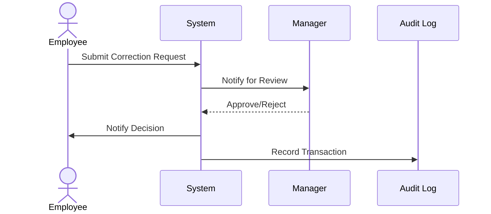

Correction Approval Workflows are essential in environments where data integrity and auditability are of paramount importance. This pattern ensures that any modifications to existing data are reviewed and approved by designated authorities before being applied, thus maintaining control over data changes.

## Description

Correction Approval Workflows involve implementing systematic procedures that regulate changes to data by requiring acknowledgment or endorsement from an empowered entity within an organization. The workflow typically consists of three phases: submission, review and approval, and final application.

### Key Components
1. **Submission Interface**: A form or interface where corrective actions are proposed. It captures the details of corrections, the rationale, and the author.
2. **Review Mechanism**: The process where proposed corrections are evaluated. This evaluation is performed by a responsible party who can approve, reject, or request more information.
3. **Approval Protocol**: Defined rules and hierarchy that determine who can authorize a correction based on its nature and impact. 
4. **Audit Logging**: Maintaining a detailed log of changes submitted, reviewed, and approved for tracking the decision-making process.
5. **Notification System**: Inform relevant stakeholders about the status of a correction request, ensuring transparency and accountability.

## Architectural Approach

A typical architectural setup for implementing Correction Approval Workflows leverages microservices or modular components to separate concerns like submission, processing, and auditing. This ensures scalability and resilience.

### Example Workflow Process

1. **Submission**: Employee submits a correction request via a web or mobile application.
2. **Validation**: System performs preliminary checks on the data correction request.
3. **Routing**: Request is forwarded to a specific manager or approval board based on predefined business rules.
4. **Approval/Rejection**: Decision is made by the approver who might have the option to add comments or request clarifications.
5. **Automatic Notification**: Notifications are sent out to the relevant parties about the decision.
6. **Logging**: Comprehensive logs are made available for auditing and compliance purposes.

## Example Code

Below is a simplified sample code to illustrate a basic correction approval workflow system utilizing Java and the Spring Boot framework.

```java
@RestController
@RequestMapping("/corrections")
public class CorrectionController {

    @Autowired
    private CorrectionService correctionService;

    @PostMapping("/submit")
    public ResponseEntity<String> submitCorrection(@RequestBody CorrectionRequest request) {
        correctionService.submit(request);
        return ResponseEntity.ok("Correction request submitted.");
    }

    @GetMapping("/review/{id}")
    public ResponseEntity<CorrectionRequest> reviewCorrection(@PathVariable Long id) {
        CorrectionRequest request = correctionService.getCorrectionById(id);
        return ResponseEntity.ok(request);
    }

    @PostMapping("/approve/{id}")
    public ResponseEntity<String> approveCorrection(@PathVariable Long id) {
        correctionService.approve(id);
        return ResponseEntity.ok("Correction request approved.");
    }
}
```

## Diagrams

Below is a Mermaid sequence diagram illustrating the Correction Approval Workflow:



## Related Patterns

1. **Audit Trail Pattern**: Ensures a record of all data modification actions, accommodating compliance and debugging.
2. **Process Automation Pattern**: Utilizes software to execute repeatable tasks, ensuring consistency and reducing errors.
3. **Event-driven Pattern**: Reacts to submitted data changes by triggering approval processes.

## Additional Resources

- Martin Fowler's book on [Enterprise Integration Patterns](https://www.amazon.com/Enterprise-Integration-Patterns-Designing-Deploying/dp/0321200683).
- [BPMN (Business Process Model and Notation)](https://www.omg.org/spec/BPMN/2.0/) for designing process models.
- Spring Cloud's [Microservices Documentation](https://spring.io/projects/spring-cloud) 

## Summary

Correction Approval Workflows offer a structured approach to modifying sensitive data within organizations. By ensuring that changes need to be approved by responsible parties before being applied, this pattern upholds data integrity and meets regulatory compliance requirements. As businesses increasingly rely on data-driven decisions, having robust mechanisms for managing data corrections is critical. This practice not only enforces organizational policies but also fosters an environment of transparency and accountability.
