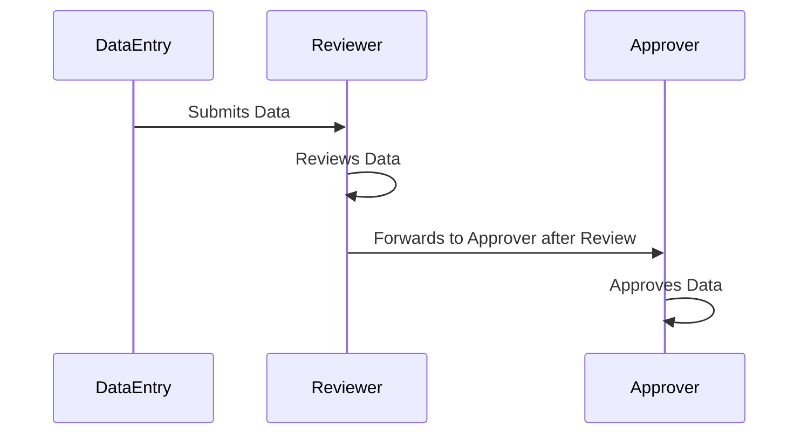

## Overview

The Segregation of Duties (SoD) design pattern is a critical strategy in both physical and digital systems to minimize risks associated with errors and fraud. By distributing tasks and associated privileges for a particular process among multiple users or systems, it prevents single points of failure and reduces the likelihood of improper actions.

## In-Depth Explanation

Segregation of Duties is a fundamental element in system security and integrity. By ensuring that no one individual has control over all phases of a critical process, this pattern helps organizations to:

- **Minimize Risk**: Reduce the potential for unauthorized or fraudulent activities.
- **Enhance Accuracy**: Ensure a greater chance of errors being detected before any negative impact.
- **Compliance**: Meet various regulatory requirements that demand the implementation of SoD for increased transparency and oversight.

### Key Concepts

1. **Task Separation**: Dividing tasks among multiple actors, such that the responsibilities for executing, verifying, and approving processes are divided.

2. **Role Differentiation**: Assigning responsibilities to different roles ensures that conflicting roles are not performed by the same individual.
  
3. **Access Control**: Implementing strict access rights and auditing logins and actions to ensure that tasks are performed by the designated individuals.

## Example

Consider a scenario in enterprise resource planning (ERP) systems where:

- **Data Entry Personnel**: Input transactional data.
- **Reviewer**: Checks for data accuracy and flags discrepancies.
- **Approver**: Confirms and finalizes the transaction after all checks.

By segregating these duties, the organization ensures that data entry errors are caught and corrected before final approval, thus maintaining data integrity.

### Code Example (e.g., in Java)

```java
public class SegregationOfDutiesExample {

    // Interface for duties
    interface Duty {
        void perform();
    }

    // Data Entry Implementation
    static class DataEntry implements Duty {
        @Override
        public void perform() {
            System.out.println("Performing Data Entry...");
        }
    }

    // Review Implementation
    static class Review implements Duty {
        @Override
        public void perform() {
            System.out.println("Reviewing Data...");
        }
    }

    // Approval Implementation
    static class Approval implements Duty {
        @Override
        public void perform() {
            System.out.println("Approving Transaction...");
        }
    }

    public static void main(String[] args) {
        Duty dataEntry = new DataEntry();
        Duty review = new Review();
        Duty approval = new Approval();

        dataEntry.perform();
        review.perform();
        approval.perform();
    }
}
```

## Diagram

Here's a sequence diagram to visualize the flow of the Segregation of Duties pattern:



## Related Patterns

- **Role-Based Access Control (RBAC)**: Establishes restrictions based on the roles of users within an organization, complementing segregation by defining what each role can do.
  
- **Audit Logging Pattern**: Keeps a record of activities that can be reviewed to ensure compliance with SoD.

- **Least Privilege Principle**: Users are granted permission to only the minimal resources necessary to perform their job functions.

## Additional Resources

1. [National Institute of Standards and Technology (NIST) Guidelines](https://nvlpubs.nist.gov/nistpubs/Legacy/SP/nistspecialpublication800-53r3.pdf) - A guide to security and privacy controls that include segregation of duties.
2. [ISO/IEC 27002](https://www.iso.org/standard/54533.html) - An international standard that provides guidelines for organizational information security standards.
3. [CIS Controls](https://www.cisecurity.org/controls/) - A set of best practices for securing IT systems that also reference SoD.

## Summary

The Segregation of Duties pattern is an essential practice in maintaining system integrity, security, and compliance. By dividing responsibilities across different roles and enforcing strict control over who can execute each task, organizations can significantly reduce the risks associated with errors, mismanagement, and fraudulent activities. Implementing this pattern effectively requires a clear understanding of the tasks, roles, and necessary controls within a system.
