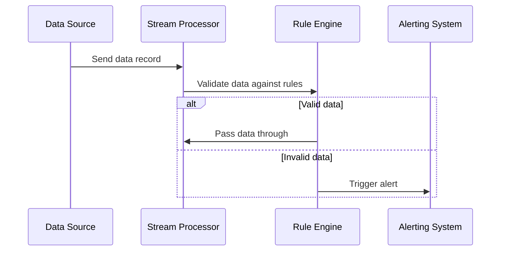

---

linkTitle: "Data Monitoring Systems"
title: "Data Monitoring Systems"
category: "Correction and Reconciliation Patterns"
series: "Data Modeling Design Patterns"
description: "Automated systems that monitor data for inconsistencies in real-time, improving data quality and compliance."
categories:
- Correction Patterns
- Reconciliation Patterns
- Data Quality
tags:
- Data Monitoring
- Real-time Analytics
- Data Integrity
- Correction Patterns
- Data Compliance
date: 2024-07-07
type: docs
canonical: "https://softwarepatternslexicon.com/103/7/28"
license: "© 2024 Tokenizer Inc. CC BY-NC-SA 4.0"
---

## Introduction

Within the realm of data-centric applications, maintaining data quality and integrity is paramount. "Data Monitoring Systems" are architectural design patterns prevalent in real-time data systems. They automate the process of detecting inconsistencies, errors, and anomalies in data as it flows through a system, offering crucial benefits for data governance and quality assurance.

## Detailed Explanation

Data Monitoring Systems leverage automated tools and processes to continuously observe and validate data integrity across distributed systems. These systems not only enhance data quality but also ensure compliance with predefined business rules and regulatory standards. By employing real-time monitoring, organizations can quickly respond to issues such as incomplete records or erroneous entries, ultimately minimizing the impact of poor data on business operations.

### Architectural Approaches

- **Stream Processing**: Implementing data monitoring using stream processing frameworks like Apache Kafka Streams or Apache Flink allows for real-time evaluations and instant alerting systems for detected irregularities.

- **Rule Engines**: Deploying rule-based systems that automatically apply validation rules across data pipelines, ensuring that only compliant data is processed further. This can often be implemented using tools like Drools or JBoss.

- **Machine Learning Models**: Utilizing machine learning models for anomaly detection within datasets, these systems can flag unusual patterns which might not have been anticipated, helping preempt data integrity issues.

### Example Code

Below is a simplified example of a rule-based data monitoring system using Apache Kafka:

```java
import org.apache.kafka.streams.KafkaStreams;
import org.apache.kafka.streams.StreamsBuilder;
import org.apache.kafka.streams.kstream.KStream;
import org.apache.kafka.streams.kstream.Predicate;

public class DataMonitoringExample {

    public static void main(String[] args) {
        StreamsBuilder builder = new StreamsBuilder();

        KStream<String, String> salesOrders = builder.stream("sales-orders");
        
        Predicate<String, String> invalidCustomerPredicate = (key, value) -> 
                value.contains("customerId: null");

        KStream<String, String>[] branches = salesOrders.branch(invalidCustomerPredicate, (key, value) -> true);

        branches[0].to("alert-missing-customer");

        KafkaStreams streams = new KafkaStreams(builder.build(), new StreamsConfig("config.properties"));
        streams.start();
    }
}
```

### Diagrams

#### Data Monitoring System Sequence Diagram



## Related Patterns

- **Data Validation Pattern**: Focuses on verifying data quality at the point of entry.
- **Event Sourcing**: A technique where state changes are logged as a sequence of events, enabling reconstruction of state and auditing.
- **Data Quality Firewall**: Acts as a filter to prevent low-quality data from entering the system.

## Additional Resources

- [The Data Warehouse Toolkit by Ralph Kimball](https://www.amazon.com/Data-Warehouse-Toolkit-Ralph-Kimball/dp/1118530802)
- [Machine Learning for Anomaly Detection Conference Papers](https://scholar.google.com)

## Summary

Data Monitoring Systems are pivotal in automating the oversight of data quality and integrity in real-time. By integrating stream processing, rule engines, and machine learning, these systems provide robust mechanisms for proactively addressing data-related issues, thus optimizing data pipelines for accuracy and reliability. Their implementation helps organizations to comply with industry standards and enhances operational efficiency by maintaining a solid foundation of high-quality data.
