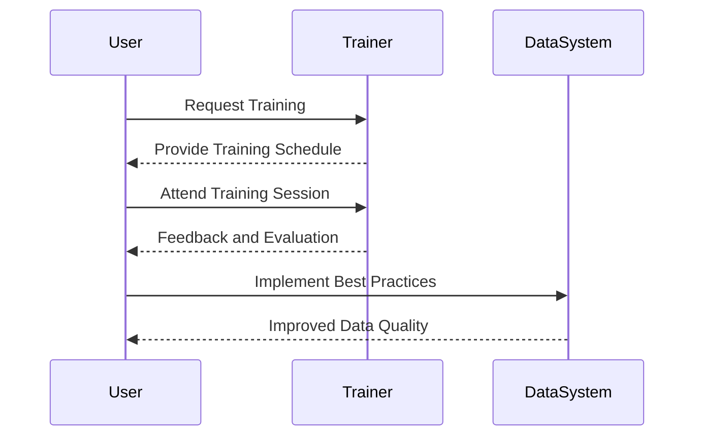

## Overview

In the realm of data management, maintaining high-quality data is essential to derive meaningful insights. User training on data quality is a process-oriented design pattern aimed at educating users on the importance of accurate data entry and effective correction procedures. This pattern focuses on creating a culture of accountability and awareness, enabling users to be proactive in maintaining data integrity.

## Detailed Explanation

User training on data quality involves the following key components:

1. **Awareness Programs**: Conducting workshops and seminars to increase awareness about the significance of data quality and its impact on business operations.

2. **Hands-On Training**: Organizing regular training sessions where users are taught best practices in data entry, common pitfalls, and corrective measures to rectify errors.

3. **Standard Operating Procedures (SOPs)**: Developing and distributing SOPs that include guidelines for data entry, validation, and correction processes.

4. **Feedback Mechanisms**: Implementing feedback loops where users can report issues and suggest improvements, ensuring continuous enhancement of data quality protocols.

5. **Incentive Programs**: Encouraging adherence to data quality standards by recognizing and rewarding users who consistently demonstrate high levels of data integrity.

## Best Practices

- **Tailored Training Programs**: Customize training sessions based on user roles and responsibilities to ensure relevance and effectiveness.
  
- **Continuous Learning Approach**: Establish an ongoing learning culture by updating training materials regularly to reflect changes in data processes and frameworks.

- **Collaborative Learning**: Foster an environment of peer-to-peer learning where users share experiences and strategies for improving data quality.

- **Accessible Resources**: Provide users with easy access to training materials and support resources.

## Example Code

While user training itself does not involve traditional coding, implementing systems to track data quality issues can involve scripting. For instance, a simple script to track input errors in a database system can look like this:

```sql
CREATE TABLE DataEntryErrors (
    id SERIAL PRIMARY KEY,
    user_id INT NOT NULL,
    error_type VARCHAR(255),
    error_description TEXT,
    timestamp TIMESTAMP DEFAULT CURRENT_TIMESTAMP
);

INSERT INTO DataEntryErrors (user_id, error_type, error_description)
VALUES (101, 'Input Error', 'Invalid date format');
```

## Diagrams

Below is a Mercruid UML Sequence Diagram illustrating the process flow for user training on data quality:



## Related Patterns

- **Data Validation Pattern**: Ensures data meets predefined criteria before being entered into the system.
- **Data Cleansing Pattern**: Process of detecting and correcting corrupt or inaccurate records from a dataset.

## Additional Resources

- "[Data Quality Fundamentals](https://example.com/data-quality-fundamentals)" - A comprehensive guide on maintaining high data standards.
- "[Improving Data Entry Practices](https://example.com/improving-data-entry)" - Tips and strategies for effective data entry operations.
- "[Employee Data Training Framework](https://example.com/employee-data-training)" - A framework for developing role-specific data training programs.

## Summary

The User Training on Data Quality pattern emphasizes the critical role users play in data management. By investing in comprehensive training programs, organizations can significantly enhance their data quality, leading to more accurate analytics and informed decision-making.
