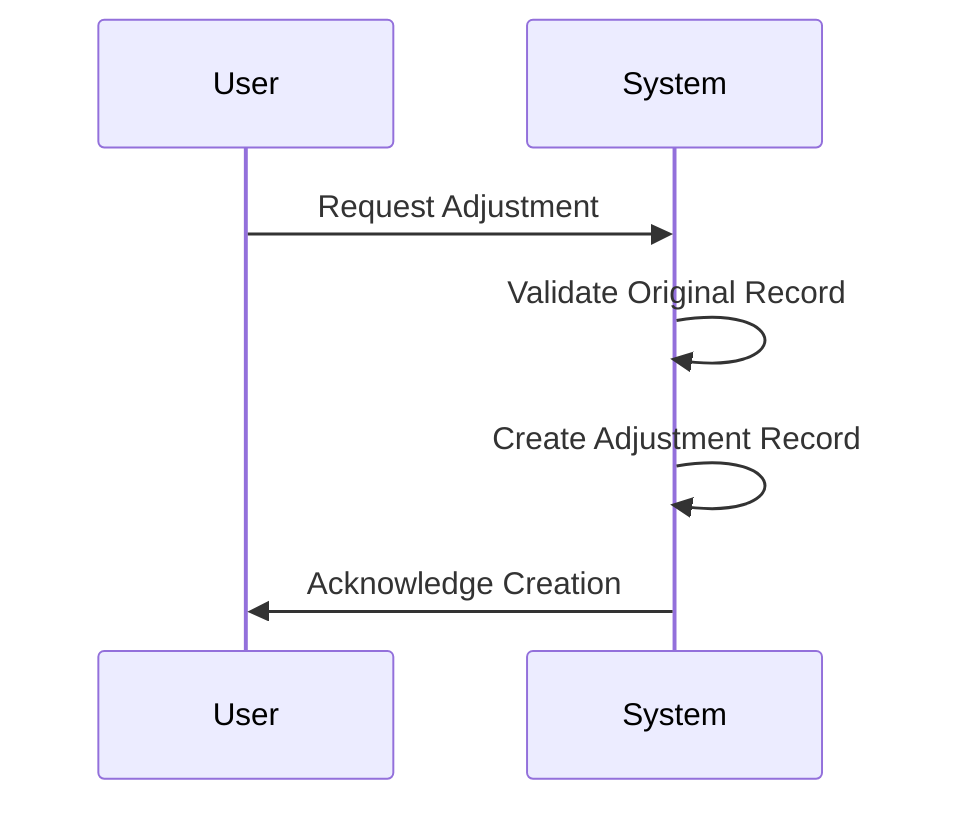

---

linkTitle: "Adjustment Records"
title: "Adjustment Records"
category: "Correction and Reconciliation Patterns"
series: "Data Modeling Design Patterns"
description: "A design pattern that involves adding records to adjust the effects of previous data without deleting them. This approach ensures data consistency and traceability in scenarios such as inventory management and financial reconciliations."
categories:
- Data Modeling
- Data Integrity
- Cloud Patterns
tags:
- Adjustment Records
- Data Consistency
- Logging
- Reconciliation
- Data Traceability
date: 2024-07-07
type: docs

canonical: "https://softwarepatternslexicon.com/103/7/3"
license: "© 2024 Tokenizer Inc. CC BY-NC-SA 4.0"
---

## Overview

The Adjustment Records pattern is a crucial design strategy used in data systems to record changes or corrections without altering the original data. This pattern enhances data integrity, ensures traceability, and supports historical auditing by adding new records to offset or adjust prior discrepancies. Common applications include inventory management, financial accounting, and any system requiring precise correction logging.

## Detailed Explanation

### Design Considerations

When implementing the Adjustment Records pattern, it is important to consider:
- **Data Integrity**: Preserve original records intact and immutable to maintain a clear historical trail.
- **Auditability**: Capture all relevant information regarding the adjustment to support downstream audit and monitoring processes.
- **Data Consistency**: Ensure that adjustments accurately reflect the intended changes and do not introduce new errors.

### Architectural Approaches

- **Immutable Data Structures**: Use immutable data storage solutions which inherently support adjustment logs without risking data corruption.
- **Event Sourcing**: Apply event sourcing principles where changes are logged as a series of events; each adjustment is a distinct event that alters the current state of an aggregate.
- **Temporal Databases**: Utilize databases that support temporal data constructs to manage changes over time seamlessly.

### Best Practices

- Always annotate adjustment records with metadata such as timestamp, user information, reason for adjustment, and reference to the original record.
- Employ validation procedures to ensure adjustments are accurately and consistently applied.
- Implement access controls to restrict who can create adjustment records and under what circumstances.

## Example Code

Here is an example in which an adjustment is made to inventory records:

```scala
case class InventoryRecord(itemId: String, quantity: Int, adjustment: Int, timestamp: Long)

def createAdjustmentRecord(itemId: String, adjustment: Int): InventoryRecord = {
  val timestamp = System.currentTimeMillis()
  InventoryRecord(itemId, 0, adjustment, timestamp)
}

// Example usage
val adjustment1 = createAdjustmentRecord("item123", 10)
println(adjustment1)
```

## Diagrams



## Related Patterns

- **Audit Log**: This pattern complements the Adjustment Records pattern by systematically recording all actions performed within a system.
- **Compensating Transaction**: Specifically targets undoing actions within a transactional scope to solve partial failures.
- **Event Sourcing**: Logs state changes as events, thus making the adjustment a natural part of the aggregate's lifecycle.

## Additional Resources

- Martin Fowler's article on [Event Sourcing](https://martinfowler.com/eaaDev/EventSourcing.html).
- "Patterns of Enterprise Application Architecture" by Martin Fowler for more on database design patterns.

## Summary

The Adjustment Records pattern is invaluable in systems where preserving the integrity of historical data is paramount. By logging changes as append-only records, systems can maintain actionable insights, traceability, and consistent state management without loss of historical accuracy. This approach is not only a cornerstone for financial and inventory systems but is increasingly relevant across all domains that prioritize data fidelity and regulatory compliance.
