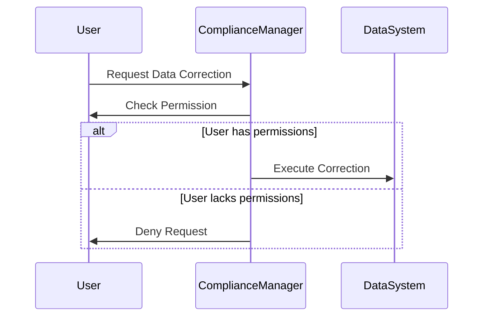

## Legal and Regulatory Compliance

In today's data-driven world, organizations must ensure that all data-related operations and corrections adhere to legal and regulatory requirements. This design pattern focuses on strategies and practices to ensure compliance with applicable laws such as the General Data Protection Regulation (GDPR), the Health Insurance Portability and Accountability Act (HIPAA), and various industry-specific regulations.

### Detailed Explanation

Compliance with legal and regulatory standards requires a deep understanding of the laws applicable to the jurisdiction in which a company operates. It encompasses data collection, storage, processing, and correction practices to ensure that they meet specified requirements regarding privacy, security, legality, and transparency.

#### Key Components:
1. **Policy Enforcement**: Implement policies that govern data handling and ensure everyone in the organization understands and adheres to these rules.
2. **Access Control**: Ensure that only authorized users have access to sensitive data. Implement Role-Based Access Control (RBAC) or Attribute-Based Access Control (ABAC) for robust security measures.
3. **Audit and Logging**: Maintain detailed logs of data operations, including data corrections, to ensure accountability and traceability.
4. **Data Anonymization and Encryption**: Use advanced techniques for data anonymization and encryption to protect sensitive data sets, especially when correcting or rectifying data.
5. **Compliance Monitoring**: Regularly review data operations and processes to identify any discrepancies with compliance requirements and make necessary adjustments.

### Architectural Approaches

- **Centralized Compliance Framework**: Establish a central compliance framework that can universally apply compliance checks across all systems and services.
- **Decoupled Compliance Layer**: Create a decoupled component specifically dedicated to monitoring and enforcing compliance within your architecture. This can be deployed as a microservice or as middleware.

### Best Practices

- **Keep Updated on Regulations**: Regulatory compliance is a moving target. Regularly update your compliance policies to align them with the latest legal and regulatory changes.
- **Integrate Compliance in Development Lifecycle**: Embed compliance requirements into the software development lifecycle to identify and solve compliance issues early.
- **Regular Training for Staff**: Conduct regular training sessions to ensure all members of your organization understand the current laws and the importance of compliance.
- **Third-Party Audits**: Regularly employ third-party experts to audit your compliance strategies and execution to get unbiased insights.

### Example Code

Here's an example illustrating Role-Based Access Control for data correction operations in an application using a Java-based solution:

```java
public class ComplianceManager {

    public boolean hasPermission(User user, DataCorrectionRequest request) {
        // Get the user's roles
        List<String> roles = user.getRoles();

        // Check if the user's roles allow the specific correction operation
        if (roles.contains("DATA_ADMIN") || (roles.contains("DATA_ANALYST") && request.isMinorCorrection())) {
            return true;
        }
        return false;
    }
    
    public void executeCorrection(User user, DataCorrectionRequest request) {
        if (hasPermission(user, request)) {
            // Apply the correction logic here
        } else {
            throw new SecurityException("User does not have permission to execute this correction.");
        }
    }
}
```

### Diagrams

Below is a simplified Mermaid UML Sequence Diagram illustrating a compliance check in data correction flow:



### Related Patterns

- **Data Masking Patterns**: Techniques for obscuring specific parts of the data to prevent unauthorized access.
- **Privacy by Design**: An approach to systems engineering which takes privacy into account throughout the whole engineering process.

### Additional Resources

- [General Data Protection Regulation (GDPR)](https://gdpr-info.eu/)
- [U.S. Health Insurance Portability and Accountability Act (HIPAA)](https://www.hhs.gov/hipaa/index.html)
- [ISO/IEC 27001 – Information security management](https://www.iso.org/isoiec-27001-information-security.html)

### Final Summary

Adhering to legal and regulatory compliance is an integral part of business operations in the digital age. Implementing a structured and proactive approach to compliance not only ensures conformity with applicable laws but also builds trust with customers and partners by protecting sensitive information and maintaining transparency in data handling processes. Organizations should leverage established compliance frameworks and best practices to navigate this complex landscape effectively.
