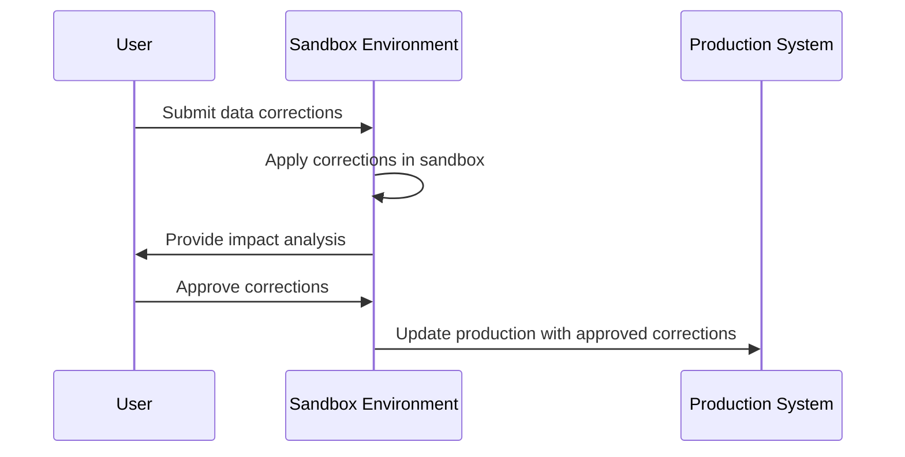

## Data Correction Impact Modeling

### Description

Data Correction Impact Modeling is a design pattern that addresses the challenges of ensuring data integrity and accuracy. This pattern focuses on simulating the potential effects of data corrections within a controlled environment before implementing them in production systems. By modeling these impacts, organizations can better understand the outcomes of corrections, anticipate any possible disruptions, and make informed decisions.

### Architectural Approaches

1. **Sandbox Environments**: Create isolated environments that mimic production settings to model the effects of data corrections.
   - **Advantages**: Prevents unintended consequences in the live environment.
   - **Challenges**: Requires resources to create and maintain realistic replicas.

2. **Versioning Systems**: Implement data versioning to track changes over time and revert if corrections lead to adverse outcomes.
   - **Advantages**: Provides historical data points for comparison.
   - **Challenges**: Complexity in managing multiple data versions.

3. **Change Data Capture (CDC)**: Leverage CDC to monitor and manage the flow of data changes in real-time.
   - **Advantages**: Enables incremental data corrections without full data reprocessing.
   - **Challenges**: Performance overhead associated with continuous change monitoring.

### Paradigms and Best Practices

- **Iterative Testing**: Conduct multiple test cycles within sandbox environments to increase reliability of corrections.
- **Stakeholder Review**: Involve domain experts in reviewing potential corrections to ensure comprehensiveness.
- **Automated Testing Frameworks**: Utilize automated test cases that reflect real-world scenarios for efficient and effective validation.
- **Data Auditing**: Implement auditing mechanisms to log corrective actions and their impacts for future reference.

### Example Code

Below is a conceptual example using Python for a sandbox simulation of data corrections:

```python
import copy

class DataEnvironment:
    def __init__(self, data):
        self.original_data = data
        self.sandbox_data = copy.deepcopy(data)

    def apply_corrections(self, corrections):
        for correction in corrections:
            self.sandbox_data[correction['index']] = correction['newValue']

    def evaluate_impact(self):
        # This is a placeholder for whatever evaluation logic helps determine success
        impact_score = sum(self.sandbox_data) - sum(self.original_data)
        return impact_score

data = [10, 20, 30, 40]
corrections = [{'index': 2, 'newValue': 60}]

env = DataEnvironment(data)
env.apply_corrections(corrections)
impact = env.evaluate_impact()
print(f"Impact of corrections: {impact}")
```

### Diagrams

#### Mermaid UML Sequence Diagram



### Related Patterns

- **Event Sourcing**: Helps maintain a clear event log for corrections and their effects over time.
- **Rollback Strategy**: Applies when corrections need to be undone without impacting system integrity.
- **Data Enrichment Patterns**: Useful for adding necessary contextual data during correction modeling.

### Additional Resources

- [Wikipedia on Data Cleansing](https://en.wikipedia.org/wiki/Data_cleansing)
- [Article: Best Practices for Data Correction](ttps://example.com/best-practices-data-correction)

### Summary

Data Correction Impact Modeling empowers organizations to make safe and effective data corrections through simulation and analysis. By utilizing sandbox environments and iterative testing, both immediate and long-term impacts on data systems can be assessed. This pattern not only safeguards data integrity but also enhances decision-making processes across data-driven business operations.
