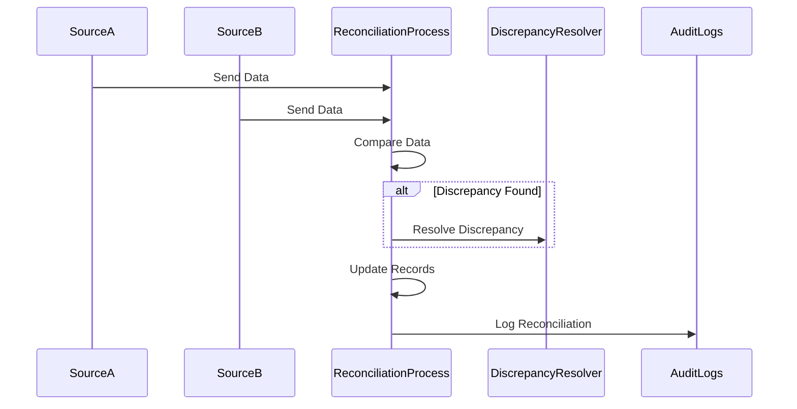

## Introduction

The data reconciliation process is essential in ensuring data accuracy and consistency across various systems and sources. Discrepancies in data can lead to inaccurate insights, financial errors, and lost business opportunities. This design pattern focuses on comparing data from different sources to identify and resolve inconsistencies.

## Problem Statement

Organizations often maintain data across multiple systems, databases, and third-party solutions. With different systems inherently having varying update mechanisms and frequencies, ensuring data consistency across these systems can be challenging. The problem arises when data inconsistencies lead to conflicting reports, operational inefficiencies, and erroneous decision-making.

## Solution

Data reconciliation involves systematically comparing and correcting data from disparate sources to ensure consistency and accuracy. This process typically comprises the following steps:

1. **Data Extraction**: Obtain data from various sources like databases, applications, and files needed for reconciliation.
2. **Data Transformation**: Apply necessary transformations to align data formats, types, and structures across systems for a uniform basis of comparison.
3. **Data Comparison**: Utilize algorithms or manual checks to identify discrepancies between the datasets.
4. **Discrepancy Resolution**: Address identified discrepancies through automated processes or human intervention to ensure synchronization.
5. **Reporting and Documentation**: Document the reconciliation process, discrepancies found, resolved, and pending issues for auditing and transparency.

## Architectural Approaches

There are several architectural approaches to implement data reconciliation:

- **Batch Processing**: Execute data reconciliation tasks periodically, typically during non-peak hours, where data volumes are vast, but immediate data consistency is not critical.
- **Real-time Processing**: Leverage streaming platforms like Apache Kafka or AWS Kinesis to identify and resolve inconsistencies as they occur, ensuring near real-time data consistency across systems.
- **Hybrid Approaches**: Use a combination of batch and real-time processing to optimize performance and accuracy, focusing immediately on high-priority discrepancies while handling others on a scheduled basis.

## Example Code

Here's a simplified example using Python to demonstrate a basic reconciliation process:

```python
import pandas as pd

source_a = pd.DataFrame({
    'account_id': [1, 2, 3],
    'balance': [100, 200, 300]
})

source_b = pd.DataFrame({
    'account_id': [1, 2, 3],
    'balance': [100, 250, 300]
})

merged_data = pd.merge(source_a, source_b, on='account_id', suffixes=('_a', '_b'))
discrepancies = merged_data[merged_data['balance_a'] != merged_data['balance_b']]

if not discrepancies.empty:
    print("Discrepancies found:\n", discrepancies)
else:
    print("No discrepancies found.")
```

## Diagrams

### Sequence Diagram



## Related Patterns

- **ETL (Extract, Transform, Load)**: Often a precursor to reconciliation where data is integrated from different sources and transformed for analysis.
- **Master Data Management (MDM)**: It ensures a single reliable source of truth within the organization by maintaining consistent data definitions.
- **Data Cleansing**: Improves data quality and paves the way for successful reconciliation by removing inaccuracies and redundancies.

## Additional Resources

- [Data Reconciliation in ETL Processes](https://examplelink.com)
- [Best Practices for Data Synchronization](https://examplelink.com)
- [Mastering Data Quality in Data Lakes](https://examplelink.com)

## Summary

Data Reconciliation Processes play a vital role in maintaining data integrity across diversified data sources. By systematically reconciling data, organizations can ensure that decisions are based on consistent and reliable data. Balancing batch and real-time strategies, while integrating supportive patterns like ETL and MDM, enhances the effectiveness of reconciliation efforts in enterprise systems.
