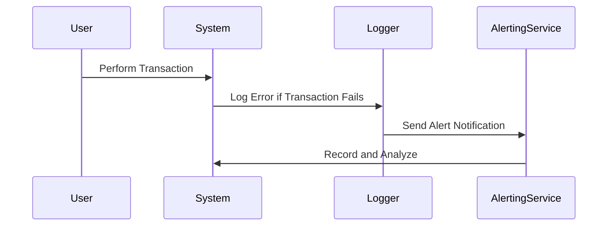

---

linkTitle: "Error Logging and Reporting"
title: "Error Logging and Reporting"
category: "Correction and Reconciliation Patterns"
series: "Data Modeling Design Patterns"
description: "A robust pattern for logging errors and anomalies in systems to facilitate streamlined review, correction, and reporting processes, ensuring high data quality and system reliability."
categories:
- Correction and Reconciliation Patterns
- Data Integrity
- Monitoring
tags:
- Error Logging
- Anomaly Detection
- Data Quality
- System Reliability
- Error Reporting
date: 2024-07-07
type: docs

canonical: "https://softwarepatternslexicon.com/103/7/5"
license: "© 2024 Tokenizer Inc. CC BY-NC-SA 4.0"
---

## Overview

The Error Logging and Reporting pattern is an essential component in modern distributed systems that deal with large volumes of data. The focus is on capturing errors and anomalies in the system where they occur and ensuring they are logged for examination and corrective actions. This pattern improves the reliability of systems by providing insights into operational failures and quality issues.

## Detailed Explanation

### Purpose

The primary aim of the Error Logging and Reporting pattern is to detect, capture, and manage errors across an application. Effective implementation results in quick identification and rectification of issues, minimizing the impact on end-users and system integrity.

### Architectural Considerations

1. **Centralized Logging System**: Utilize a centralized logging architecture where logs from various components are aggregated and stored in a single, queryable system. Technologies like ELK Stack (Elasticsearch, Logstash, Kibana) or centralized cloud logging services from AWS, Azure, or GCP are ideal for this purpose.

2. **Error Categorization**: Classify errors by types, such as validation errors, transactional inconsistencies, and system failures. This segmentation helps prioritize actions and resolve issues more systematically.

3. **Real-Time Notification**: Implement real-time alerting for critical errors. Integration with services like Slack, PagerDuty, or email notifications ensures that the right personnel are promptly informed.

4. **Data Retention Policies**: Define data retention strategies to manage the size of the error logs, balancing cost and usefulness, and ensuring compliance with data protection regulations.

5. **Security and Privacy**: Ensure that logging complies with security best practices, avoiding sensitive data exposure in the logs and ensuring logs are encrypted in transit and at rest.

### Best Practices

- **Standardized Logging Format**: Use consistent logging formats such as JSON or structured log formats that facilitate parsing and processing.
- **Correlation IDs**: Use identifiers to correlate logs related to the same transaction or user session, thus simplifying debugging across distributed components.
- **Error Recovery Strategies**: Implement automated error recovery processes where feasible, such as retry mechanisms or alternative data flow paths.
- **Regular Audits**: Conduct periodic audits of log entries to uncover systemic issues, ensure compliance, and refine alerting rules.

### Example Code Snippet

Here is a sample code snippet in Java for logging errors using SLF4J (Simple Logging Facade for Java):

```java
import org.slf4j.Logger;
import org.slf4j.LoggerFactory;

public class TransactionProcessor {
    private static final Logger logger = LoggerFactory.getLogger(TransactionProcessor.class);

    public void processTransaction(Transaction tx) {
        try {
            // Transaction processing logic
        } catch (Exception e) {
            logger.error("Error processing transaction ID {}: {}", tx.getId(), e.getMessage());
            // Additional actions like notifying an error tracking dashboard
        }
    }
}
```

### Diagrams

Below is a simple Mermaid sequence diagram showing an example error logging flow:



## Related Patterns

- **Retry Pattern**: In conjunction with error logging, this pattern provides strategies for reattempting failed operations.
- **Circuit Breaker Pattern**: Works to prevent the system from repeated struggling with known faults and conserves its resources for more productive tasks.
- **Audit Trail Pattern**: Provides comprehensive logging beyond just errors to include user actions and changes, enhancing system accountability.

## Additional Resources

- [Centralized Logging with Kubernetes](https://kubernetes.io/docs/concepts/cluster-administration/logging/)
- [The Twelve-Factor App - Logs](https://12factor.net/logs)
- [Designing Distributed Systems: Patterns and Paradigms for Scalable, Reliable Services](https://www.amazon.com/Designing-Distributed-Systems-Paradigms-Scalable/dp/1491983647)

## Summary

Error Logging and Reporting form the backbone of maintaining data integrity and system resilience. By systematically capturing errors, categorizing them, and notifying stakeholders, organizations can quickly address underlying issues that could otherwise escalate to significant failures. Implementing this pattern strategically ensures a robust error handling framework that enhances overall system quality and user satisfaction.


