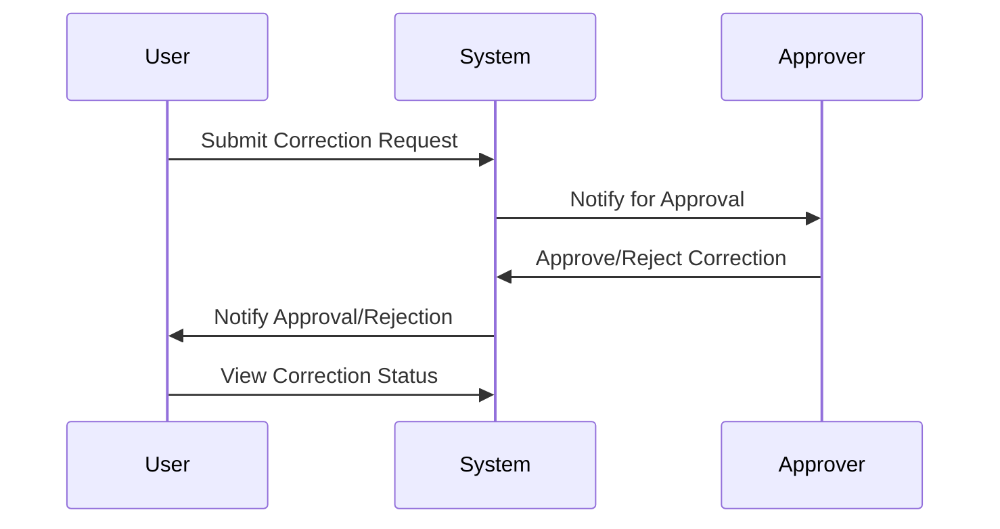

## Description

The Manual Correction Workflow design pattern focuses on establishing procedures to handle manual data corrections that require controlled and traceable modifications. It ensures data integrity by applying a formal process that involves validation, error handling, approval mechanisms, and audit trails. This pattern is especially critical in domains where data precision is crucial, such as finance, healthcare, or regulatory compliance.

## Architectural Overview

Manual data correction processes generally follow specific stages, such as identification of the error, request for correction, approval, and implementation of changes, all tracked in a system that provides auditability.

**Key Components**

1. **Error Identification**: Mechanisms to detect and report errors, often involving validation rules or custom alerts.
2. **Correction Request**: A defined process for submitting correction requests, typically via form submissions or service requests.
3. **Approval Workflow**: An integrated approval process, often multi-tiered, depending on the data sensitivity.
4. **Audit & Traceability**: Logging modifications including timestamps, user information, and reasons for changes.
5. **Notification System**: To keep stakeholders informed at different workflow stages, using emails or dashboards.

## Best Practices

- Define clear roles and responsibilities for each stage in the correction workflow.
- Implement rigorous validation checks to prevent manual entry errors.
- Use version control for data to ensure that changes can be reverted in case of incorrect corrections.
- Incorporate automated error detection where possible, reducing the need for manual interventions.
- Ensure all change requests and corrections are documented and audit trails are maintained.

## Example Code

Here is a sample pseudo-code structure demonstrating a manual correction request system using an event-driven architecture:

```typescript
interface CorrectionRequest {
    id: string;
    dataField: string;
    originalValue: string;
    suggestedValue: string;
    reason: string;
    status: "pending" | "approved" | "rejected";
    comments: string[];
}

class CorrectionWorkflow {
    requests: Map<string, CorrectionRequest> = new Map();

    submitRequest(request: CorrectionRequest) {
        request.status = "pending";
        this.requests.set(request.id, request);
        // notify approvers
    }

    approveRequest(requestId: string, approverComment: string) {
        const request = this.requests.get(requestId);
        if (request) {
            request.status = "approved";
            request.comments.push(approverComment);
            // apply correction logic
            // update audit logs
        } else {
            throw new Error("Request not found");
        }
    }

    rejectRequest(requestId: string, approverComment: string) {
        const request = this.requests.get(requestId);
        if (request) {
            request.status = "rejected";
            request.comments.push(approverComment);
            // update audit logs
        } else {
            throw new Error("Request not found");
        }
    }
}
```

## Diagram

Here is a Mermaid sequence diagram illustrating a simple manual correction workflow:



## Related Patterns

- **Event Sourcing**: Maintains an immutable record of all changes, allowing manual corrections to be implemented through event logs.
- **Approval Workflow**: A broader pattern for handling approval processes outside data corrections, like resource allocations.

## Additional Resources

- [Enterprise Integration Patterns by Gregor Hohpe](https://www.enterpriseintegrationpatterns.com)
- [Patterns of Enterprise Application Architecture by Martin Fowler](https://www.martinfowler.com/books/eaa.html)

## Summary

The Manual Correction Workflow design pattern is vital for ensuring controlled changes in data systems where precision and validation of information are critical. By incorporating clear process steps, role responsibilities, and audit trails, it upholds data integrity and complies with regulatory standards. Through a structured workflow for error corrections, organizations can minimize the risks associated with manual data handling and enhancements.
