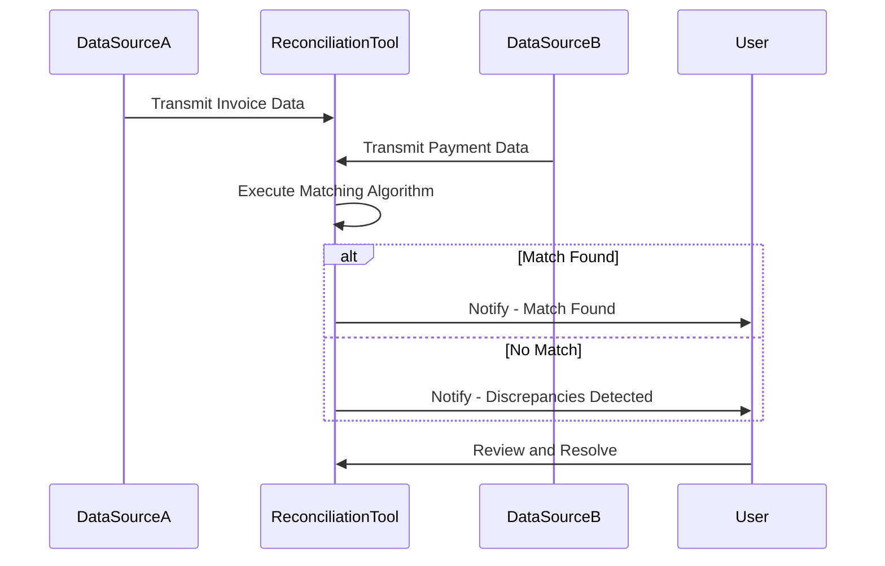

## Automated Reconciliation Tools

### Introduction

Automated Reconciliation Tools are essential in efficiently managing and comparing data across different systems and datasets. Reconciliation involves ensuring that two sets of records are consistent. Traditionally, this was done manually, which was not only time-consuming but also prone to errors. Automation solves these issues by employing algorithms and tools that verify data accuracy and consistency across sources.

### Design Pattern Overview

The Automated Reconciliation Tools pattern leverages technology to automatically identify discrepancies between datasets, propose matches, and in some cases, resolve mismatches without human intervention. This pattern is particularly beneficial in domains that require precise data comparisons, such as finance, supply chain management, and auditing.

### Architectural Approaches

1. **Rule-Based Systems**: Automated rules are created to match records based on predefined criteria such as date, amount, ID, and description.

2. **Machine Learning Algorithms**: Employ supervised or unsupervised learning models that can identify patterns and anomalies that are not apparent in rule-based approaches.

3. **Integration Middleware**: Utilize middleware platforms to connect disparate data sources and streamline reconciliation processes across systems.

4. **Event-Driven Architecture**: Implement an architecture where reconciliation activities are triggered by events (e.g., new transaction entry), allowing for real-time reconciliation.

### Best Practices

- **Data Standardization**: Ensure that data from different sources is standardized before reconciliation to reduce complexity and increase accuracy.

- **Regular Updates**: Maintain up-to-date data in source systems to enhance the effectiveness of reconciliation tools.

- **Audit Trails**: Implement robust logging and audit trails for transparency and troubleshooting purposes.

- **Security Measures**: Protect sensitive data during the reconciliation process by enforcing encryption and access controls.

### Example Implementation

Let's consider an example using an event-driven architecture in a financial system:

```python
import pandas as pd

def reconcile_payments(invoices_df, payments_df):
    # Standardize the data frames
    invoices_df['InvoiceAmount'] = invoices_df['InvoiceAmount'].round(2)
    payments_df['PaymentAmount'] = payments_df['PaymentAmount'].round(2)

    # Reconciliation logic: Match invoices to payments
    reconciliation_result = pd.merge(invoices_df, payments_df, left_on='InvoiceID', right_on='PaymentID', how='outer', indicator=True)
    
    # Filter out unmatched records
    unmatched_invoices = reconciliation_result[reconciliation_result['_merge'] == 'left_only']
    unmatched_payments = reconciliation_result[reconciliation_result['_merge'] == 'right_only']

    return reconciliation_result, unmatched_invoices, unmatched_payments

invoices = pd.DataFrame({'InvoiceID': [1, 2], 'InvoiceAmount': [100.00, 150.00]})
payments = pd.DataFrame({'PaymentID': [1, 3], 'PaymentAmount': [100.00, 150.00]})

result, unmatched_invoices, unmatched_payments = reconcile_payments(invoices, payments)

print("Reconciliation Result: \n", result)
print("Unmatched Invoices: \n", unmatched_invoices)
print("Unmatched Payments: \n", unmatched_payments)
```

### Diagrams

Here's a simple Mermaid sequence diagram illustrating an automated reconciliation process:



### Related Patterns

- **Data Synchronization**: Ensures that data in different locations are updated and consistent.
- **Event Sourcing**: Using a time-ordered sequence of events to update data models and track changes over time.
- **Data Cleansing**: Prior to reconciliation, it may be important for data to be cleansed and pre-processed.

### Additional Resources

- [Reconciliation Techniques in Finance](https://example.com/reconciliation-in-finance)
- [Machine Learning for Reconciliation](https://example.com/ml-for-reconciliation)
- [Best Practices for Data Integration](https://example.com/data-integration-best-practices)

### Summary

In summary, Automated Reconciliation Tools are invaluable in data management, particularly where accuracy and efficiency are vital. By using smart algorithms and software tools, organizations can automate the reconciliation process, reduce errors, and save both time and resources. Implementing these tools requires careful consideration of data sources, integration methods, and security measures. With advances in technology, utilizing machine learning models can further enhance capabilities to detect patterns and resolve discrepancies autonomously.
