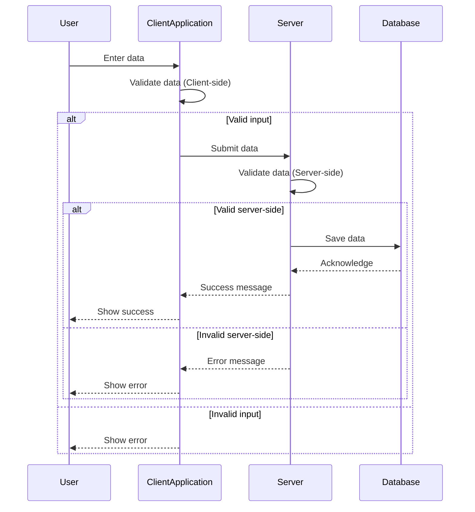

## Overview
Data Validation Rules are essential in maintaining data quality and integrity across systems and applications. These rules are designed to enforce constraints and conditions that data must meet before being processed or stored in databases. Whether validating entries such as social security numbers, ensuring data is in the correct format, or verifying against predefined criteria, data validation rules are critical components of modern data-centric applications.

## Design Pattern Explanation

### Key Concepts
- **Validation Layer**: A component of the architecture specifically responsible for enforcing data validation rules.
- **Constraints**: Conditions or rules defined to ensure data accuracy and integrity.
- **Error Handling**: Mechanisms in place to handle invalid data inputs, often providing feedback to users or systems.

### Example Code
Consider a scenario where you need to validate a social security number (SSN) in an application. Here’s a simple JavaScript function to validate SSN:

```javascript
function validateSSN(ssn) {
    const ssnPattern = /^\d{3}-\d{2}-\d{4}$/;
    return ssnPattern.test(ssn);
}

// Example usage
const ssn = "123-45-6789";
console.log(validateSSN(ssn)); // True if valid, False if invalid
```

This code uses a regular expression to check if the given SSN matches the expected format. Such validations can be extended to other fields as required.

### Architectural Approach
- **Client-Side Validation**: Implement data validation rules in user interfaces (UIs) to provide immediate feedback and prevent incorrect data entry.
- **Server-Side Validation**: Complement client-side validation with server-side checks to ensure data integrity, even for direct database interactions or API calls.
- **Database Constraints**: Use database-level constraints like NOT NULL, UNIQUE, FOREIGN KEY, and CHECK to enforce rules at the storage level.

## Best Practices
- Implement both client-side and server-side validations for comprehensive data integrity checks.
- Leverage third-party libraries and frameworks that provide robust validation mechanisms.
- Regularly update validation rules to align with changes in business requirements or regulatory standards.
- Log validation failures for monitoring and auditing purposes.
- Provide clear and informative error messages to aid users in correcting invalid data entries.

## Diagrams

### Sequence Diagram


## Related Patterns
- **Data Cleansing Pattern**: Focuses on removing or correcting inaccurate data that has already been stored.
- **Data Masking Pattern**: Protects sensitive data by obfuscating it as it moves through validation and processing stages.
- **Error Reporting Pattern**: Provides mechanisms for logging and notifying users or administrators about data validation failures.

## Additional Resources
- [OWASP Secure Data Validation](https://owasp.org/www-project-secure-coding-practices/) for secure data validation practices.
- [W3C Data Validation for Web Forms](https://www.w3.org/TR/html5/sec-forms.html) for HTML-based validation techniques.
- Various libraries such as [Joi](https://hapi.dev/module/joi/) for Node.js and [FluentValidation](https://fluentvalidation.net/) for .NET.

## Summary
Data Validation Rules are critical for maintaining data integrity and ensuring that applications work with verified, correct, and meaningful data. Implementing these rules at various layers of an application enhances accuracy, reduces errors, and provides a robust foundation for any data processing system. By combining client-side and server-side validations and leveraging database constraints, developers can create a comprehensive data validation strategy that aligns with modern software engineering standards.
