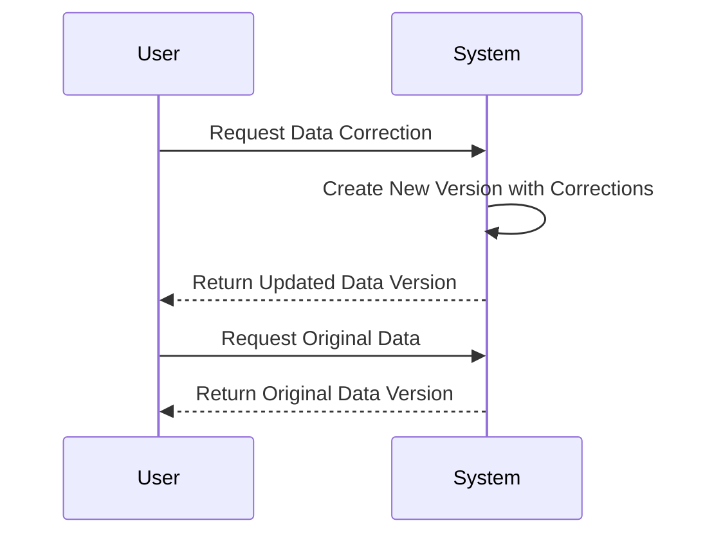

## Introduction

In the realm of data modeling and management, maintaining the integrity and history of data while applying necessary corrections is crucial. The **Versioned Data Corrections** pattern addresses the need to correct data errors or discrepancies without losing the historical data context. This pattern involves creating a new version of the data that reflects the necessary corrections while preserving prior versions for auditing and tracking purposes.

## Problem

Data inconsistencies and errors are common, especially in complex systems where data is collected and processed from multiple sources. Corrections are often needed, but overwriting original data can lead to loss of historical authenticity and make auditing difficult. How can we apply corrections such that both the corrected and original data versions are maintained?

## Solution

The **Versioned Data Corrections** pattern suggests maintaining multiple versions of a data entry. When a correction is required, a new version of the data is created with the necessary changes, while the original version is preserved. This approach allows:

- **Historical Integrity**: Keeping the original data intact for audit and reference.
- **Traceability**: Offering a complete audit trail of the changes made.
- **Data Integrity**: Making sure data correction does not lead to data loss or corruption.
- **Transparency**: Providing different stakeholders visibility into the changes applied over time.

## Example Code

Here's a simple Java example demonstrating this pattern:

```java
import java.util.ArrayList;
import java.util.List;

class DataEntry {
    private final int version;
    private final String content;

    public DataEntry(int version, String content) {
        this.version = version;
        this.content = content;
    }

    public int getVersion() {
        return version;
    }

    public String getContent() {
        return content;
    }
}

class VersionedData {
    private final List<DataEntry> versions = new ArrayList<>();
    private int currentVersion = 0;

    public void addVersion(String content) {
        var entry = new DataEntry(++currentVersion, content);
        versions.add(entry);
    }

    public List<DataEntry> getVersions() {
        return versions;
    }
}

public class VersionedDataCorrectionDemo {
    public static void main(String[] args) {
        VersionedData data = new VersionedData();
        data.addVersion("Original Data");
        data.addVersion("Corrected Data Version 1");
        
        for(DataEntry entry : data.getVersions()) {
            System.out.println("Version: " + entry.getVersion() + ", Content: " + entry.getContent());
        }
    }
}
```

## Diagram

Below an example of how to visually depict this pattern with Mermaid UML:



## Related Patterns

- **Event Sourcing**: Where state changes are stored as a sequence of events. It complements this pattern by providing an event-based history.
- **Audit Logging**: Maintaining a log of changes for security and forensic purposes can be part of or benefit from versioned corrections.
- **Immutable Data Pattern**: While the data versions are separately saved, immutability can help in maintaining the original state.

## Additional Resources

- **Martin Fowler's Patterns of Enterprise Application Architecture** covers related data integrity and reconciliation patterns.
- **Event Sourcing** at microservices.io provides insight into managing state changes as events.

## Summary

The **Versioned Data Corrections** pattern provides a robust solution to manage data corrections without compromising data history and integrity. By maintaining versions of data, organizations can ensure transparency and traceability of data modifications, thus supporting better data governance and compliance objectives. Implementing this pattern allows systems to remain adaptable and maintain high data integrity in the evolving needs of businesses.
