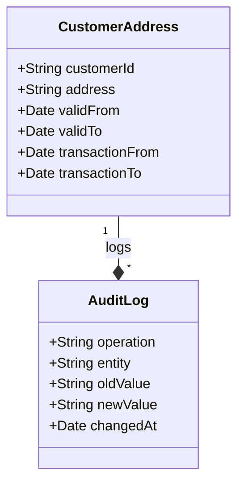

Retroactive changes handling is a design pattern used to apply corrections or updates to data that affects previous historical records. Particularly relevant in domains requiring high data fidelity and integrity, such as finance, healthcare, or legal sectors, this pattern ensures that past errors can be corrected without altering the historical truth as originally recorded.

## Architectural Approach

The retroactive changes handling pattern involves modifying data to reflect changes for past events while maintaining consistent snapshots of historical truth:

1. **Bi-Temporal Data Model**: Utilize a bi-temporal data architecture that distinguishes between valid time (when the fact is true in reality) and transaction time (when the fact was recorded in the database).

2. **Audit and Versioning**: Implement audit trails and version control mechanisms. Every change, whether retroactive or real-time, should be traceable.

3. **Correction Layer**: Introduce a logical layer for retroactive corrections to ensure previous records reflect changes accurately without loss of original history.

4. **Merge Strategy**: Develop a strategy to merge corrected historical data with current records while maintaining bi-temporal constraints.

## Best Practices

- **Data Integrity Check**: Implement comprehensive checks to ensure that retroactive changes do not introduce inconsistencies or corruptions in the data.
  
- **Audit Logs**: Maintain detailed logging of all modifications, noting the original record and the reason for any retroactive change for future auditability.

- **Minimize Impact**: Execute retroactive updates asynchronously to prevent operational impacts, using batch processes or scheduled tasks outside of peak operational hours.

- **Communication and Governance**: Maintain robust workflows for approval and communication of changes to stakeholders to ensure consensus and traceability.

## Example Code

Here’s an example using SQL to handle retroactive changes:

```sql
-- Correcting a Past Address Error for a Customer
UPDATE customer_addresses
SET address = '123 New Street, New City'
WHERE customer_id = 'CUST123'
AND valid_time_period = '2020-01-01' AND transaction_time_period = '2020-01-05';

-- Adding an Audit Entry
INSERT INTO audit_log (operation, entity, old_value, new_value, changed_at)
VALUES ('UPDATE', 'customer_addresses', '123 Old Street, Old City', '123 New Street, New City', CURRENT_TIMESTAMP);
```

## Diagrams

Here is a UML class diagram for illustrative purposes:



## Related Patterns

- **Event Sourcing**: Use alongside event sourcing to maintain a complete and immutable record of all state changes, allowing for event replay and precise reconstruction of past states.
- **Temporal Pattern**: Growth in data complexity over time necessitates coordinated use of temporal patterns to accommodate historical accuracy and query flexibility.
- **Snapshot Pattern**: Complement retroactive changes by capturing periodic snapshots of the data state for easier rollback and analysis.

## Additional Resources

- [Temporal Database Design](#)
- [Managing Bi-Temporal Data With SQL](#)
- [Data Integrity Checks and Best Practices](#)

## Summary

Retroactive changes handling is crucial in environments where data precision and historical accuracy are paramount. By utilizing a bi-temporal model and ensuring comprehensive logging and auditing, organizations can apply necessary corrections to past data without losing historical context. Leveraging these principles increases transparency and consistency, enabling better decision-making and compliance.
