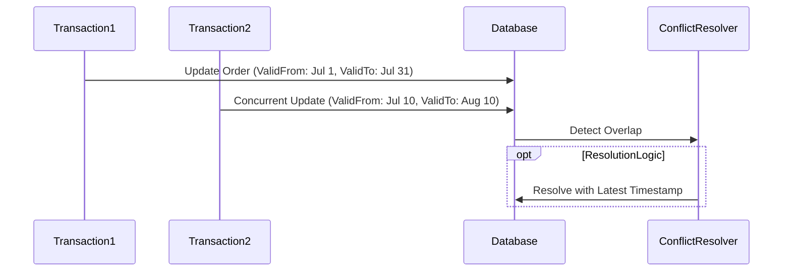

## Introduction

In bi-temporal databases, data must be managed across both valid time — the time period during which a fact is true in the real world — and transaction time — the time period during which a fact is stored in the database. Temporal Conflict Resolution is a design pattern used to address inconsistencies that occur when multiple concurrent updates attempt to modify the same piece of data within these time dimensions.

## Problem Statement

Concurrent temporal data updates can lead to conflicts. These often occur in systems where different transactions or processes update the same datasets based on overlapping or conflicting valid time periods. For example, financial systems or ticket booking systems face such challenges. Resolving these conflicts in a timely and efficient manner without data loss or corruption is crucial.

## Architectural Approach

### Conflict Detection

Utilize transaction logs or concurrency control mechanisms to detect when two data change operations intersect temporally. Implement database triggers or middleware processing to automate detection.

### Conflict Resolution Strategies

- **Timestamp Priority**: Use timestamps to determine which update takes precedence. E.g., the latest transaction time prevails.
  
- **Business Rules**: Implement domain-specific heuristics. For example, in financial applications, business policies may dictate that certain types of transactions inherently override others.
  
- **User-Defined Priority**: Provide users or administrators the ability to define custom rules or manually resolve conflicts when detected.

### Example Code

This example uses a simplified version of a temporal table with concurrent updates in SQL:

```sql
-- Assume a table structure with relevant temporal information
CREATE TABLE Orders (
  OrderID INT PRIMARY KEY,
  ProductID INT,
  Quantity INT,
  ValidFrom DATE,
  ValidTo DATE,
  TransactionTime TIMESTAMP
);

-- Transaction 1 attempts to update an order
UPDATE Orders
SET Quantity = 10, 
    ValidFrom = '2024-07-01', 
    ValidTo = '2024-07-31', 
    TransactionTime = CURRENT_TIMESTAMP
WHERE OrderID = 100;

-- Transaction 2 also attempts to update the same order with overlapping valid time
UPDATE Orders
SET Quantity = 15, 
    ValidFrom = '2024-07-10', 
    ValidTo = '2024-08-10', 
    TransactionTime = CURRENT_TIMESTAMP + INTERVAL '1' SECOND
WHERE OrderID = 100;

-- Resolve using timestamp priority
-- Depending on application logic, apply the appropriate resolution logic or raise a conflict alert
```

### Diagrams

Mermaid UML Sequence Diagram to illustrate conflict resolution:



## Related Patterns

- **Event Sourcing**: Maintains a record of changes to support conflict detection.
- **Optimistic Concurrency Control**: A general pattern for managing data consistency.
- **Temporal Table Pattern**: Implements bi-temporal data management in relational databases.

## Additional Resources

- *Allen, James F.* "Maintaining Knowledge about Temporal Intervals."
- Leveraging modern databases like PostgreSQL or SQL Server for temporal capabilities.

## Summary

The Temporal Conflict Resolution pattern helps maintain data integrity by resolving conflicts arising from concurrent updates in bi-temporal databases. By leveraging well-defined strategies and practices — utilizing business rules, timestamps, or user-defined policies — this pattern preserves the consistency and accuracy of temporal data across complex, real-world systems.
