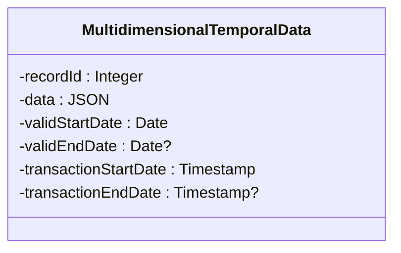

## Introduction to Multidimensional Temporal Consistency

Multidimensional Temporal Consistency is a design pattern used in data modeling to maintain consistency across multiple temporal dimensions, such as valid time, transaction time, and decision time. This pattern is crucial for systems that rely on accurate time-based data to perform transactions, decision-making, and historical data analysis. For instance, in financial systems, various dates like valuation dates, transaction dates, and reporting dates must be coherently managed to ensure trustworthiness and compliance.

## Detailed Explanation

### Temporal Dimensions:
- **Valid Time**: Represents the period during which a fact is true in the real world. For example, the life of a contract.
- **Transaction Time**: Refers to the time at which a fact is stored in the database. It records changes in state and updates.
- **Decision Time**: Denotes the time at which a decision was made, affecting how data is processed or acted upon.

### Architectural Approaches:
1. **Temporal Data Storage**: Use databases with temporal data support, allowing you to store, query, and manage data changes over time effectively. Databases such as PostgreSQL and Oracle offer built-in features for managing valid and transaction times.
  
2. **Bi-Temporal Tables**: Incorporate tables that can handle both valid and transaction time, ensuring the consistency of historical data and transactions.
  
3. **Versioning Techniques**: Implement versioning of records to track changes over time, helping to keep a comprehensive history of data modifications.

4. **Data Modeling**: Define a data model that encapsulates multiple temporal dimensions and captures the dependencies between these dimensions clearly.

### Best Practices:
- **Synchronization**: Ensure synchronization across temporal dimensions to maintain a consistent view of data. Misalignment can lead to erroneous historical analysis or data misinterpretation.
  
- **Temporal Indexing**: Use indexes on temporal attributes for efficient querying and retrieval of temporal data segments.
  
- **Auditing and Logging**: Keep an audit trail of changes across temporal dimensions to assist in historical analysis and error resolution.
  
- **Consistency Checks**: Regularly implement and run consistency checks to validate that temporal data aligns across different dimensions.

### Example Code:

Here's a simplified example using SQL to create a bi-temporal table:

```sql
CREATE TABLE financial_records (
    record_id SERIAL PRIMARY KEY,
    data JSONB,
    valid_start_date DATE NOT NULL,
    valid_end_date DATE,
    transaction_start_date TIMESTAMP DEFAULT CURRENT_TIMESTAMP,
    transaction_end_date TIMESTAMP
);

-- Query to fetch current state
SELECT * FROM financial_records
WHERE valid_start_date <= CURRENT_DATE AND (valid_end_date IS NULL OR valid_end_date >= CURRENT_DATE)
AND transaction_start_date <= NOW() AND (transaction_end_date IS NULL OR transaction_end_date > NOW());
```

### Diagram Representation:



## Related Patterns and Paradigms

- **Event Sourcing**: Captures and applies all data change events, providing a reliable log to derive state across various temporal dimensions.
- **Audit Logs**: Keep a record of who changed what and when, supporting tracking across multidimensional timeframes.

## Additional Resources

- [Temporal Data & Time in Databases](https://somesite.com/temporal-data)
- [Time-Oriented Databases](https://somesite.com/time-oriented-databases)

## Summary

Multidimensional Temporal Consistency is essential for applications requiring integrity and reliability across various time dimensions. By leveraging databases equipped with temporal capabilities, implementing precise data modeling, and adhering to best practices, systems can ensure consistent and logically coherent management of their temporal datasets. This enables accurate historical insights and data accountability fundamental to domains like finance and compliance.
