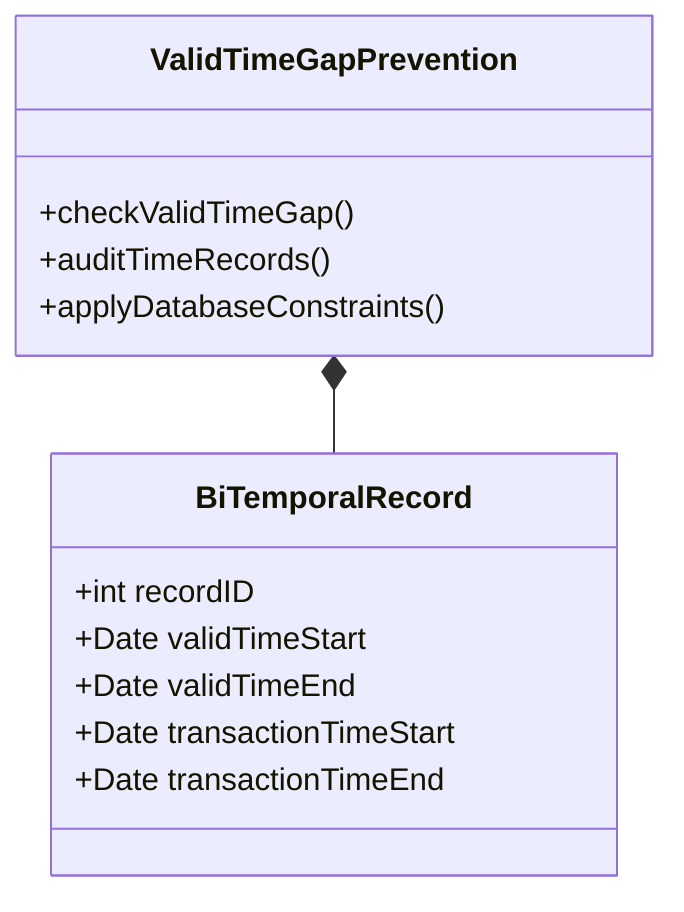

## Overview

In the world of temporal databases, managing valid times for data entries is crucial. The Valid Time Gap Prevention pattern is pivotal to ensure continuity and integrity of data records by avoiding any unintended gaps in valid time periods. Bi-temporal data includes valid time (the time period during which a fact is true in the real world) and transaction time (the time period during which a fact is stored in the database).

## Detailed Explanation

A time gap in valid time could lead to inconsistencies, misunderstandings, and potential errors in business operations. This is especially pertinent in industries like insurance, finance, and healthcare, where data integrity over time is critical.

### Architectural Approach

To prevent gaps in valid time:

1. **Validation Logic**: Implement validation checks in the application layer to ensure that any newly added or updated entry aligns with existing time spans.
   
2. **Database Constraints**: Define appropriate constraints in the database schema that will automatically validate the continuation of time spans.

3. **API Design**: Ensure APIs that interact with temporal data check new entries against predefined rules for overlapping or contiguous valid times.

4. **Regular Audits**: Periodically audit the database to uncover any potential gaps that might not have been caught initially.

### Best Practices

- **Data Auditing**: Implement logging mechanisms to catch any discrepancies that occur at the time of data entry.
- **Redundancy Checks**: Build redundant checks at multiple layers (e.g., application, database, and API level) to minimize oversights.
- **Automation**: Use automation tools for consistent auditing and validation tasks to detect and correct errors promptly.

## Example Code

Below is an example of a SQL constraint ensuring no gaps exist between valid time periods in a bi-temporal table.

```sql
CREATE TABLE bitemporal_records (
  record_id INT PRIMARY KEY,
  valid_time_start DATE,
  valid_time_end DATE,
  transaction_time_start DATE,
  transaction_time_end DATE,
  CHECK (valid_time_end >= valid_time_start), -- Ensure valid time periods are non-negative
  CHECK (transaction_time_end >= transaction_time_start)
);

-- Add a procedure or trigger to ensure no gaps between valid times
CREATE FUNCTION check_valid_time_gap() RETURNS trigger AS 
BEGIN
  IF EXISTS (
    SELECT 1
    FROM bitemporal_records br
    WHERE br.record_id <> NEW.record_id
    AND NOT (
      br.valid_time_end <= NEW.valid_time_start OR
      br.valid_time_start >= NEW.valid_time_end
    )
  ) THEN
    RAISE EXCEPTION 'Valid time gap detected between records';
  END IF;

  RETURN NEW;
END;
 LANGUAGE plpgsql;

CREATE TRIGGER valid_time_trigger
BEFORE INSERT OR UPDATE ON bitemporal_records
FOR EACH ROW EXECUTE FUNCTION check_valid_time_gap();
```

## Diagram



## Related Patterns

- **Temporal Validity Pattern**: This pattern focuses on managing both valid and transaction times efficiently.
- **Snapshot Pattern**: Entails capturing and maintaining a snapshot of data at specific times to see how data looked at any point in history.

## Additional Resources

- [Temporal Database Concepts](https://en.wikipedia.org/wiki/Temporal_database)
- [SQL Bitemporal Tutorials](https://www.sqltutorial.org/sql-bi-temporal/)
- [Time-Oriented Database Patterns](https://martinfowler.com/eaaDev/timeNarrative.html)

## Summary

The Valid Time Gap Prevention pattern is critical in maintaining data integrity over time by ensuring that data records have a continuous timeline without accidental gaps. Implementing this pattern involves a combination of validation logic, database constraints, and regular audits to manage the complexity of temporal data. Properly applying these methods aids in maintaining a consistent and reliable data model in time-sensitive applications.
