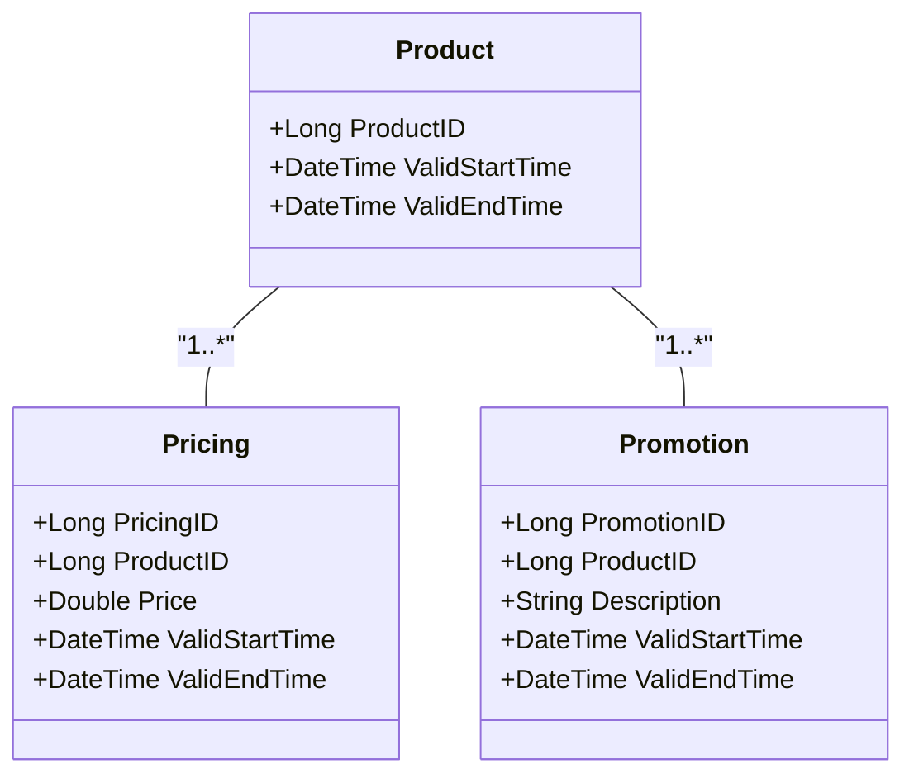

## Overview

Temporal Cascading Updates is a bi-temporal consistency pattern. This pattern focuses on maintaining consistency across related temporal records when a change occurs in one entity. The goal is to ensure that all dependent or related records reflect changes in their respective valid time ranges without violating temporal integrity.

## Context

In complex data systems, particularly those involving rigorous temporal data requirements, understanding the impact of changes over time across a network of records is critical. For example, in business applications that manage offers, products, pricing, or policies over specific timeframes, a change in one component needs to be consistently reflected in all related records.

## Problem

When an entity experiences a temporal change, such as a product being discontinued or a new policy implemented, related records must reflect this change over their respective valid times. Failing to properly update these records can lead to inconsistencies such as outdated pricing or promotions showing as active, leading to business logic errors.

## Solution

Temporal Cascading Updates involve cascading modifications to temporal records in a manner that respects and maintains temporal constraints. The solution requires implementing a mechanism to detect changes in primary records and trigger corresponding updates to all dependent records to synchronize their temporal states.

## Implementation

1. **Change Detection**: Implement a mechanism to monitor changes on primary records. This could involve event-based triggers or periodic checks on temporal changes.

2. **Cascading Logic**: Develop logic to determine which related records are affected. This logic should identify dependent records based on relational mappings, such as foreign key constraints or semantic relationships.

3. **Temporal Alignment**: Adjust the valid and transaction times of all affected records. This involves:
   - Extending or truncating validity periods.
   - Creating new temporal instances if trends need recording rather than modifying existing records.

4. **Conflict Resolution**: Implement consistency checks and conflict resolution strategies, ensuring updates do not violate established temporal constraints or create temporal paradoxes.

5. **Logging and Auditing**: Maintain audit logs to track changes for compliance and historical analysis.

### Example Code Snippet

Assuming we use a relational database with bi-temporal tables representing products, pricing, and promotions:

```sql
BEGIN;
-- Example pseudo code for propagating price changes when a product is discontinued
-- Update Pricing and Promotions to reflect product discontinuation

-- Detect product discontinuation
UPDATE Products
SET ValidEndTime = CURRENT_TIMESTAMP
WHERE ProductID = 101 AND ValidEndTime > CURRENT_TIMESTAMP;

-- Update Pricing
UPDATE Pricing
SET ValidEndTime = CURRENT_TIMESTAMP
WHERE ProductID = 101 AND ValidEndTime > CURRENT_TIMESTAMP;

-- Update Promotions
UPDATE Promotions
SET ValidEndTime = CURRENT_TIMESTAMP
WHERE ProductID = 101 AND ValidEndTime > CURRENT_TIMESTAMP;

COMMIT;
```

### Example Diagram



## Related Patterns

- **Versioning**: Maintain different states of an entity over time.
- **Event Sourcing**: Store state-changes as a series of events to enable complex event cascades and temporal queries.
- **Command Query Responsibility Segregation (CQRS)**: Use separate models for reading and updating temporal data.

## Additional Resources

- [Temporal Data Management](https://www.example.com/temporal-data-management)
- [Maintaining Data Consistency in Distributed Systems](https://www.example.com/data-consistency-distributed-systems)

## Summary

Temporal Cascading Updates ensure the temporal integrity and consistency of related records in complex datasets. By implementing a structured approach to detect, propagate, and manage temporal updates, organizations can maintain coherent data states over time, reducing errors and supporting reliable business operations.
