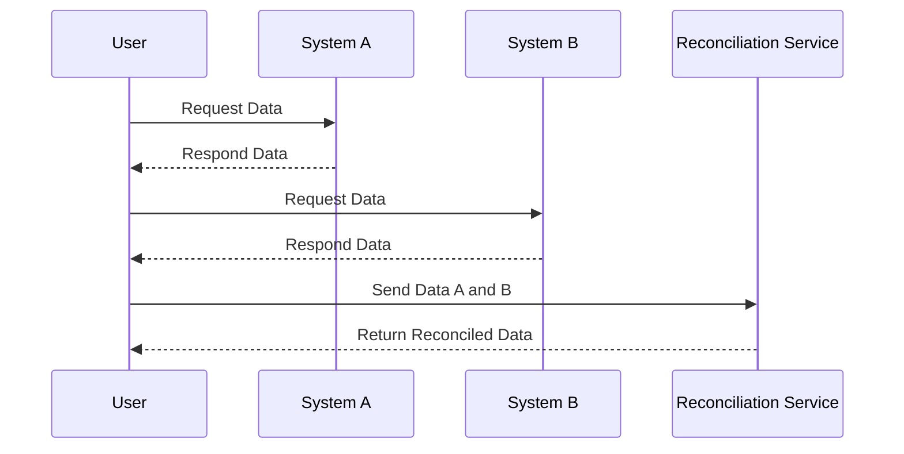

---

linkTitle: "Temporal Data Reconciliation"
title: "Temporal Data Reconciliation"
category: "Bi-Temporal Consistency Patterns"
series: "Data Modeling Design Patterns"
description: "Comparing and aligning temporal data from different sources to ensure consistency and correctness."
categories:
- Data Modeling
- Consistency Patterns
- Temporal Data
tags:
- Temporal Data
- Data Reconciliation
- Bi-Temporal
- Consistency
- Data Integration
date: 2024-07-07
type: docs

canonical: "https://softwarepatternslexicon.com/103/8/14"
license: "© 2024 Tokenizer Inc. CC BY-NC-SA 4.0"
---

## Temporal Data Reconciliation

### Overview
Temporal Data Reconciliation is a design pattern aimed at comparing and aligning data associated with time attributes from disparate sources. It ensures the accuracy and consistency of temporal data by reconciling discrepancies between datasets relative to their time dimensions. This pattern is especially crucial in scenarios where data validity and system-period timelines must align across multiple systems or databases.

### Use Cases
- **Sales Transactions**: Reconciling sales records from two systems by matching transactions that were valid during the same time periods.
- **Financial Reporting**: Aligning asset valuations from different financial reports to ensure accurate-period consistency.
- **Supply Chain Management**: Matching inventory levels across different systems to ensure temporal consistency.

### Architectural Approaches
Temporal Data Reconciliation can be achieved using several architectural approaches:

1. **Bi-Temporal Data Modeling**: Incorporates valid-time and transaction-time to track data changes and decisions over time.
2. **Temporal Join Operations**: Use SQL features or specialized temporal databases to perform joins over temporal dimensions.
3. **Event Sourcing**: Utilize event logs to rebuild state over time and reconcile discrepancies based on historical sequences.
4. **Machine Learning Models**: Deploy models to predict and adjust temporal inconsistencies where historical patterns are discernible.

### Best Practices
- **Normalize Timezones**: Ensure all data sources synchronize with a common timezone standard.
- **Use UTC Timestamps**: Leverage UTC-based timestamps to avoid discrepancies due to daylight savings or location changes.
- **Store Original and Modified Timestamps**: Maintain both original and modified temporal attributes for accurate auditing.
- **Automate Reconciliation Processes**: Implement automated scripts or tools to periodically check and reconcile temporal data.

### Example Code
Here’s a simplified example in SQL to reconcile temporal data by joining two tables based on valid-time periods:

```sql
SELECT
    a.transaction_id,
    a.amount,
    b.amount AS reconciled_amount
FROM
    sales_table_a a
JOIN
    sales_table_b b
ON
    a.transaction_date BETWEEN b.valid_from AND b.valid_to
WHERE
    a.amount <> b.amount;
```

### Diagrams

#### Sequence Diagram


### Related Patterns
- **Event Sourcing**: Captures changes as a series of event logs providing a historical record that can be reconciled.
- **Snapshot Isolation**: Utilizes versioned snapshots of database states to provide a consistent reading frame for reconciliation.
- **CQRS (Command Query Responsibility Segregation)**: Separates read and update operations for such reconciling tasks.

### Additional Resources
- [Temporal Data in Databases](https://www.oreilly.com/library/view/fundamentals-of-database/9781449326474/ch09.html)
- [Bi-Temporal Data Management: Schema and Approach](https://www.vldb.org/pvldb/vol4/p1049-dolby.pdf)

### Summary
Temporal Data Reconciliation plays a vital role in ensuring data consistency and correctness across systems with temporal information. Best practices like normalizing timezones, using bi-temporal modeling, and leveraging SQL temporal capabilities are essential for effective temporal data alignment. The pattern is integral to modern data architectures, ensuring reliable data integrity in transactional and analytical applications. 

By implementing Temporal Data Reconciliation, organizations can significantly mitigate data discrepancies, facilitating more accurate reporting and decision-making processes.

---
