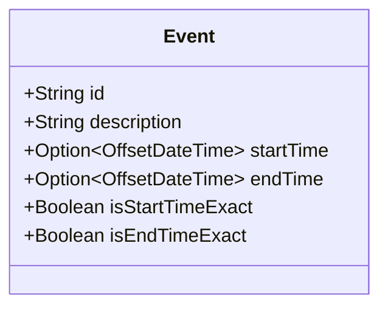

## Overview

In data modeling, especially when dealing with events or records that have temporal attributes, it’s often the case that some data may initially have uncertain or unknown valid times. The Indeterminate Time Handling design pattern addresses the need to manage and update such data effectively, without sacrificing consistency within the system.

## Problem Statement

When dealing with events, records, or transactions, the precise timing details may not always be available at the time of initial entry. This can occur due to various reasons including data collection methods, delays in receiving information, or systemic uncertainties. The challenge is to maintain bi-temporal consistency in a database while allowing for updates once precise temporal details become available. 

## Solution Explanation

The Indeterminate Time Handling pattern provides a structured approach to managing records with unknown or approximate valid times by implementing a data model that accommodates time indeterminacy. 

### Key Components:

1. **Indeterminate Temporal Fields**: Introduce fields like `start_time` and `end_time` that can accommodate approximate or undefined values. These fields could be implemented using nullable data types or special markers (e.g., null, zero, or a predefined constant).

2. **Status Indicators**: Use additional attributes to signify whether a time is determined or indeterminate. These could be reflected using Boolean flags such as `is_start_time_exact` and `is_end_time_exact`.

3. **Time Estimation and Validation Logic**: Implement business logic that estimates time ranges based on available data, and updates these when confirmed data becomes available. This logic may use algorithms or data from similar cases to initially fill indeterminate time gaps.

4. **Versioning and Auditing Mechanisms**: Maintain an audit trail or version history of records to track changes as indeterminate times become exact. This would involve maintaining a bi-temporal logging mechanism where both physical and transaction times are stored and updated.

## Practical Example

```scala
case class Event(
  id: String,
  description: String,
  startTime: Option[OffsetDateTime],
  endTime: Option[OffsetDateTime],
  isStartTimeExact: Boolean = false,
  isEndTimeExact: Boolean = false
)

def updateEventTimes(event: Event, preciseStartTime: OffsetDateTime, preciseEndTime: OffsetDateTime): Event = {
  event.copy(
    startTime = Some(preciseStartTime),
    endTime = Some(preciseEndTime),
    isStartTimeExact = true,
    isEndTimeExact = true
  )
}
```

## UML Class Diagram

Here is a simple UML class diagram representing indeterminate time handling in a system:



## Related Patterns

- **Temporal Pattern**: A pattern for managing and querying time-dimensional data more broadly.
- **Event Sourcing**: Useful for tracking full histories of changes and reconstructing past states, which can be beneficial for dealing with temporal indeterminacy.
- **Command Query Responsibility Segregation (CQRS)**: Managing read and update concerns separately can be useful in bi-temporal data handling.

## Additional Resources

- [Martin Fowler's Temporal Patterns](https://martinfowler.com/eaaDev/TemporalPatterns.html)
- [Valid-Time Temporal Database Theory](https://cs.wayne.edu/legacy/ValidTimeTheory)

## Summary

The Indeterminate Time Handling pattern is essential in systems where the timing of data events may not always be precise at first. By adopting this pattern, systems can ensure consistency and allow graceful corrections as more precise information becomes available. Robust handling of time indeterminacy ensures data integrity and aids in meaningful temporal queries and analyses.
