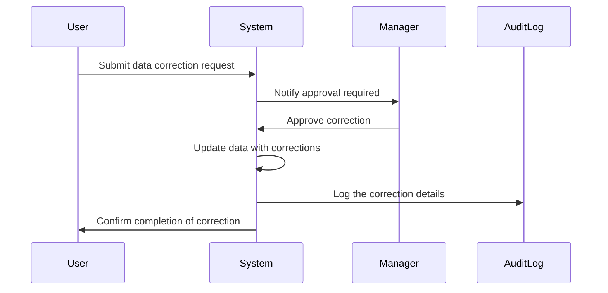

## Overview

Data Correction Policies are essential in ensuring the integrity and accuracy of temporal data across organizations. These policies outline the guidelines and procedures for making modifications to temporal data, which include both transaction time (when data is stored in the database) and valid time (the time period during which the data is considered accurate in the real world). Such policies are crucial for maintaining bi-temporal consistency and upholding data governance standards.

## Design Pattern Explanation

### Key Elements of Data Correction Policies

1. **Authorization**: Define roles and responsibilities for who can approve and perform corrections on temporal data. Typically, managerial or supervisory approval is required for high-impact changes to data.

2. **Documentation**: Every correction should be thoroughly documented. This includes a record of the original data, the nature of the correction, who made the change, when it was made, and why it was necessary.

3. **Auditability**: Maintain detailed audit logs for all corrections. These logs should be immutable and accessible to authorized users for review and compliance purposes.

4. **Reproducibility**: Ensure that the steps taken to correct the data can be followed by others to reproduce the same result. This includes maintaining a historical record of all changes.

### Procedures

- **Change Request Process**: Implement a formal change request process where proposed corrections are submitted, reviewed, and either approved or rejected by authorized personnel.
  
- **Notification and Approval Workflow**: Develop workflows for notifying stakeholders of proposed changes and obtaining the necessary approvals prior to modifications.

- **Training and Awareness**: Educate staff about data correction policies and the importance of maintaining data integrity to ensure consistent application of the procedures.

## Example Implementation

Imagine managing financial records in a bi-temporal database. Suppose there's a need to correct a backdated transaction due to an input error:

```sql
-- Example SQL for backdating a correction, assuming a bi-temporal schema:
UPDATE FinancialRecords
SET Amount = 2000,
    LastModifiedBy = 'manager123',
    LastModifiedDate = CURRENT_DATE
WHERE TransactionID = 'TXN12345'
AND ValidTimeStart <= '2023-06-01'
AND ValidTimeEnd >= '2023-06-01';

-- Insert a correction audit log
INSERT INTO AuditLog (ChangeID, TransactionID, ChangeType, OldValue, NewValue, ChangedBy, ChangeDate)
VALUES (NEWID(), 'TXN12345', 'Correction', '1000', '2000', 'manager123', CURRENT_TIMESTAMP);
```

### UML Sequence Diagram

Here is a Mermaid UML Sequence diagram that depicts the process of performing a data correction:



## Related Patterns

- **Audit Log Pattern**: Maintains a history of changes and access to the data for compliance and recovery purposes.
- **Versioned Data Pattern**: Handles multiple versions of data, capturing changes over time for analytical and compliance requirements.
- **Snapshot Isolation Pattern**: Provides read consistency without locking the actual data, useful in systems requiring historical data analysis.

## Additional Resources

- [Bi-Temporal Data Management](https://www.example.com/bi-temporal-data-management)
- [Temporal Databases and Their Applications](https://www.example.com/temporal-databases)

## Summary

Data Correction Policies are integral for maintaining data integrity and compliance, especially in environments dealing with bi-temporal data. By defining clear procedures, establishing authorization roles, and maintaining comprehensive audit logs, organizations can ensure that corrections are made accurately and responsibly while keeping a transparent history of data changes. Implementing these policies helps in mitigating potential data discrepancies that can arise due to errors or mismanagement.
