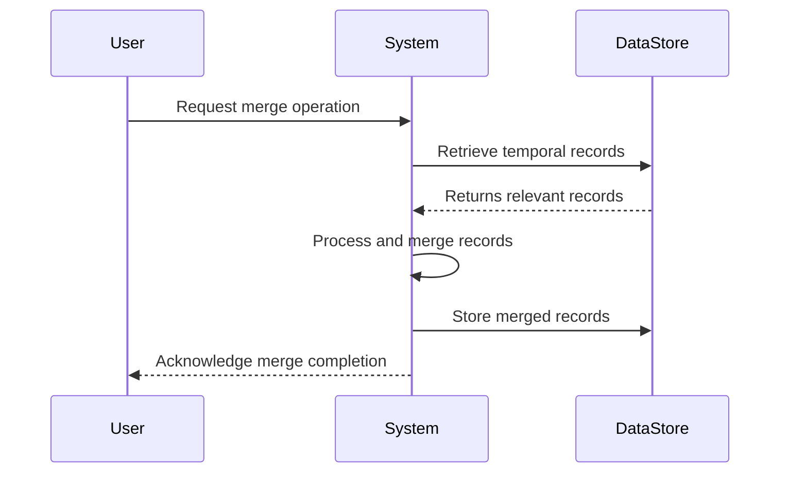
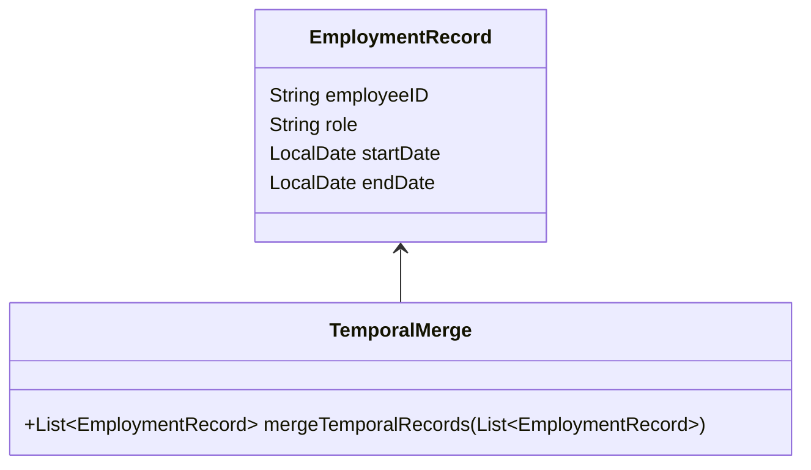

## Introduction to Temporal Merge Patterns

Temporal Merge Patterns are essential in data management for effectively consolidating overlapping or directly adjacent temporally-based records to ensure data simplification and synchronization. This pattern helps manage the complexity of datasets in which records can overlap or succeed one another slightly without consequential changes to key attributes, like in the example of continuous employment records.

## Detailed Explanation

### Problem

In modern data systems, maintaining numerous timestamped records can lead to inefficiencies, redundancies, and potential inconsistency if not managed properly. The issue arises when these temporal records have overlapping time periods with no significant changes, making it difficult to derive actionable insights.

### Solution

Implement the Temporal Merge Pattern, which involves merging data records that are either overlapping or closely adjacent when there is no significant change in their essential attributes. By doing so, systems can minimize redundancy, simplify datasets for analytical processes, and provide consistent temporal data views. 

### Architectural Approach

1. **Identify Mergeable Records**: 
   - Parse through the temporal datasets to identify records that have overlapping or consecutive time periods with identical essential attribute values.
   
2. **Define Merge Logic**:
   - Devise a merging strategy to decide how timestamps are updated. Typically, this may mean extending the start and end time to cover the entire period of merged records.

3. **Merge Process Implementation**:
   - Developing data pipelines to automate the merging of records as part of ETL processes. This may involve using tools designed for big data processing, such as Apache Flink or Kafka.

4. **Validation**:
   - Ensure that the merging logic correctly applies temporal bi-consistency rules, i.e., both valid and transaction time periods are respected and anticipated in the merge process.

### Best Practices

- **Clearly Define Mergeability**: Set stringent rules defining what constitutes "no significant change" to ensure mergers don't accidentally eliminate necessary granularity.
- **Version Control**: Keep historical versions of data pre-merger for tracking accuracy and potential backtrack needs.
- **Automation**: Use data stream processing for continuous merging in real-time systems.
- **Testing and Validation**: Extensively validate merged records to confirm that merged records are accurate and that the merging improves user queries rather than complicates them.

## Example Code

Below is a simple Scala snippet demonstrating how one might implement a basic temporal merge function. 

```scala
case class EmploymentRecord(employeeID: String, role: String, startDate: LocalDate, endDate: LocalDate)

def mergeTemporalRecords(records: List[EmploymentRecord]): List[EmploymentRecord] = {
  records.sortBy(_.startDate).foldLeft(List[EmploymentRecord]()) { (merged, current) =>
    merged match {
      case last :: rest if last.role == current.role && last.endDate.isAfter(current.startDate.minusDays(1)) =>
        EmploymentRecord(last.employeeID, last.role, last.startDate, current.endDate.max(last.endDate)) :: rest
      case _ =>
        current :: merged
    }
  }.reverse
}
```

## Diagrams

### Sequence Diagram



### Class Diagram



## Related Patterns

- **Temporal Validity Pattern**: Focuses on maintaining the validity timeframe of data records.
- **Snapshot Pattern**: Captures and preserves the state of a record at a particular time.
- **Slowly Changing Dimension**: Manages and tracks changes over time in data warehouses.

## Additional Resources

- "Temporal Data & The Relational Model: A Detailed Exploration" by C.J. Date et al.
- Articles on best practices for data merging in large-scale data systems.
- Apache Flink documentation for stream processing of temporal data.

## Summary

Temporal Merge Patterns serve as a stiff backbone in the management of temporal data by merging redundant records. When thoughtfully applied, they distill complexity into simple, effective data models, ensuring datasets remain consistent and actionable over time. As businesses increasingly hinge on time-based insights, leveraging this pattern is becoming indispensable for creating lean data solutions that support meaningful analytics without compromising historical integrity.
