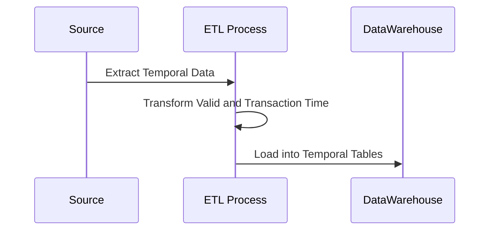

## Temporal Data Consistency in ETL

### Overview

Temporal data consistency in ETL is a crucial design pattern aimed at ensuring that temporal aspects of data—such as valid time and transaction time—are accurately preserved throughout the ETL processes. This pattern is vital when transferring data across systems, particularly from operational databases to data warehouses, where historical data analysis and auditability are essential.

### Key Concepts

- **Valid Time**: The time period during which a fact is true concerning the real world.
- **Transaction Time**: The time period during which a fact is stored in the database.
- **Bi-Temporal Data**: Data that is tracked with both valid and transaction times.

### Architectural Approaches

1. **Data Versioning**: Track changes over time by creating new records with version identifiers for every update, instead of overwriting existing records. 

2. **Temporal Tables**: Utilize database features specifically designed for handling bi-temporal data, such as SQL Server's system-versioned temporal tables.

3. **Snapshot Records**: Maintain consistency by capturing periodic snapshots of data states, which allows for reconstructing data states at specific points in time.

### Best Practices

- **Consistency Checks**: Regularly verify consistency across the datasets after ETL to ensure integrity in valid and transaction times.
  
- **Use of Temporal Databases**: Leverage specialized temporal database capabilities for better out-of-the-box support for temporal data handling.

- **ETL Design for Temporal Data**: Carefully design ETL workflows to handle transactions involving historical records, correcting mismatches promptly.

### Example Code

Consider an ETL pipeline using Apache Flink to process temporal data:

```scala
import org.apache.flink.streaming.api.scala._
import org.apache.flink.streaming.api.scala.StreamExecutionEnvironment
import org.apache.flink.api.scala.createTypeInformation

// Create execution environment
val env = StreamExecutionEnvironment.getExecutionEnvironment

// Define DataStream representing updates with temporal attributes
case class TemporalRecord(id: String, validTimeStart: Long, validTimeEnd: Long, transactionTime: Long)

// Dummy source with temporal data
val temporalDataStream: DataStream[TemporalRecord] = env.fromElements(
  TemporalRecord("rec1", 1622520000L, 1625208400L, 1626100000L),
  TemporalRecord("rec2", 1622520000L, 1625208400L, 1627800000L)
)

// ETL transformation logic preserving temporal data
temporalDataStream
  .map(record => {
     // Simulated transformation preserving temporal attributes
     record.copy(transactionTime = System.currentTimeMillis())
  })
  .addSink(// Your Sink Here)

env.execute("ETL with Temporal Data Consistency")
```
### Diagrams

#### UML Sequence Diagram



### Related Patterns

- **Event Sourcing**: Maintaining a log of changes as events occur can complement temporal data consistency by providing a historical record.

- **Command Query Responsibility Segregation (CQRS)**: Separation of read and write operations can work well with bitemporal consistency patterns, allowing reads to access temporal queries directly.

### Additional Resources

- Martin Fowler's article on [Bitemporal Modelling](https://martinfowler.com/bliki/BitemporalModeling.html)
- **Temporal Database** by Zdonik, S. (Springer)

### Summary

Temporal data consistency in ETL processes is essential for maintaining the integrity of historical data, which is critical for analytics and compliance. By employing strategies like data versioning and temporal tables, and adhering to best practices such as consistency checks and dedicated ETL workflows, organizations can ensure the accurate preservation of both valid and transaction times across systems. This pattern not only supports sophisticated temporal queries but also enhances traceability and auditability of data transformations over time.
