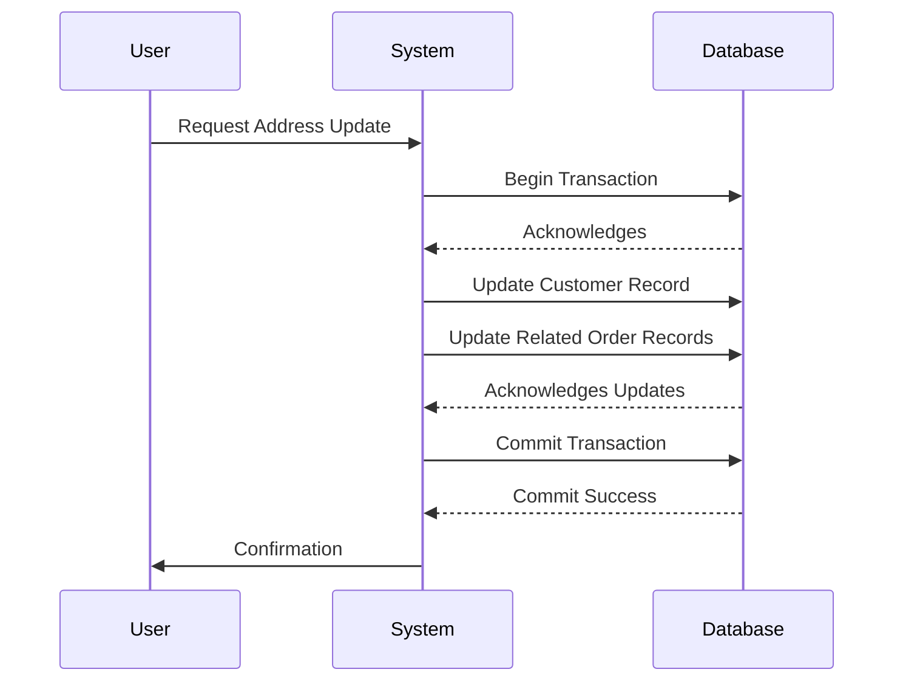

## Introduction

In modern data management systems, maintaining consistency across related datasets becomes complex due to the bi-temporal nature of data—capturing both the valid time and transaction time of data entries. This pattern, Bi-Temporal Transaction Atomization, addresses the need for an atomic approach to manage temporal data transactions, ensuring that all updates occur as a unified operation, preserving data integrity and consistency.

## Detailed Explanation

### Bi-Temporality in Data

Bi-temporality involves managing two distinct timelines:

1. **Valid Time**: When the data is actually applicable in the real world.
2. **Transaction Time**: When the data is stored and becomes part of the database record.

These timelines necessitate precise handling of temporal compositions. When updating or inserting records that involve bi-temporal data, it’s crucial to address them atomically to prevent inconsistencies.

### Atomic Transactions 

Atomic transactions provide a mechanism to execute a sequence of operations in such a way that all succeed or fail as a unit. In a bi-temporal database context, this involves updating records across valid and transaction times seamlessly. A partial update may lead to inconsistent states unless rollback or compensatory measures are realized.

### Application

- **Scenario**: Consider an e-commerce system managing customer details and order information. When user data is updated (e.g., address changes), any associated orders reflecting this change should also be updated in accordance with their validity and transaction timelines.
- **Operation**: Use a transaction mechanism that ensures the change of address is simultaneously reflected across all related order records, thus maintaining bi-temporal consistency.

## Example Code

Here is a simplified Java and SQL-based example for executing a bi-temporal transaction:

```java
public void updateCustomerAndOrders(Connection conn, Customer customer, List<Order> orders) throws SQLException {
    try (PreparedStatement updateCustomer = conn.prepareStatement(
                 "UPDATE customers SET address = ?, valid_until = ? WHERE id = ? AND valid_from = ?")
         PreparedStatement updateOrder = conn.prepareStatement(
                 "UPDATE orders SET shipping_address = ?, transaction_time = current_timestamp WHERE customer_id = ?")) {

        conn.setAutoCommit(false);

        updateCustomer.setString(1, customer.getAddress());
        updateCustomer.setDate(2, customer.getValidUntil());
        updateCustomer.setInt(3, customer.getId());
        updateCustomer.setDate(4, customer.getValidFrom());
        updateCustomer.executeUpdate();

        for (Order order : orders) {
            updateOrder.setString(1, customer.getAddress());
            updateOrder.setInt(2, order.getCustomerId());
            updateOrder.executeUpdate();
        }
        
        conn.commit();
    } catch (SQLException e) {
        conn.rollback();
        throw e;
    }
}
```

## Diagrams

### Sequence Diagram



## Related Patterns

- **Event Sourcing**: Captures all changes to an application state as a sequence of events.
- **Command Query Responsibility Segregation (CQRS)**: Utilizes separation of read and write operations for better scalability and performance.

## Additional Resources

- [Temporal Data & The Relational Model](https://www.springer.com/books/10.5555/2614672)
- [Time Management Patterns](https://variouspatterns.com)

## Summary

In bi-temporal systems, managing changes in data such as updates or deletes across timelines can be intricate. The Bi-Temporal Transaction Atomization pattern provides a structure to handle transactions atomically, securing coherence and reliability in applications where time is a critical factor. Leveraging transactional control frameworks in programming languages or RDBMS systems assists in achieving this consistency, bolstering both the reliability and credibility of bi-temporal data systems.
