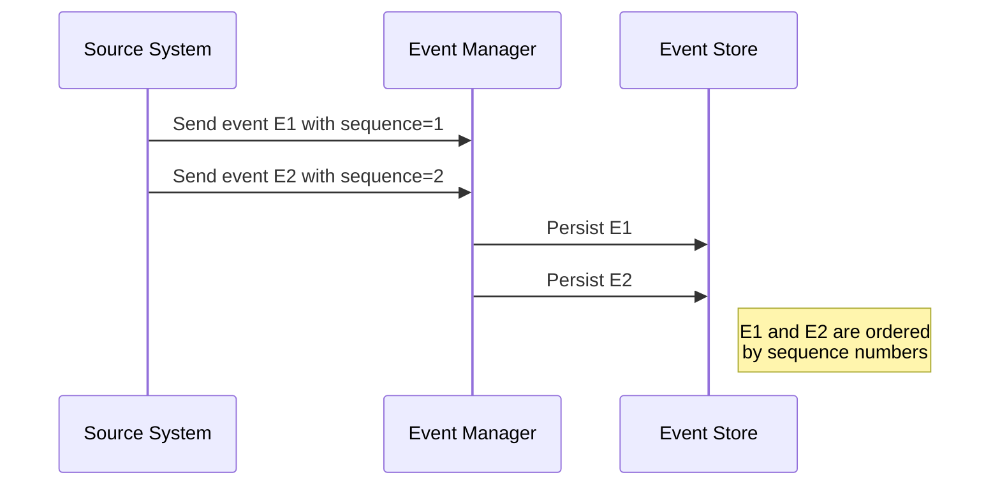

## Temporal Event Ordering

### Overview

Temporal Event Ordering is a design pattern that ensures events in temporal data are maintained in their actual sequence of occurrence. This is crucial in systems where data events must reflect the correct order of operations, which is particularly challenging in distributed systems and situations where timestamp consistency cannot be guaranteed.

### Context

In many applications, it's critical to maintain the correct sequence of events over time. Consider financial systems, where transaction order impacts account balances, or logistics systems, where delivery sequences dictate operational planning. When events are timestamped upon entry, network latencies, differing clock skews, and distributed system architectures can lead to inconsistent event ordering. In such cases, relying solely on timestamps is often insufficient.

### Problem

Aligning events in the correct temporal order can be challenging due to:

- Different clock systems generating timestamps.
- Network delays affecting the order of event reception.
- Events arriving with out-of-date timestamps.
  
To mitigate this, a robust mechanism for ordering needs to be established that transcends simple timestamp recording.

### Solution

To accurately order temporal events:

1. **Use Sequence Numbers**: Assign sequence numbers to each event at the source. These numbers can more reliably maintain order than timestamps, as they derive from the originating source which knows the internal sequence of events.

2. **Logical Clocks**: Employ logical clocks, such as Lamport timestamps, to capture a causal relationship between events in distributed systems. 

3. **Vector Clocks**: In highly distributed environments where events might be concurrent, use vector clocks to achieve a partial ordering while understanding concurrency.

4. **Persistent Logs**: Leverage persistent distributed logs, such as Apache Kafka, which inherently process messages in the order they are written. 

5. **Temporal Anchoring**: Use a trusted external temporal source or a dedicated synchronizer service to provide consistent time anchoring across distributed nodes.

### Example

Here's an example using Apache Kafka, a distributed event streaming platform:

```java
Properties props = new Properties();
props.put("bootstrap.servers", "localhost:9092");
props.put("key.serializer", "org.apache.kafka.common.serialization.StringSerializer");
props.put("value.serializer", "org.apache.kafka.common.serialization.StringSerializer");

Producer<String, String> producer = new KafkaProducer<>(props);
String topic = "transaction-events";

try {
  for (int i = 0; i < 10; i++) {
    ProducerRecord<String, String> record = new ProducerRecord<>(topic, Integer.toString(i), "Transaction"+i);
    producer.send(record);
  }
} finally {
  producer.close();
}
```

In this code snippet, messages are sent to Kafka, which preserves the order of transactions as they appear in the log.

### Diagram

Here's a sequence diagram explaining a simple event ordering system using sequence numbers.



### Related Patterns

- **Event Sourcing**: Revolves around storing the sequence of events, ensuring historical actions can be reconstructed.
- **CQRS (Command Query Responsibility Segregation)**: Splits the model into separate entities for updates and reads and complements bi-temporal consistency by maintaining different data views.

### Additional Resources

- "Designing Data-Intensive Applications" by Martin Kleppmann
- "Distributed Systems: Principles and Paradigms" by Tanenbaum and van Steen
- Apache Kafka Documentation and User Manuals

### Summary

Temporal Event Ordering is essential for maintaining accurate state representation in distributed systems, especially where the order of events determines the system's correct behavior. By leveraging strategies such as sequence numbers, logical clocks, and persistent logs, we can achieve consistent and reliable event ordering, thereby promoting data integrity and system reliability.
