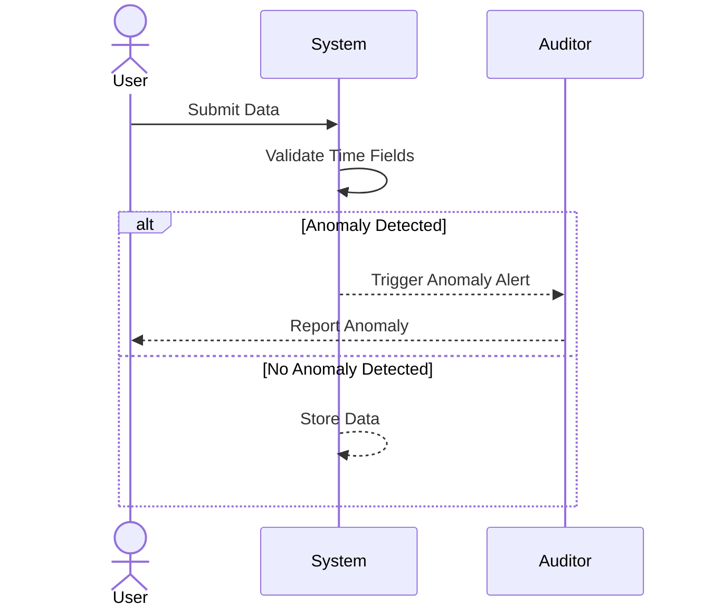

## Bi-Temporal Anomaly Detection

Bi-temporal anomaly detection is a crucial pattern in data modeling that focuses on identifying and resolving inconsistencies or anomalies in bi-temporal data. Bi-temporal data models include two dimensions of time: transaction time (the time when the data is stored in the database) and valid time (the period when the data is supposed to be in effect in the real world). Anomalies in this context can arise from inconsistencies such as invalid temporal sequences or conflicting date ranges.

### Key Concepts

- **Transaction Time**: Refers to when data changes are physically stored in the database.
- **Valid Time**: Represents the time period during which data is considered accurate or applicable in the real-world context.
- **Anomaly Detection**: Involves identifying data inconsistencies like records where transaction time precedes valid time or overlapping valid times for the same entity.

### Architectural Approaches

1. **Data Validation**: Implement data validation rules at the entry point to check the consistency of transaction and valid times.
2. **Temporal Constraint Enforcement**: Enforce temporal integrity constraints in the database schema.
3. **Automated Audits**: Develop systems for automated audits and anomaly alerts using batch jobs or real-time streams.
4. **Data Correction Workflows**: Create automated or manual workflows to correct detected anomalies.

### Example Code

Consider a scenario using SQL where a database needs to enforce that transaction times must not precede valid times:

```sql
CREATE TABLE Orders (
    OrderID INT,
    ProductID INT,
    TransactionTime DATETIME,
    ValidTimeStart DATETIME,
    ValidTimeEnd DATETIME,
    CONSTRAINT chk_time CHECK (TransactionTime <= ValidTimeStart)
);
```

This constraint ensures that the transaction time is always less than or equal to the start of the valid time period.

### Diagrams

Below is a simple sequence diagram illustrating the procedure for handling detected anomalies in our bi-temporal data model:



### Related Patterns

- **Slowly Changing Dimensions**: Addresses how historical changes to data over time are managed.
- **Event Sourcing**: A pattern primarily used in event-driven systems to store and manage changes over time at the event level.
  
### Additional Resources

- [Temporal Data & the Relational Model](https://www.amazon.com/Temporal-Relational-Model-Language-Implementation/dp/1558608559)
- [Time and Relational Theory: Expertise in Advanced SQL](https://www.amazon.com/Time-Relational-Theory-Expertise-Management/dp/1491941189)
- [Bitemporal Data: Theory and Practice](https://en.wikipedia.org/wiki/Bitemporal_Model)

### Summary

Bi-temporal anomaly detection is a vital design pattern for ensuring the integrity and accuracy of data in systems that employ bi-temporal models. By enforcing temporal constraints, validating data at multiple stages, and setting up mechanisms for the detection and correction of anomalies, this pattern helps maintain reliable data for analytical and operational purposes, offering a solid foundation for historical data analysis and auditing.
