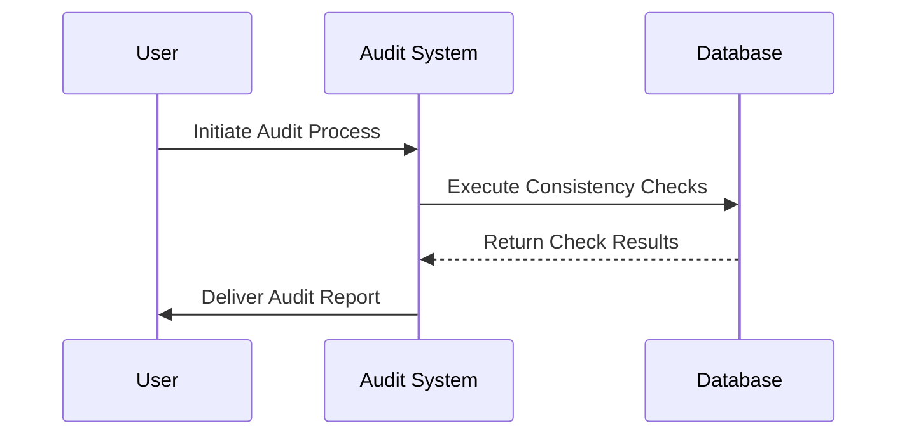

## Temporal Data Consistency Auditing

### Introduction

Temporal Data Consistency Auditing is a design pattern focused on maintaining and verifying the integrity of temporal data. Temporal data represents information that tracks or manages time-variant data like historical states and changes over time, crucial in scenarios where tracking the evolution and timeline-specific decisions are necessary, such as financial systems, transactional histories, and compliance reporting.

### Core Concepts and Motivation

In bi-temporal databases, which manage both valid-time (the time period during which a fact is true concerning the real world) and transaction-time (the time period during which a fact is stored in the database), ensuring consistency and accuracy is paramount. Temporal Data Consistency Auditing serves the following purposes:

- **Consistency Assurance**: Verifies data consistency across different time dimensions to prevent discrepancies.
- **Compliance Verification**: Confirms adherence to regulatory requirements, which often necessitate accurate historical records.
- **Accuracy Maintenance**: Identifies and resolves data inaccuracies related to timeline-specific data before affecting analytical outcomes.

### Architectural Approach

Implementing a Temporal Data Consistency Auditing mechanism involves several steps:

1. **Data Versioning**: Ensure that data changes are tracked over time, with detailed entries for valid-time and transaction-time windows.
   
2. **Audit Triggers**: Deploy database triggers or scheduled batch jobs that systematically check for anomalies like overlaps, gaps, or inconsistencies in temporal data dimensions.

3. **Automated Validation Scripts**: Scripts periodically run consistency checks to compare expected temporal data states against actual data states.

4. **Logging and Notifications**: In case discrepancies or violations are detected, log detailed reports and alert relevant teams for rectification actions.

5. **Audit Trails and Historical Logs**: Maintain records of all modifications and audit logs to trace any historical adjustments and data state evolution.

### Example Code

```sql
-- Example of a trigger to audit temporal data consistency

CREATE OR REPLACE FUNCTION check_temporal_consistency()
RETURNS TRIGGER AS 
BEGIN
  IF NEW.valid_end_time < NEW.valid_start_time THEN
    RAISE EXCEPTION 'Inconsistent temporal data: valid_end_time is before valid_start_time';
  END IF;

  -- Additional checks and logic for transaction-time and overlaps...
  RETURN NEW;
END;
 LANGUAGE plpgsql;

CREATE TRIGGER temporal_consistency_trigger
BEFORE INSERT OR UPDATE ON your_temporal_table
FOR EACH ROW EXECUTE FUNCTION check_temporal_consistency();
```

### Diagrams

#### UML Sequence Diagram



### Best Practices

- **Frequent Audits**: Regular audits improve the detection of temporal inconsistencies sooner.
- **Cross-Check Mechanisms**: Implement redundant checks using various consistency metrics to ensure comprehensive coverage.
- **Flexible Scripting**: Develop customizable validation scripts that can be adjusted to changing business rules.

### Related Patterns

- **Time-Travel Query Patterns**: Patterns enabling queries to extract data states as they were at past points in time.
- **Versioning Alchemy**: Techniques for handling version-controlled data objects that coexist across multiple time states.

### Additional Resources

- [Temporal Data Patterns](https://martinfowler.com/articles/patterns-of-time/)
- [Managing Temporal Consistency in Databases](https://docs.microsoft.com/en-us/sql/)
- [Effective Historical Data Auditing Techniques](https://www.techonthenet.com/sql/index.php)

### Summary

Temporal Data Consistency Auditing acts as a safeguard, ensuring data accuracy and compliance by rigorously auditing temporal data. This pattern assists enterprises in preserving the integrity of their temporally influenced datasets, enabling reliable decision-making founded on correct historical records. Adopting this pattern empowers organizations to mitigate legal risks and enhance data-driven strategies.
