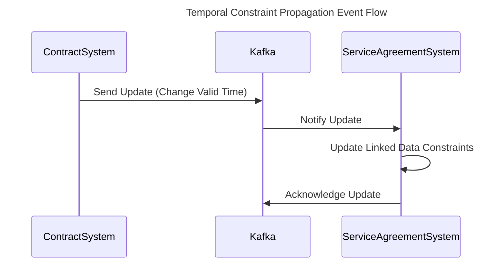

---

linkTitle: "Temporal Constraint Propagation"
title: "Temporal Constraint Propagation"
category: "Bi-Temporal Consistency Patterns"
series: "Data Modeling Design Patterns"
description: "A design pattern that ensures changes in temporal constraints on one entity are propagated consistently to related entities."
categories:
- Data Management
- Consistency Patterns
- Temporal Patterns
tags:
- Temporal Consistency
- Data Integrity
- Propagation Strategies
- Valid-Time
- Bi-Temporal Systems
date: 2024-07-07
type: docs

canonical: "https://softwarepatternslexicon.com/103/8/25"
license: "© 2024 Tokenizer Inc. CC BY-NC-SA 4.0"
---

## Introduction

Temporal Constraint Propagation is a design pattern that deals with maintaining consistency in bi-temporal data models. In these models, it is critical that temporal constraints on an entity, such as the valid or transaction time, are reflected correctly in all associated entities. This propagation ensures data integrity across the system whenever changes occur.

## Design Pattern Explanation

In a system where data has both valid-time and transaction-time dimensions, managing temporal constraints becomes complex. The Temporal Constraint Propagation pattern provides a systematic way to handle this complexity by:

- **Focusing on Dependencies**: Identify dependencies between entities where changes in temporal constraints should trigger updates in related entities.
- **Propagation Mechanism**: Define a mechanism to propagate changes in temporal data across these dependencies. This could be in the form of event-driven updates, scheduled batch processing, or real-time streaming.
- **Consistency Maintenance**: Ensure the temporal consistency is maintained without causing conflicts or data anomalies.

## Architectural Approach

**1. Identify Temporal Constraints:**
   - Determine both valid-time and transaction-time properties for your entities.
   - Understand how changes to these properties affect related entities.

**2. Define Propagation Rules:**
   - Establish rules that trigger propagation when specific conditions are met, e.g., when the valid time of a contract is extended or modified.

**3. Implement Propagation Mechanism:**
   - Choose between an event-driven architecture for real-time propagation or scheduled processes for aggregative changes.

**4. Use a Consistent Event Model:**
   - Employ a consistent event model using systems like Apache Kafka to handle change data capture (CDC) and ensure reliability in propagation.

**5. Ensure Idempotence:**
   - Implement idempotent operations to guarantee that repeated application of the same updates does not cause unintended changes.

## Example Code

Here's a simple illustration using Java and Kafka to propagate changes in temporal data:

```java
public class TemporalPropagation {

    private final KafkaProducer<String, String> producer;

    public TemporalPropagation() {
        Properties props = new Properties();
        props.put("bootstrap.servers", "localhost:9092");
        props.put("key.serializer", "org.apache.kafka.common.serialization.StringSerializer");
        props.put("value.serializer", "org.apache.kafka.common.serialization.StringSerializer");
        this.producer = new KafkaProducer<>(props);
    }

    public void propagateChange(String contractId, LocalDate newEndDate) {
        // Sample event payload creating an update event
        String eventPayload = String.format("{ \"contract_id\": \"%s\", \"new_end_date\": \"%s\" }", contractId, newEndDate);
        producer.send(new ProducerRecord<>("temporal-updates", contractId, eventPayload));
        System.out.println("Propagation event sent: " + eventPayload);
    }
}
```

## Mermaid UML Sequence Diagram



## Related Patterns

- **Event-Driven Architecture**: This pattern can be effectively combined with Temporal Constraint Propagation to ensure low-latency updates.
- **Change Data Capture (CDC)**: Use CDC to capture and propagate changes across systems seamlessly.
- **Idempotency Pattern**: Ensure updates do not introduce inconsistencies by applying changes idempotently.

## Additional Resources

- Martin Fowler's article on [Temporal Patterns](https://martinfowler.com/eaaDev/timePattern.html)
- "Designing Data-Intensive Applications" by Martin Kleppmann
- Online courses on [Bi-Temporal Data Modeling](https://www.datamodelinginstitute.com/)

## Summary

Temporal Constraint Propagation is essential for maintaining consistency in systems that utilize temporal data dimensions, such as validity and transaction time. By employing well-defined rules, leveraging event-driven architectures, and ensuring idempotency, systems can propagate temporal constraints efficiently, ensuring all related entities remain consistent and accurate. This pattern is crucial for businesses reliant on accurate temporal data for compliance, reporting, and operational needs.
