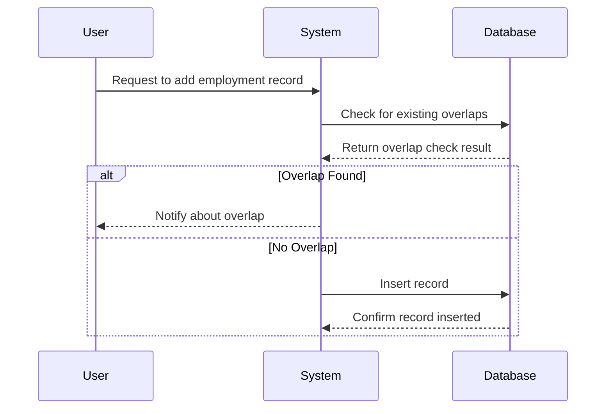

## Introduction

In temporal databases, particularly those dealing with bi-temporal data, we often encounter the challenge of ensuring consistent and non-overlapping valid time periods for records. This pattern, Overlapping Period Resolution, addresses such challenges by providing strategies to manage and resolve overlaps in time periods that are meant to remain mutually exclusive.

## Problem Statement

Bi-temporal databases track both valid time and transaction time, which often leads to scenarios where overlapping periods arise due to incorrect data entry or concurrency issues. For example, consider employment records for an individual who cannot logically work in two departments over overlapping periods. The inconsistency could compromise data integrity and business logic.

## Solution Approaches

### 1. Constraint Enforcement
#### Approach
Use constraints within the database to prevent entering overlapping valid time data initially.

#### Implementation
In SQL databases, utilize `CHECK` constraints or triggers. In NoSQL, constraints must be managed via application logic.

```sql
ALTER TABLE Employment
ADD CONSTRAINT NoOverlap
CHECK (DepartmentID IS DISTINCT FOR EACH EMPLOYEE AND VALID_PERIOD);
```

### 2. Preemptive Checks
#### Approach
Implement logic at the application level to enforce checks before updates or inserts occur.

#### Implementation
```java
public void addEmploymentRecord(EmploymentRecord record) throws OverlapException {
    if (isOverlapping(record)) {
        throw new OverlapException("New record overlaps with existing records.");
    }
    employmentRepository.save(record);
}
```

### 3. Retrospective Resolution
#### Approach
Post-process the records to remove overlaps, usually during nightly data maintenance.

#### Implementation
```sql
WITH CTE_Resolved AS (
    SELECT EmployeeID, MAX(StartDate) AS CorrectedStartDate,
    MIN(EndDate) AS CorrectedEndDate FROM Employment
    GROUP BY EmployeeID, DepartmentID
    HAVING COUNT(*) > 1
)
UPDATE Employment
SET StartDate = CTE_Resolved.CorrectedStartDate,
    EndDate = CTE_Resolved.CorrectedEndDate
FROM CTE_Resolved
WHERE Employment.EmployeeID = CTE_Resolved.EmployeeID;
```

## Diagrams



## Related Patterns

- **Temporal Pattern:** Focuses on managing time dimensions in data.
- **Correction and Reprocessing Pattern:** Provides strategies for data correction and reprocessing tasks often necessary in resolving temporal inconsistencies.

## Additional Resources

1. *Managing Time in Relational Databases* by Tom Johnston and Randall Weis.
2. *Temporal Data & the Relational Model* by C.J. Date, Hugh Darwen, and Nikos Lorentzos.

## Summary

Overlapping Period Resolution is a vital pattern for maintaining the consistency of bi-temporal databases. By leveraging preemptive checks, constraint enforcement, and retrospective resolutions, developers can ensure temporal integrity and enhance database reliability. This pattern is especially crucial in domains where historical and transactional correctness directly impacts business decisions and outcomes.
